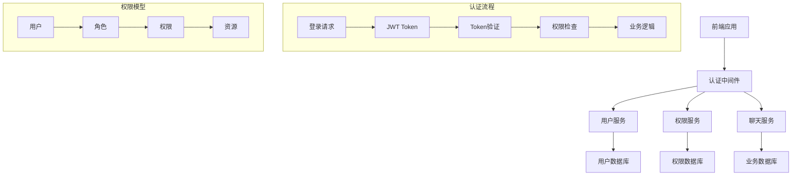

# 阶段2：用户体系详细设计

## 📋 阶段概述

### 目标与价值
在MVP核心功能基础上，构建完整的多用户体系，实现用户管理、认证授权、权限控制等企业级功能。

**核心价值主张**：
- 支持多用户独立使用，数据隔离
- 灵活的角色权限管理，适应不同组织架构
- 完整的用户生命周期管理
- 安全可靠的认证授权机制
- 为后续企业级功能奠定基础

### 成功指标
- **用户管理完整性**：支持用户注册、登录、密码重置、资料修改
- **权限控制精确性**：精确到接口级别的权限控制
- **数据隔离安全性**：用户间数据完全隔离，无数据泄露
- **性能影响最小**：权限验证响应时间 < 100ms
- **平滑迁移**：现有匿名用户数据无缝迁移到多用户模式

## 🏗️ 整体架构设计

### 用户体系架构图



### RBAC权限模型设计

```
用户(User) ←→ 用户角色(UserRole) ←→ 角色(Role)
                                      ↓
                                   角色权限(RolePermission)
                                      ↓
                                   权限(Permission)
                                      ↓
                                   资源(Resource)
```

**核心权限类别**：
1. **聊天权限**：chat:create, chat:read, chat:delete
2. **会话权限**：session:create, session:read, session:delete
3. **数据查询权限**：query:execute, query:read, query:export
4. **用户管理权限**：user:create, user:read, user:update, user:delete
5. **系统管理权限**：system:config, system:monitor, system:audit

## 📊 数据库详细设计

### 用户体系核心表结构

```sql
-- 1. 用户基础信息表
CREATE TABLE users (
    id TEXT PRIMARY KEY DEFAULT (lower(hex(randomblob(16)))),
    username VARCHAR(50) UNIQUE NOT NULL,
    email VARCHAR(255) UNIQUE NOT NULL,
    phone VARCHAR(20),
    password_hash VARCHAR(255) NOT NULL,
    full_name VARCHAR(100),
    avatar_url VARCHAR(255),
    department_id TEXT,
    status TINYINT DEFAULT 1 COMMENT '1:active, 0:inactive, -1:deleted',
    last_login_at DATETIME,
    created_at DATETIME DEFAULT CURRENT_TIMESTAMP,
    updated_at DATETIME DEFAULT CURRENT_TIMESTAMP
);

-- 2. 部门组织架构表
CREATE TABLE departments (
    id TEXT PRIMARY KEY DEFAULT (lower(hex(randomblob(16)))),
    name VARCHAR(100) NOT NULL,
    description TEXT,
    parent_id TEXT,
    level INTEGER DEFAULT 1,
    sort_order INTEGER DEFAULT 0,
    manager_id TEXT,
    created_at DATETIME DEFAULT CURRENT_TIMESTAMP,
    updated_at DATETIME DEFAULT CURRENT_TIMESTAMP,
    FOREIGN KEY (parent_id) REFERENCES departments(id),
    FOREIGN KEY (manager_id) REFERENCES users(id)
);

-- 3. 角色定义表
CREATE TABLE roles (
    id TEXT PRIMARY KEY DEFAULT (lower(hex(randomblob(16)))),
    name VARCHAR(50) UNIQUE NOT NULL,
    display_name VARCHAR(100) NOT NULL,
    description TEXT,
    is_system BOOLEAN DEFAULT FALSE,
    is_active BOOLEAN DEFAULT TRUE,
    created_at DATETIME DEFAULT CURRENT_TIMESTAMP,
    updated_at DATETIME DEFAULT CURRENT_TIMESTAMP
);

-- 4. 权限定义表
CREATE TABLE permissions (
    id TEXT PRIMARY KEY DEFAULT (lower(hex(randomblob(16)))),
    name VARCHAR(50) UNIQUE NOT NULL,
    display_name VARCHAR(100) NOT NULL,
    resource VARCHAR(50) NOT NULL,
    action VARCHAR(50) NOT NULL,
    description TEXT,
    created_at DATETIME DEFAULT CURRENT_TIMESTAMP
);

-- 5. 用户角色关联表
CREATE TABLE user_roles (
    id TEXT PRIMARY KEY DEFAULT (lower(hex(randomblob(16)))),
    user_id TEXT NOT NULL,
    role_id TEXT NOT NULL,
    assigned_by TEXT,
    assigned_at DATETIME DEFAULT CURRENT_TIMESTAMP,
    expires_at DATETIME,
    FOREIGN KEY (user_id) REFERENCES users(id) ON DELETE CASCADE,
    FOREIGN KEY (role_id) REFERENCES roles(id) ON DELETE CASCADE,
    FOREIGN KEY (assigned_by) REFERENCES users(id),
    UNIQUE(user_id, role_id)
);

-- 6. 角色权限关联表
CREATE TABLE role_permissions (
    id TEXT PRIMARY KEY DEFAULT (lower(hex(randomblob(16)))),
    role_id TEXT NOT NULL,
    permission_id TEXT NOT NULL,
    granted_by TEXT,
    granted_at DATETIME DEFAULT CURRENT_TIMESTAMP,
    FOREIGN KEY (role_id) REFERENCES roles(id) ON DELETE CASCADE,
    FOREIGN KEY (permission_id) REFERENCES permissions(id) ON DELETE CASCADE,
    FOREIGN KEY (granted_by) REFERENCES users(id),
    UNIQUE(role_id, permission_id)
);

-- 7. 用户会话表
CREATE TABLE user_sessions (
    id TEXT PRIMARY KEY DEFAULT (lower(hex(randomblob(16)))),
    user_id TEXT NOT NULL,
    token_hash VARCHAR(255) NOT NULL,
    device_info TEXT,
    ip_address VARCHAR(45),
    user_agent TEXT,
    expires_at DATETIME NOT NULL,
    created_at DATETIME DEFAULT CURRENT_TIMESTAMP,
    last_used_at DATETIME DEFAULT CURRENT_TIMESTAMP,
    is_active BOOLEAN DEFAULT TRUE,
    FOREIGN KEY (user_id) REFERENCES users(id) ON DELETE CASCADE
);

-- 8. 用户操作审计日志表
CREATE TABLE user_audit_logs (
    id INTEGER PRIMARY KEY AUTOINCREMENT,
    user_id TEXT,
    action VARCHAR(100) NOT NULL,
    resource VARCHAR(100),
    resource_id TEXT,
    old_values JSON,
    new_values JSON,
    ip_address VARCHAR(45),
    user_agent TEXT,
    created_at DATETIME DEFAULT CURRENT_TIMESTAMP,
    FOREIGN KEY (user_id) REFERENCES users(id)
);

-- 更新现有表结构，添加用户关联
ALTER TABLE chat_sessions ADD COLUMN user_id TEXT;
ALTER TABLE chat_sessions ADD CONSTRAINT fk_chat_sessions_user_id 
    FOREIGN KEY (user_id) REFERENCES users(id);

-- 创建索引
CREATE INDEX idx_users_username ON users(username);
CREATE INDEX idx_users_email ON users(email);
CREATE INDEX idx_users_department_id ON users(department_id);
CREATE INDEX idx_users_status ON users(status);
CREATE INDEX idx_departments_parent_id ON departments(parent_id);
CREATE INDEX idx_user_roles_user_id ON user_roles(user_id);
CREATE INDEX idx_user_roles_role_id ON user_roles(role_id);
CREATE INDEX idx_role_permissions_role_id ON role_permissions(role_id);
CREATE INDEX idx_user_sessions_user_id ON user_sessions(user_id);
CREATE INDEX idx_user_sessions_token_hash ON user_sessions(token_hash);
CREATE INDEX idx_user_audit_logs_user_id ON user_audit_logs(user_id);
CREATE INDEX idx_user_audit_logs_created_at ON user_audit_logs(created_at);
CREATE INDEX idx_chat_sessions_user_id ON chat_sessions(user_id);
```

### 初始数据插入

```sql
-- 插入默认角色
INSERT INTO roles (id, name, display_name, description, is_system) VALUES
('role_admin', 'admin', '系统管理员', '拥有系统所有权限', TRUE),
('role_manager', 'manager', '部门经理', '拥有部门管理权限', TRUE),
('role_analyst', 'analyst', '数据分析师', '拥有数据查询分析权限', TRUE),
('role_user', 'user', '普通用户', '基础聊天查询权限', TRUE);

-- 插入默认权限
INSERT INTO permissions (id, name, display_name, resource, action, description) VALUES
-- 聊天相关权限
('perm_chat_create', 'chat:create', '创建聊天', 'chat', 'create', '创建新的聊天会话'),
('perm_chat_read', 'chat:read', '查看聊天', 'chat', 'read', '查看聊天历史记录'),
('perm_chat_update', 'chat:update', '修改聊天', 'chat', 'update', '修改聊天内容'),
('perm_chat_delete', 'chat:delete', '删除聊天', 'chat', 'delete', '删除聊天记录'),

-- 会话相关权限
('perm_session_create', 'session:create', '创建会话', 'session', 'create', '创建新的聊天会话'),
('perm_session_read', 'session:read', '查看会话', 'session', 'read', '查看会话列表'),
('perm_session_delete', 'session:delete', '删除会话', 'session', 'delete', '删除聊天会话'),

-- 查询相关权限
('perm_query_execute', 'query:execute', '执行查询', 'query', 'execute', '执行SQL查询'),
('perm_query_export', 'query:export', '导出结果', 'query', 'export', '导出查询结果'),

-- 用户管理权限
('perm_user_create', 'user:create', '创建用户', 'user', 'create', '创建新用户'),
('perm_user_read', 'user:read', '查看用户', 'user', 'read', '查看用户信息'),
('perm_user_update', 'user:update', '修改用户', 'user', 'update', '修改用户信息'),
('perm_user_delete', 'user:delete', '删除用户', 'user', 'delete', '删除用户'),

-- 系统管理权限
('perm_system_config', 'system:config', '系统配置', 'system', 'config', '修改系统配置'),
('perm_system_audit', 'system:audit', '系统审计', 'system', 'audit', '查看系统审计日志');

-- 配置角色权限
INSERT INTO role_permissions (role_id, permission_id) VALUES
-- 管理员：所有权限
('role_admin', 'perm_chat_create'), ('role_admin', 'perm_chat_read'), ('role_admin', 'perm_chat_update'), ('role_admin', 'perm_chat_delete'),
('role_admin', 'perm_session_create'), ('role_admin', 'perm_session_read'), ('role_admin', 'perm_session_delete'),
('role_admin', 'perm_query_execute'), ('role_admin', 'perm_query_export'),
('role_admin', 'perm_user_create'), ('role_admin', 'perm_user_read'), ('role_admin', 'perm_user_update'), ('role_admin', 'perm_user_delete'),
('role_admin', 'perm_system_config'), ('role_admin', 'perm_system_audit'),

-- 部门经理：用户管理 + 完整业务权限
('role_manager', 'perm_chat_create'), ('role_manager', 'perm_chat_read'), ('role_manager', 'perm_chat_delete'),
('role_manager', 'perm_session_create'), ('role_manager', 'perm_session_read'), ('role_manager', 'perm_session_delete'),
('role_manager', 'perm_query_execute'), ('role_manager', 'perm_query_export'),
('role_manager', 'perm_user_read'), ('role_manager', 'perm_user_update'),

-- 数据分析师：查询导出权限
('role_analyst', 'perm_chat_create'), ('role_analyst', 'perm_chat_read'),
('role_analyst', 'perm_session_create'), ('role_analyst', 'perm_session_read'), ('role_analyst', 'perm_session_delete'),
('role_analyst', 'perm_query_execute'), ('role_analyst', 'perm_query_export'),

-- 普通用户：基础权限
('role_user', 'perm_chat_create'), ('role_user', 'perm_chat_read'),
('role_user', 'perm_session_create'), ('role_user', 'perm_session_read'), ('role_user', 'perm_session_delete'),
('role_user', 'perm_query_execute');
```

## 🔧 详细技术实现

### 1. 认证服务实现

```go
// internal/service/auth_service.go
package service

import (
    "context"
    "crypto/rand"
    "encoding/base64"
    "fmt"
    "time"
    
    "golang.org/x/crypto/bcrypt"
    "github.com/golang-jwt/jwt/v5"
)

type AuthService struct {
    userRepo     repository.UserRepository
    sessionRepo  repository.SessionRepository
    jwtSecret    []byte
    tokenExpiry  time.Duration
}

type LoginRequest struct {
    Username string `json:"username" validate:"required"`
    Password string `json:"password" validate:"required"`
    DeviceInfo string `json:"device_info"`
    RememberMe bool `json:"remember_me"`
}

type LoginResponse struct {
    User         *model.User `json:"user"`
    Token        string      `json:"token"`
    RefreshToken string      `json:"refresh_token"`
    ExpiresAt    time.Time   `json:"expires_at"`
}

type RegisterRequest struct {
    Username    string `json:"username" validate:"required,min=3,max=50"`
    Email       string `json:"email" validate:"required,email"`
    Password    string `json:"password" validate:"required,min=8"`
    FullName    string `json:"full_name" validate:"required"`
    Phone       string `json:"phone,omitempty"`
    DepartmentID string `json:"department_id,omitempty"`
}

// NewAuthService 创建认证服务实例
func NewAuthService(userRepo repository.UserRepository, sessionRepo repository.SessionRepository, jwtSecret string) *AuthService {
    return &AuthService{
        userRepo:    userRepo,
        sessionRepo: sessionRepo,
        jwtSecret:   []byte(jwtSecret),
        tokenExpiry: 24 * time.Hour, // 默认24小时过期
    }
}

// Login 用户登录
func (as *AuthService) Login(ctx context.Context, req *LoginRequest, clientIP, userAgent string) (*LoginResponse, error) {
    // 1. 查找用户
    user, err := as.userRepo.GetByUsernameOrEmail(ctx, req.Username)
    if err != nil {
        return nil, fmt.Errorf("invalid credentials")
    }
    
    // 2. 验证用户状态
    if user.Status != model.UserStatusActive {
        return nil, fmt.Errorf("user account is disabled")
    }
    
    // 3. 验证密码
    if err := bcrypt.CompareHashAndPassword([]byte(user.PasswordHash), []byte(req.Password)); err != nil {
        // 记录登录失败
        as.recordLoginAttempt(ctx, user.ID, false, clientIP, userAgent)
        return nil, fmt.Errorf("invalid credentials")
    }
    
    // 4. 生成JWT Token
    token, err := as.generateJWTToken(user)
    if err != nil {
        return nil, fmt.Errorf("generate token failed: %w", err)
    }
    
    // 5. 生成Refresh Token
    refreshToken, err := as.generateRefreshToken()
    if err != nil {
        return nil, fmt.Errorf("generate refresh token failed: %w", err)
    }
    
    // 6. 创建用户会话记录
    expiresAt := time.Now().Add(as.tokenExpiry)
    if req.RememberMe {
        expiresAt = time.Now().Add(30 * 24 * time.Hour) // 30天
    }
    
    session := &model.UserSession{
        UserID:       user.ID,
        TokenHash:    as.hashToken(token),
        RefreshToken: refreshToken,
        DeviceInfo:   req.DeviceInfo,
        IPAddress:    clientIP,
        UserAgent:    userAgent,
        ExpiresAt:    expiresAt,
        IsActive:     true,
    }
    
    if err := as.sessionRepo.Create(ctx, session); err != nil {
        return nil, fmt.Errorf("create session failed: %w", err)
    }
    
    // 7. 更新最后登录时间
    user.LastLoginAt = time.Now()
    as.userRepo.UpdateLastLogin(ctx, user.ID, user.LastLoginAt)
    
    // 8. 记录登录成功
    as.recordLoginAttempt(ctx, user.ID, true, clientIP, userAgent)
    
    return &LoginResponse{
        User:         user,
        Token:        token,
        RefreshToken: refreshToken,
        ExpiresAt:    expiresAt,
    }, nil
}

// Register 用户注册
func (as *AuthService) Register(ctx context.Context, req *RegisterRequest) (*model.User, error) {
    // 1. 检查用户名和邮箱唯一性
    if exists, _ := as.userRepo.ExistsByUsername(ctx, req.Username); exists {
        return nil, fmt.Errorf("username already exists")
    }
    
    if exists, _ := as.userRepo.ExistsByEmail(ctx, req.Email); exists {
        return nil, fmt.Errorf("email already exists")
    }
    
    // 2. 密码加密
    hashedPassword, err := bcrypt.GenerateFromPassword([]byte(req.Password), bcrypt.DefaultCost)
    if err != nil {
        return nil, fmt.Errorf("hash password failed: %w", err)
    }
    
    // 3. 创建用户对象
    user := &model.User{
        Username:     req.Username,
        Email:        req.Email,
        PasswordHash: string(hashedPassword),
        FullName:     req.FullName,
        Phone:        req.Phone,
        DepartmentID: req.DepartmentID,
        Status:       model.UserStatusActive,
        CreatedAt:    time.Now(),
        UpdatedAt:    time.Now(),
    }
    
    // 4. 保存用户
    if err := as.userRepo.Create(ctx, user); err != nil {
        return nil, fmt.Errorf("create user failed: %w", err)
    }
    
    // 5. 分配默认角色
    if err := as.assignDefaultRole(ctx, user.ID); err != nil {
        return nil, fmt.Errorf("assign default role failed: %w", err)
    }
    
    return user, nil
}

// ValidateToken 验证JWT Token
func (as *AuthService) ValidateToken(tokenString string) (*model.User, error) {
    // 1. 解析JWT Token
    token, err := jwt.Parse(tokenString, func(token *jwt.Token) (interface{}, error) {
        if _, ok := token.Method.(*jwt.SigningMethodHMAC); !ok {
            return nil, fmt.Errorf("unexpected signing method: %v", token.Header["alg"])
        }
        return as.jwtSecret, nil
    })
    
    if err != nil {
        return nil, fmt.Errorf("parse token failed: %w", err)
    }
    
    // 2. 验证Token有效性
    if claims, ok := token.Claims.(jwt.MapClaims); ok && token.Valid {
        userID := claims["user_id"].(string)
        
        // 3. 检查会话是否存在且有效
        session, err := as.sessionRepo.GetByTokenHash(context.Background(), as.hashToken(tokenString))
        if err != nil || !session.IsActive || time.Now().After(session.ExpiresAt) {
            return nil, fmt.Errorf("session invalid or expired")
        }
        
        // 4. 获取用户信息
        user, err := as.userRepo.GetByID(context.Background(), userID)
        if err != nil || user.Status != model.UserStatusActive {
            return nil, fmt.Errorf("user not found or inactive")
        }
        
        // 5. 更新会话最后使用时间
        as.sessionRepo.UpdateLastUsed(context.Background(), session.ID, time.Now())
        
        return user, nil
    }
    
    return nil, fmt.Errorf("invalid token claims")
}

// RefreshToken 刷新Token
func (as *AuthService) RefreshToken(ctx context.Context, refreshToken string) (*LoginResponse, error) {
    // 1. 查找会话
    session, err := as.sessionRepo.GetByRefreshToken(ctx, refreshToken)
    if err != nil {
        return nil, fmt.Errorf("invalid refresh token")
    }
    
    // 2. 检查会话有效性
    if !session.IsActive || time.Now().After(session.ExpiresAt) {
        return nil, fmt.Errorf("refresh token expired")
    }
    
    // 3. 获取用户信息
    user, err := as.userRepo.GetByID(ctx, session.UserID)
    if err != nil || user.Status != model.UserStatusActive {
        return nil, fmt.Errorf("user not found or inactive")
    }
    
    // 4. 生成新的Token
    token, err := as.generateJWTToken(user)
    if err != nil {
        return nil, fmt.Errorf("generate new token failed: %w", err)
    }
    
    // 5. 生成新的Refresh Token
    newRefreshToken, err := as.generateRefreshToken()
    if err != nil {
        return nil, fmt.Errorf("generate new refresh token failed: %w", err)
    }
    
    // 6. 更新会话
    session.TokenHash = as.hashToken(token)
    session.RefreshToken = newRefreshToken
    session.ExpiresAt = time.Now().Add(as.tokenExpiry)
    session.LastUsedAt = time.Now()
    
    if err := as.sessionRepo.Update(ctx, session); err != nil {
        return nil, fmt.Errorf("update session failed: %w", err)
    }
    
    return &LoginResponse{
        User:         user,
        Token:        token,
        RefreshToken: newRefreshToken,
        ExpiresAt:    session.ExpiresAt,
    }, nil
}

// Logout 用户登出
func (as *AuthService) Logout(ctx context.Context, tokenString string) error {
    tokenHash := as.hashToken(tokenString)
    return as.sessionRepo.DeactivateByTokenHash(ctx, tokenHash)
}

// 辅助方法
func (as *AuthService) generateJWTToken(user *model.User) (string, error) {
    claims := jwt.MapClaims{
        "user_id":    user.ID,
        "username":   user.Username,
        "email":      user.Email,
        "full_name":  user.FullName,
        "department": user.DepartmentID,
        "exp":        time.Now().Add(as.tokenExpiry).Unix(),
        "iat":        time.Now().Unix(),
    }
    
    token := jwt.NewWithClaims(jwt.SigningMethodHS256, claims)
    return token.SignedString(as.jwtSecret)
}

func (as *AuthService) generateRefreshToken() (string, error) {
    bytes := make([]byte, 32)
    if _, err := rand.Read(bytes); err != nil {
        return "", err
    }
    return base64.URLEncoding.EncodeToString(bytes), nil
}

func (as *AuthService) hashToken(token string) string {
    // 使用SHA-256哈希Token用于存储
    hash := sha256.Sum256([]byte(token))
    return base64.StdEncoding.EncodeToString(hash[:])
}

func (as *AuthService) assignDefaultRole(ctx context.Context, userID string) error {
    // 分配默认的普通用户角色
    return as.userRepo.AssignRole(ctx, userID, "role_user")
}

func (as *AuthService) recordLoginAttempt(ctx context.Context, userID string, success bool, ip, userAgent string) {
    action := "login_failed"
    if success {
        action = "login_success"
    }
    
    // 记录到审计日志（这里简化处理）
    log.Printf("User %s %s from %s", userID, action, ip)
}
```

### 2. 权限服务实现

```go
// internal/service/permission_service.go
package service

import (
    "context"
    "fmt"
    "strings"
    "sync"
    "time"
)

type PermissionService struct {
    roleRepo       repository.RoleRepository
    permissionRepo repository.PermissionRepository
    userRepo       repository.UserRepository
    cache          map[string]*UserPermissions
    cacheMutex     sync.RWMutex
    cacheTTL       time.Duration
}

type UserPermissions struct {
    UserID      string
    Roles       []string
    Permissions []string
    ExpiresAt   time.Time
}

type PermissionCheck struct {
    Resource string
    Action   string
}

// NewPermissionService 创建权限服务实例
func NewPermissionService(
    roleRepo repository.RoleRepository,
    permissionRepo repository.PermissionRepository,
    userRepo repository.UserRepository,
) *PermissionService {
    return &PermissionService{
        roleRepo:       roleRepo,
        permissionRepo: permissionRepo,
        userRepo:       userRepo,
        cache:          make(map[string]*UserPermissions),
        cacheTTL:       15 * time.Minute, // 缓存15分钟
    }
}

// CheckPermission 检查用户是否具有特定权限
func (ps *PermissionService) CheckPermission(ctx context.Context, userID, resource, action string) (bool, error) {
    // 1. 获取用户权限（带缓存）
    permissions, err := ps.getUserPermissions(ctx, userID)
    if err != nil {
        return false, fmt.Errorf("get user permissions: %w", err)
    }
    
    // 2. 检查权限
    permissionName := fmt.Sprintf("%s:%s", resource, action)
    
    for _, perm := range permissions.Permissions {
        if perm == permissionName {
            return true, nil
        }
    }
    
    return false, nil
}

// CheckPermissions 批量检查权限
func (ps *PermissionService) CheckPermissions(ctx context.Context, userID string, checks []PermissionCheck) (map[string]bool, error) {
    permissions, err := ps.getUserPermissions(ctx, userID)
    if err != nil {
        return nil, fmt.Errorf("get user permissions: %w", err)
    }
    
    result := make(map[string]bool)
    permSet := make(map[string]bool)
    
    // 构建权限集合
    for _, perm := range permissions.Permissions {
        permSet[perm] = true
    }
    
    // 批量检查
    for _, check := range checks {
        permissionName := fmt.Sprintf("%s:%s", check.Resource, check.Action)
        result[permissionName] = permSet[permissionName]
    }
    
    return result, nil
}

// HasRole 检查用户是否具有特定角色
func (ps *PermissionService) HasRole(ctx context.Context, userID, roleName string) (bool, error) {
    permissions, err := ps.getUserPermissions(ctx, userID)
    if err != nil {
        return false, fmt.Errorf("get user permissions: %w", err)
    }
    
    for _, role := range permissions.Roles {
        if role == roleName {
            return true, nil
        }
    }
    
    return false, nil
}

// GetUserRoles 获取用户所有角色
func (ps *PermissionService) GetUserRoles(ctx context.Context, userID string) ([]string, error) {
    permissions, err := ps.getUserPermissions(ctx, userID)
    if err != nil {
        return nil, fmt.Errorf("get user permissions: %w", err)
    }
    
    return permissions.Roles, nil
}

// GetUserPermissions 获取用户所有权限
func (ps *PermissionService) GetUserPermissions(ctx context.Context, userID string) ([]string, error) {
    permissions, err := ps.getUserPermissions(ctx, userID)
    if err != nil {
        return nil, fmt.Errorf("get user permissions: %w", err)
    }
    
    return permissions.Permissions, nil
}

// AssignRole 为用户分配角色
func (ps *PermissionService) AssignRole(ctx context.Context, userID, roleID, assignedBy string) error {
    // 1. 检查角色是否存在
    role, err := ps.roleRepo.GetByID(ctx, roleID)
    if err != nil {
        return fmt.Errorf("role not found: %w", err)
    }
    
    // 2. 检查用户是否已有该角色
    hasRole, err := ps.HasRole(ctx, userID, role.Name)
    if err != nil {
        return fmt.Errorf("check existing role: %w", err)
    }
    
    if hasRole {
        return fmt.Errorf("user already has role: %s", role.Name)
    }
    
    // 3. 分配角色
    userRole := &model.UserRole{
        UserID:     userID,
        RoleID:     roleID,
        AssignedBy: assignedBy,
        AssignedAt: time.Now(),
    }
    
    if err := ps.roleRepo.AssignUserRole(ctx, userRole); err != nil {
        return fmt.Errorf("assign role: %w", err)
    }
    
    // 4. 清除用户权限缓存
    ps.clearUserCache(userID)
    
    return nil
}

// RevokeRole 撤销用户角色
func (ps *PermissionService) RevokeRole(ctx context.Context, userID, roleID string) error {
    if err := ps.roleRepo.RevokeUserRole(ctx, userID, roleID); err != nil {
        return fmt.Errorf("revoke role: %w", err)
    }
    
    // 清除用户权限缓存
    ps.clearUserCache(userID)
    
    return nil
}

// CreateRole 创建新角色
func (ps *PermissionService) CreateRole(ctx context.Context, role *model.Role) error {
    // 1. 检查角色名称唯一性
    if exists, _ := ps.roleRepo.ExistsByName(ctx, role.Name); exists {
        return fmt.Errorf("role name already exists: %s", role.Name)
    }
    
    // 2. 创建角色
    role.CreatedAt = time.Now()
    role.UpdatedAt = time.Now()
    
    return ps.roleRepo.Create(ctx, role)
}

// GrantPermissionToRole 为角色授予权限
func (ps *PermissionService) GrantPermissionToRole(ctx context.Context, roleID, permissionID, grantedBy string) error {
    rolePermission := &model.RolePermission{
        RoleID:       roleID,
        PermissionID: permissionID,
        GrantedBy:    grantedBy,
        GrantedAt:    time.Now(),
    }
    
    if err := ps.permissionRepo.GrantToRole(ctx, rolePermission); err != nil {
        return fmt.Errorf("grant permission to role: %w", err)
    }
    
    // 清除所有相关用户的缓存
    ps.clearRoleRelatedCache(roleID)
    
    return nil
}

// 私有方法：获取用户权限（带缓存）
func (ps *PermissionService) getUserPermissions(ctx context.Context, userID string) (*UserPermissions, error) {
    ps.cacheMutex.RLock()
    
    // 检查缓存
    if cached, exists := ps.cache[userID]; exists && time.Now().Before(cached.ExpiresAt) {
        ps.cacheMutex.RUnlock()
        return cached, nil
    }
    ps.cacheMutex.RUnlock()
    
    // 缓存未命中，从数据库查询
    ps.cacheMutex.Lock()
    defer ps.cacheMutex.Unlock()
    
    // 双重检查
    if cached, exists := ps.cache[userID]; exists && time.Now().Before(cached.ExpiresAt) {
        return cached, nil
    }
    
    // 1. 获取用户角色
    userRoles, err := ps.roleRepo.GetUserRoles(ctx, userID)
    if err != nil {
        return nil, fmt.Errorf("get user roles: %w", err)
    }
    
    var roleNames []string
    var roleIDs []string
    for _, role := range userRoles {
        roleNames = append(roleNames, role.Name)
        roleIDs = append(roleIDs, role.ID)
    }
    
    // 2. 获取角色权限
    permissions, err := ps.permissionRepo.GetByRoleIDs(ctx, roleIDs)
    if err != nil {
        return nil, fmt.Errorf("get role permissions: %w", err)
    }
    
    var permissionNames []string
    for _, perm := range permissions {
        permissionNames = append(permissionNames, perm.Name)
    }
    
    // 3. 缓存结果
    userPermissions := &UserPermissions{
        UserID:      userID,
        Roles:       roleNames,
        Permissions: permissionNames,
        ExpiresAt:   time.Now().Add(ps.cacheTTL),
    }
    
    ps.cache[userID] = userPermissions
    
    return userPermissions, nil
}

// 清除用户权限缓存
func (ps *PermissionService) clearUserCache(userID string) {
    ps.cacheMutex.Lock()
    defer ps.cacheMutex.Unlock()
    
    delete(ps.cache, userID)
}

// 清除角色相关的所有用户缓存
func (ps *PermissionService) clearRoleRelatedCache(roleID string) {
    ps.cacheMutex.Lock()
    defer ps.cacheMutex.Unlock()
    
    // 简化处理：清除所有缓存
    // 实际应用中可以维护角色-用户的映射关系以便精确清除
    ps.cache = make(map[string]*UserPermissions)
}

// 定期清理过期缓存
func (ps *PermissionService) StartCacheCleanup() {
    ticker := time.NewTicker(5 * time.Minute)
    go func() {
        for range ticker.C {
            ps.cleanupExpiredCache()
        }
    }()
}

func (ps *PermissionService) cleanupExpiredCache() {
    ps.cacheMutex.Lock()
    defer ps.cacheMutex.Unlock()
    
    now := time.Now()
    for userID, permissions := range ps.cache {
        if now.After(permissions.ExpiresAt) {
            delete(ps.cache, userID)
        }
    }
}
```

### 3. 认证中间件实现

```go
// internal/middleware/auth.go
package middleware

import (
    "net/http"
    "strings"
    
    "chat2sql/internal/service"
    "chat2sql/internal/model"
    
    "github.com/gin-gonic/gin"
)

type AuthMiddleware struct {
    authService       *service.AuthService
    permissionService *service.PermissionService
}

func NewAuthMiddleware(authService *service.AuthService, permissionService *service.PermissionService) *AuthMiddleware {
    return &AuthMiddleware{
        authService:       authService,
        permissionService: permissionService,
    }
}

// RequireAuth 要求用户认证
func (am *AuthMiddleware) RequireAuth() gin.HandlerFunc {
    return func(c *gin.Context) {
        // 1. 从Header获取Token
        token := am.extractTokenFromHeader(c)
        if token == "" {
            c.JSON(http.StatusUnauthorized, gin.H{
                "error":   "unauthorized",
                "message": "Authentication token required",
            })
            c.Abort()
            return
        }
        
        // 2. 验证Token
        user, err := am.authService.ValidateToken(token)
        if err != nil {
            c.JSON(http.StatusUnauthorized, gin.H{
                "error":   "invalid_token",
                "message": "Invalid or expired token",
            })
            c.Abort()
            return
        }
        
        // 3. 将用户信息存储到上下文
        c.Set("user", user)
        c.Set("user_id", user.ID)
        
        c.Next()
    }
}

// RequirePermission 要求特定权限
func (am *AuthMiddleware) RequirePermission(resource, action string) gin.HandlerFunc {
    return func(c *gin.Context) {
        // 1. 获取当前用户
        user, exists := c.Get("user")
        if !exists {
            c.JSON(http.StatusUnauthorized, gin.H{
                "error":   "unauthorized", 
                "message": "User not authenticated",
            })
            c.Abort()
            return
        }
        
        currentUser := user.(*model.User)
        
        // 2. 检查权限
        hasPermission, err := am.permissionService.CheckPermission(
            c.Request.Context(),
            currentUser.ID,
            resource,
            action,
        )
        
        if err != nil {
            c.JSON(http.StatusInternalServerError, gin.H{
                "error":   "permission_check_error",
                "message": "Failed to check permissions",
            })
            c.Abort()
            return
        }
        
        if !hasPermission {
            c.JSON(http.StatusForbidden, gin.H{
                "error":   "insufficient_permissions",
                "message": fmt.Sprintf("Missing permission: %s:%s", resource, action),
            })
            c.Abort()
            return
        }
        
        c.Next()
    }
}

// RequireRole 要求特定角色
func (am *AuthMiddleware) RequireRole(roleName string) gin.HandlerFunc {
    return func(c *gin.Context) {
        // 1. 获取当前用户
        user, exists := c.Get("user")
        if !exists {
            c.JSON(http.StatusUnauthorized, gin.H{
                "error":   "unauthorized",
                "message": "User not authenticated",
            })
            c.Abort()
            return
        }
        
        currentUser := user.(*model.User)
        
        // 2. 检查角色
        hasRole, err := am.permissionService.HasRole(
            c.Request.Context(),
            currentUser.ID,
            roleName,
        )
        
        if err != nil {
            c.JSON(http.StatusInternalServerError, gin.H{
                "error":   "role_check_error",
                "message": "Failed to check role",
            })
            c.Abort()
            return
        }
        
        if !hasRole {
            c.JSON(http.StatusForbidden, gin.H{
                "error":   "insufficient_role",
                "message": fmt.Sprintf("Missing role: %s", roleName),
            })
            c.Abort()
            return
        }
        
        c.Next()
    }
}

// RequireAnyRole 要求任一角色
func (am *AuthMiddleware) RequireAnyRole(roleNames ...string) gin.HandlerFunc {
    return func(c *gin.Context) {
        user, exists := c.Get("user")
        if !exists {
            c.JSON(http.StatusUnauthorized, gin.H{
                "error":   "unauthorized",
                "message": "User not authenticated",
            })
            c.Abort()
            return
        }
        
        currentUser := user.(*model.User)
        
        // 检查是否拥有任一角色
        for _, roleName := range roleNames {
            hasRole, err := am.permissionService.HasRole(
                c.Request.Context(),
                currentUser.ID,
                roleName,
            )
            
            if err == nil && hasRole {
                c.Next()
                return
            }
        }
        
        c.JSON(http.StatusForbidden, gin.H{
            "error":   "insufficient_role",
            "message": fmt.Sprintf("Missing any of required roles: %s", strings.Join(roleNames, ", ")),
        })
        c.Abort()
    }
}

// OptionalAuth 可选认证（兼容匿名用户）
func (am *AuthMiddleware) OptionalAuth() gin.HandlerFunc {
    return func(c *gin.Context) {
        token := am.extractTokenFromHeader(c)
        if token != "" {
            user, err := am.authService.ValidateToken(token)
            if err == nil {
                c.Set("user", user)
                c.Set("user_id", user.ID)
                c.Set("authenticated", true)
            }
        } else {
            // 匿名用户
            c.Set("authenticated", false)
            c.Set("user_id", "anonymous")
        }
        
        c.Next()
    }
}

// DataOwnershipFilter 数据所有权过滤（确保用户只能访问自己的数据）
func (am *AuthMiddleware) DataOwnershipFilter() gin.HandlerFunc {
    return func(c *gin.Context) {
        // 在业务逻辑中确保数据访问权限
        // 这里主要是设置标记，具体过滤在Service层实现
        c.Set("enforce_ownership", true)
        c.Next()
    }
}

// 从请求头中提取Token
func (am *AuthMiddleware) extractTokenFromHeader(c *gin.Context) string {
    authHeader := c.GetHeader("Authorization")
    if authHeader == "" {
        return ""
    }
    
    // 支持两种格式：
    // 1. Authorization: Bearer <token>
    // 2. Authorization: <token>
    
    if strings.HasPrefix(authHeader, "Bearer ") {
        return strings.TrimPrefix(authHeader, "Bearer ")
    }
    
    return authHeader
}
```

### 4. HTTP处理器实现

```go
// internal/handler/auth.go
package handler

import (
    "net/http"
    
    "chat2sql/internal/service"
    "chat2sql/internal/model"
    
    "github.com/gin-gonic/gin"
)

type AuthHandler struct {
    authService       *service.AuthService
    permissionService *service.PermissionService
}

func NewAuthHandler(authService *service.AuthService, permissionService *service.PermissionService) *AuthHandler {
    return &AuthHandler{
        authService:       authService,
        permissionService: permissionService,
    }
}

// PostLogin 用户登录
func (h *AuthHandler) PostLogin(c *gin.Context) {
    var req service.LoginRequest
    
    if err := c.ShouldBindJSON(&req); err != nil {
        c.JSON(http.StatusBadRequest, model.ErrorResponse{
            Error:   "invalid_request",
            Message: "Invalid request parameters: " + err.Error(),
        })
        return
    }
    
    clientIP := c.ClientIP()
    userAgent := c.GetHeader("User-Agent")
    
    response, err := h.authService.Login(c.Request.Context(), &req, clientIP, userAgent)
    if err != nil {
        c.JSON(http.StatusUnauthorized, model.ErrorResponse{
            Error:   "login_failed",
            Message: err.Error(),
        })
        return
    }
    
    c.JSON(http.StatusOK, model.SuccessResponse{
        Success: true,
        Data:    response,
    })
}

// PostRegister 用户注册
func (h *AuthHandler) PostRegister(c *gin.Context) {
    var req service.RegisterRequest
    
    if err := c.ShouldBindJSON(&req); err != nil {
        c.JSON(http.StatusBadRequest, model.ErrorResponse{
            Error:   "invalid_request",
            Message: "Invalid request parameters: " + err.Error(),
        })
        return
    }
    
    user, err := h.authService.Register(c.Request.Context(), &req)
    if err != nil {
        c.JSON(http.StatusBadRequest, model.ErrorResponse{
            Error:   "registration_failed",
            Message: err.Error(),
        })
        return
    }
    
    // 移除敏感信息
    user.PasswordHash = ""
    
    c.JSON(http.StatusCreated, model.SuccessResponse{
        Success: true,
        Data:    user,
        Message: "User registered successfully",
    })
}

// PostRefreshToken 刷新Token
func (h *AuthHandler) PostRefreshToken(c *gin.Context) {
    var req struct {
        RefreshToken string `json:"refresh_token" binding:"required"`
    }
    
    if err := c.ShouldBindJSON(&req); err != nil {
        c.JSON(http.StatusBadRequest, model.ErrorResponse{
            Error:   "invalid_request",
            Message: "Refresh token is required",
        })
        return
    }
    
    response, err := h.authService.RefreshToken(c.Request.Context(), req.RefreshToken)
    if err != nil {
        c.JSON(http.StatusUnauthorized, model.ErrorResponse{
            Error:   "refresh_failed",
            Message: err.Error(),
        })
        return
    }
    
    c.JSON(http.StatusOK, model.SuccessResponse{
        Success: true,
        Data:    response,
    })
}

// PostLogout 用户登出
func (h *AuthHandler) PostLogout(c *gin.Context) {
    token := c.GetHeader("Authorization")
    if strings.HasPrefix(token, "Bearer ") {
        token = strings.TrimPrefix(token, "Bearer ")
    }
    
    if token == "" {
        c.JSON(http.StatusBadRequest, model.ErrorResponse{
            Error:   "invalid_request",
            Message: "Token is required",
        })
        return
    }
    
    err := h.authService.Logout(c.Request.Context(), token)
    if err != nil {
        c.JSON(http.StatusInternalServerError, model.ErrorResponse{
            Error:   "logout_failed",
            Message: err.Error(),
        })
        return
    }
    
    c.JSON(http.StatusOK, model.SuccessResponse{
        Success: true,
        Message: "Logged out successfully",
    })
}

// GetProfile 获取用户资料
func (h *AuthHandler) GetProfile(c *gin.Context) {
    user, _ := c.Get("user")
    currentUser := user.(*model.User)
    
    // 获取用户角色和权限
    roles, err := h.permissionService.GetUserRoles(c.Request.Context(), currentUser.ID)
    if err != nil {
        roles = []string{}
    }
    
    permissions, err := h.permissionService.GetUserPermissions(c.Request.Context(), currentUser.ID)
    if err != nil {
        permissions = []string{}
    }
    
    // 构建响应
    profile := map[string]interface{}{
        "id":            currentUser.ID,
        "username":      currentUser.Username,
        "email":         currentUser.Email,
        "full_name":     currentUser.FullName,
        "phone":         currentUser.Phone,
        "department_id": currentUser.DepartmentID,
        "avatar_url":    currentUser.AvatarURL,
        "status":        currentUser.Status,
        "last_login_at": currentUser.LastLoginAt,
        "created_at":    currentUser.CreatedAt,
        "roles":         roles,
        "permissions":   permissions,
    }
    
    c.JSON(http.StatusOK, model.SuccessResponse{
        Success: true,
        Data:    profile,
    })
}

// PutProfile 更新用户资料
func (h *AuthHandler) PutProfile(c *gin.Context) {
    user, _ := c.Get("user")
    currentUser := user.(*model.User)
    
    var req struct {
        FullName  string `json:"full_name"`
        Phone     string `json:"phone"`
        AvatarURL string `json:"avatar_url"`
    }
    
    if err := c.ShouldBindJSON(&req); err != nil {
        c.JSON(http.StatusBadRequest, model.ErrorResponse{
            Error:   "invalid_request",
            Message: err.Error(),
        })
        return
    }
    
    // 更新用户信息
    currentUser.FullName = req.FullName
    currentUser.Phone = req.Phone
    currentUser.AvatarURL = req.AvatarURL
    
    // 保存到数据库（这里需要实现UserRepository的Update方法）
    // err := h.userRepo.Update(c.Request.Context(), currentUser)
    
    c.JSON(http.StatusOK, model.SuccessResponse{
        Success: true,
        Message: "Profile updated successfully",
    })
}

// PostChangePassword 修改密码
func (h *AuthHandler) PostChangePassword(c *gin.Context) {
    user, _ := c.Get("user")
    currentUser := user.(*model.User)
    
    var req struct {
        OldPassword string `json:"old_password" binding:"required"`
        NewPassword string `json:"new_password" binding:"required,min=8"`
    }
    
    if err := c.ShouldBindJSON(&req); err != nil {
        c.JSON(http.StatusBadRequest, model.ErrorResponse{
            Error:   "invalid_request",
            Message: err.Error(),
        })
        return
    }
    
    // 验证旧密码并更新新密码（这里需要在AuthService中实现ChangePassword方法）
    err := h.authService.ChangePassword(c.Request.Context(), currentUser.ID, req.OldPassword, req.NewPassword)
    if err != nil {
        c.JSON(http.StatusBadRequest, model.ErrorResponse{
            Error:   "change_password_failed",
            Message: err.Error(),
        })
        return
    }
    
    c.JSON(http.StatusOK, model.SuccessResponse{
        Success: true,
        Message: "Password changed successfully",
    })
}
```

### 5. 前端认证组件实现

#### 登录组件

```svelte
<!-- web/src/lib/components/auth/LoginForm.svelte -->
<script lang="ts">
  import { createEventDispatcher } from 'svelte';
  import { authStore } from '$lib/stores/authStore';
  import { goto } from '$app/navigation';
  import LoadingSpinner from '../LoadingSpinner.svelte';

  const dispatch = createEventDispatcher();

  let username = '';
  let password = '';
  let rememberMe = false;
  let isLoading = false;
  let error = '';

  async function handleLogin() {
    if (!username.trim() || !password.trim()) {
      error = '用户名和密码不能为空';
      return;
    }

    isLoading = true;
    error = '';

    try {
      const response = await fetch('/api/v1/auth/login', {
        method: 'POST',
        headers: {
          'Content-Type': 'application/json',
        },
        body: JSON.stringify({
          username: username.trim(),
          password,
          remember_me: rememberMe,
          device_info: navigator.userAgent
        })
      });

      const result = await response.json();

      if (result.success) {
        // 保存认证信息到store
        authStore.login(result.data);
        
        // 跳转到主页面
        await goto('/');
        
        dispatch('loginSuccess');
      } else {
        error = result.message || '登录失败';
      }
    } catch (err) {
      error = '网络连接错误，请稍后重试';
      console.error('Login error:', err);
    } finally {
      isLoading = false;
    }
  }

  function handleKeyDown(event: KeyboardEvent) {
    if (event.key === 'Enter') {
      event.preventDefault();
      handleLogin();
    }
  }
</script>

<div class="min-h-screen flex items-center justify-center bg-base-200 py-12 px-4 sm:px-6 lg:px-8">
  <div class="max-w-md w-full space-y-8">
    <!-- 标题 -->
    <div class="text-center">
      <h2 class="mt-6 text-3xl font-bold">
        登录到 Chat2SQL
      </h2>
      <p class="mt-2 text-sm text-base-content/70">
        使用您的账户访问智能数据查询系统
      </p>
    </div>

    <!-- 登录表单 -->
    <form class="mt-8 space-y-6" on:submit|preventDefault={handleLogin}>
      <div class="space-y-4">
        <!-- 用户名输入 -->
        <div>
          <label for="username" class="block text-sm font-medium mb-1">
            用户名或邮箱
          </label>
          <input
            id="username"
            type="text"
            bind:value={username}
            on:keydown={handleKeyDown}
            disabled={isLoading}
            placeholder="请输入用户名或邮箱"
            class="input input-bordered w-full"
            class:input-error={error}
          />
        </div>

        <!-- 密码输入 -->
        <div>
          <label for="password" class="block text-sm font-medium mb-1">
            密码
          </label>
          <input
            id="password"
            type="password"
            bind:value={password}
            on:keydown={handleKeyDown}
            disabled={isLoading}
            placeholder="请输入密码"
            class="input input-bordered w-full"
            class:input-error={error}
          />
        </div>
      </div>

      <!-- 记住我和忘记密码 -->
      <div class="flex items-center justify-between">
        <label class="flex items-center">
          <input
            type="checkbox"
            bind:checked={rememberMe}
            disabled={isLoading}
            class="checkbox checkbox-primary checkbox-sm"
          />
          <span class="ml-2 text-sm">记住我</span>
        </label>

        <a href="/auth/forgot-password" class="link link-primary text-sm">
          忘记密码？
        </a>
      </div>

      <!-- 错误提示 -->
      {#if error}
        <div class="alert alert-error">
          <svg xmlns="http://www.w3.org/2000/svg" class="stroke-current shrink-0 h-6 w-6" fill="none" viewBox="0 0 24 24">
            <path stroke-linecap="round" stroke-linejoin="round" stroke-width="2" d="M10 14l2-2m0 0l2-2m-2 2l-2-2m2 2l2 2m7-2a9 9 0 11-18 0 9 9 0 0118 0z" />
          </svg>
          <span>{error}</span>
        </div>
      {/if}

      <!-- 登录按钮 -->
      <button
        type="submit"
        disabled={isLoading || !username.trim() || !password.trim()}
        class="btn btn-primary w-full"
      >
        {#if isLoading}
          <LoadingSpinner size="sm" />
          登录中...
        {:else}
          登录
        {/if}
      </button>
    </form>

    <!-- 注册链接 -->
    <div class="text-center">
      <span class="text-sm text-base-content/70">还没有账户？</span>
      <a href="/auth/register" class="link link-primary text-sm">
        立即注册
      </a>
    </div>
  </div>
</div>
```

#### 认证状态管理

```typescript
// web/src/lib/stores/authStore.ts
import { writable, derived } from 'svelte/store';
import { browser } from '$app/environment';

export interface User {
  id: string;
  username: string;
  email: string;
  full_name: string;
  phone?: string;
  department_id?: string;
  avatar_url?: string;
  roles: string[];
  permissions: string[];
}

export interface AuthState {
  isAuthenticated: boolean;
  user: User | null;
  token: string | null;
  refreshToken: string | null;
  expiresAt: Date | null;
}

const initialState: AuthState = {
  isAuthenticated: false,
  user: null,
  token: null,
  refreshToken: null,
  expiresAt: null
};

function createAuthStore() {
  const { subscribe, set, update } = writable<AuthState>(initialState);

  // 从localStorage恢复状态
  if (browser) {
    const stored = localStorage.getItem('auth_state');
    if (stored) {
      try {
        const parsed = JSON.parse(stored);
        if (parsed.expiresAt && new Date(parsed.expiresAt) > new Date()) {
          set({
            ...parsed,
            expiresAt: new Date(parsed.expiresAt)
          });
        }
      } catch (e) {
        console.error('Failed to restore auth state:', e);
      }
    }
  }

  return {
    subscribe,
    
    // 登录
    login: (loginResponse: any) => {
      const newState: AuthState = {
        isAuthenticated: true,
        user: loginResponse.user,
        token: loginResponse.token,
        refreshToken: loginResponse.refresh_token,
        expiresAt: new Date(loginResponse.expires_at)
      };
      
      set(newState);
      
      if (browser) {
        localStorage.setItem('auth_state', JSON.stringify(newState));
      }
    },
    
    // 登出
    logout: async () => {
      const currentState = get(authStore);
      
      // 调用后端登出接口
      if (currentState.token) {
        try {
          await fetch('/api/v1/auth/logout', {
            method: 'POST',
            headers: {
              'Authorization': `Bearer ${currentState.token}`,
              'Content-Type': 'application/json'
            }
          });
        } catch (e) {
          console.error('Logout API call failed:', e);
        }
      }
      
      // 清除状态
      set(initialState);
      
      if (browser) {
        localStorage.removeItem('auth_state');
      }
    },
    
    // 更新用户信息
    updateUser: (user: Partial<User>) => {
      update(state => {
        if (state.user) {
          const updatedState = {
            ...state,
            user: { ...state.user, ...user }
          };
          
          if (browser) {
            localStorage.setItem('auth_state', JSON.stringify(updatedState));
          }
          
          return updatedState;
        }
        return state;
      });
    },
    
    // 刷新Token
    refreshToken: async () => {
      const currentState = get(authStore);
      
      if (!currentState.refreshToken) {
        throw new Error('No refresh token available');
      }
      
      const response = await fetch('/api/v1/auth/refresh', {
        method: 'POST',
        headers: {
          'Content-Type': 'application/json'
        },
        body: JSON.stringify({
          refresh_token: currentState.refreshToken
        })
      });
      
      if (!response.ok) {
        throw new Error('Failed to refresh token');
      }
      
      const result = await response.json();
      
      if (result.success) {
        const newState: AuthState = {
          ...currentState,
          token: result.data.token,
          refreshToken: result.data.refresh_token,
          expiresAt: new Date(result.data.expires_at)
        };
        
        set(newState);
        
        if (browser) {
          localStorage.setItem('auth_state', JSON.stringify(newState));
        }
        
        return result.data.token;
      } else {
        throw new Error(result.message || 'Token refresh failed');
      }
    },
    
    // 检查权限
    hasPermission: (resource: string, action: string) => {
      const state = get(authStore);
      const permissionName = `${resource}:${action}`;
      return state.user?.permissions?.includes(permissionName) || false;
    },
    
    // 检查角色
    hasRole: (roleName: string) => {
      const state = get(authStore);
      return state.user?.roles?.includes(roleName) || false;
    },
    
    // 检查任一角色
    hasAnyRole: (roleNames: string[]) => {
      const state = get(authStore);
      return roleNames.some(role => state.user?.roles?.includes(role)) || false;
    }
  };
}

export const authStore = createAuthStore();

// 派生状态：是否为管理员
export const isAdmin = derived(authStore, $auth => 
  $auth.user?.roles?.includes('admin') || false
);

// 派生状态：是否为管理角色（管理员或经理）
export const isManager = derived(authStore, $auth => 
  $auth.user?.roles?.some(role => ['admin', 'manager'].includes(role)) || false
);

// 自动刷新Token
if (browser) {
  setInterval(async () => {
    const state = get(authStore);
    
    if (state.isAuthenticated && state.expiresAt) {
      // 在过期前5分钟刷新Token
      const fiveMinutesFromNow = new Date(Date.now() + 5 * 60 * 1000);
      
      if (state.expiresAt <= fiveMinutesFromNow) {
        try {
          await authStore.refreshToken();
        } catch (e) {
          console.error('Auto token refresh failed:', e);
          // 刷新失败，跳转到登录页
          authStore.logout();
          window.location.href = '/auth/login';
        }
      }
    }
  }, 60 * 1000); // 每分钟检查一次
}
```

#### 路由守卫

```svelte
<!-- web/src/lib/components/auth/ProtectedRoute.svelte -->
<script lang="ts">
  import { authStore } from '$lib/stores/authStore';
  import { goto } from '$app/navigation';
  import { onMount } from 'svelte';
  import LoadingSpinner from '../LoadingSpinner.svelte';

  export let requiredPermission: string = '';
  export let requiredRole: string = '';
  export let requiredAnyRole: string[] = [];
  export let redirectTo: string = '/auth/login';

  let isLoading = true;
  let hasAccess = false;

  onMount(() => {
    const unsubscribe = authStore.subscribe(($auth) => {
      isLoading = false;
      
      // 检查认证状态
      if (!$auth.isAuthenticated) {
        goto(redirectTo);
        return;
      }

      // 检查权限
      if (requiredPermission) {
        const [resource, action] = requiredPermission.split(':');
        hasAccess = authStore.hasPermission(resource, action);
      }
      
      // 检查角色
      else if (requiredRole) {
        hasAccess = authStore.hasRole(requiredRole);
      }
      
      // 检查任一角色
      else if (requiredAnyRole.length > 0) {
        hasAccess = authStore.hasAnyRole(requiredAnyRole);
      }
      
      // 无特殊要求，只要已认证即可
      else {
        hasAccess = true;
      }

      // 无访问权限，跳转到错误页面
      if (!hasAccess) {
        goto('/403'); // 403 Forbidden页面
      }
    });

    return unsubscribe;
  });
</script>

{#if isLoading}
  <div class="flex items-center justify-center min-h-screen">
    <LoadingSpinner size="lg" />
    <span class="ml-4 text-lg">验证权限中...</span>
  </div>
{:else if hasAccess}
  <slot />
{:else}
  <div class="flex items-center justify-center min-h-screen">
    <div class="text-center">
      <div class="text-6xl mb-4">🚫</div>
      <h1 class="text-2xl font-bold mb-2">访问被拒绝</h1>
      <p class="text-base-content/70 mb-6">您没有权限访问此页面</p>
      <button class="btn btn-primary" on:click={() => goto('/')}>
        返回首页
      </button>
    </div>
  </div>
{/if}
```

## 📝 数据迁移策略

### 从匿名用户到多用户系统的平滑迁移

```go
// internal/migration/user_migration.go
package migration

import (
    "context"
    "database/sql"
    "fmt"
    "time"
)

type UserMigration struct {
    db *sql.DB
}

func NewUserMigration(db *sql.DB) *UserMigration {
    return &UserMigration{db: db}
}

// MigrateAnonymousData 迁移匿名用户数据
func (um *UserMigration) MigrateAnonymousData(ctx context.Context) error {
    // 1. 创建默认匿名用户
    anonymousUser := &model.User{
        ID:           "anonymous_user",
        Username:     "anonymous",
        Email:        "anonymous@system.local",
        PasswordHash: "",
        FullName:     "匿名用户",
        Status:       model.UserStatusActive,
        CreatedAt:    time.Now(),
        UpdatedAt:    time.Now(),
    }
    
    if err := um.createDefaultUser(ctx, anonymousUser); err != nil {
        return fmt.Errorf("create anonymous user: %w", err)
    }
    
    // 2. 更新现有的聊天会话
    if err := um.updateExistingChatSessions(ctx, anonymousUser.ID); err != nil {
        return fmt.Errorf("update existing chat sessions: %w", err)
    }
    
    // 3. 分配默认角色
    if err := um.assignDefaultRoleToUser(ctx, anonymousUser.ID, "role_user"); err != nil {
        return fmt.Errorf("assign default role: %w", err)
    }
    
    return nil
}

func (um *UserMigration) createDefaultUser(ctx context.Context, user *model.User) error {
    query := `
        INSERT OR IGNORE INTO users (id, username, email, password_hash, full_name, status, created_at, updated_at)
        VALUES (?, ?, ?, ?, ?, ?, ?, ?)
    `
    
    _, err := um.db.ExecContext(ctx, query,
        user.ID, user.Username, user.Email, user.PasswordHash,
        user.FullName, user.Status, user.CreatedAt, user.UpdatedAt)
    
    return err
}

func (um *UserMigration) updateExistingChatSessions(ctx context.Context, userID string) error {
    query := `
        UPDATE chat_sessions 
        SET user_id = ? 
        WHERE user_id IS NULL OR user_id = ''
    `
    
    result, err := um.db.ExecContext(ctx, query, userID)
    if err != nil {
        return err
    }
    
    rowsAffected, _ := result.RowsAffected()
    fmt.Printf("Updated %d existing chat sessions\n", rowsAffected)
    
    return nil
}

func (um *UserMigration) assignDefaultRoleToUser(ctx context.Context, userID, roleID string) error {
    query := `
        INSERT OR IGNORE INTO user_roles (user_id, role_id, assigned_at)
        VALUES (?, ?, ?)
    `
    
    _, err := um.db.ExecContext(ctx, query, userID, roleID, time.Now())
    return err
}
```

## 🧪 测试策略

### 认证相关单元测试

```go
// internal/service/auth_service_test.go
package service

import (
    "context"
    "testing"
    "time"
    
    "github.com/stretchr/testify/assert"
    "github.com/stretchr/testify/mock"
)

func TestAuthService_Login(t *testing.T) {
    mockUserRepo := &mocks.UserRepository{}
    mockSessionRepo := &mocks.SessionRepository{}
    
    authService := NewAuthService(mockUserRepo, mockSessionRepo, "test-secret")
    
    t.Run("成功登录", func(t *testing.T) {
        // 准备测试数据
        user := &model.User{
            ID:           "user-123",
            Username:     "testuser",
            Email:        "test@example.com",
            PasswordHash: "$2a$10$...", // bcrypt hash for "password123"
            Status:       model.UserStatusActive,
        }
        
        req := &LoginRequest{
            Username: "testuser",
            Password: "password123",
        }
        
        // 设置Mock
        mockUserRepo.On("GetByUsernameOrEmail", mock.Anything, "testuser").
            Return(user, nil)
        mockSessionRepo.On("Create", mock.Anything, mock.AnythingOfType("*model.UserSession")).
            Return(nil)
        mockUserRepo.On("UpdateLastLogin", mock.Anything, "user-123", mock.AnythingOfType("time.Time")).
            Return(nil)
        
        // 执行测试
        response, err := authService.Login(context.Background(), req, "127.0.0.1", "test-agent")
        
        // 验证结果
        assert.NoError(t, err)
        assert.NotNil(t, response)
        assert.Equal(t, user.ID, response.User.ID)
        assert.NotEmpty(t, response.Token)
        assert.NotEmpty(t, response.RefreshToken)
        
        // 验证Mock调用
        mockUserRepo.AssertExpectations(t)
        mockSessionRepo.AssertExpectations(t)
    })
    
    t.Run("用户名不存在", func(t *testing.T) {
        req := &LoginRequest{
            Username: "nonexistent",
            Password: "password123",
        }
        
        mockUserRepo.On("GetByUsernameOrEmail", mock.Anything, "nonexistent").
            Return(nil, errors.New("user not found"))
        
        response, err := authService.Login(context.Background(), req, "127.0.0.1", "test-agent")
        
        assert.Error(t, err)
        assert.Nil(t, response)
        assert.Contains(t, err.Error(), "invalid credentials")
    })
    
    t.Run("密码错误", func(t *testing.T) {
        user := &model.User{
            ID:           "user-123",
            Username:     "testuser",
            PasswordHash: "$2a$10$...", // bcrypt hash for "password123"
            Status:       model.UserStatusActive,
        }
        
        req := &LoginRequest{
            Username: "testuser",
            Password: "wrongpassword",
        }
        
        mockUserRepo.On("GetByUsernameOrEmail", mock.Anything, "testuser").
            Return(user, nil)
        
        response, err := authService.Login(context.Background(), req, "127.0.0.1", "test-agent")
        
        assert.Error(t, err)
        assert.Nil(t, response)
        assert.Contains(t, err.Error(), "invalid credentials")
    })
    
    t.Run("用户被禁用", func(t *testing.T) {
        user := &model.User{
            ID:       "user-123",
            Username: "testuser",
            Status:   model.UserStatusInactive,
        }
        
        req := &LoginRequest{
            Username: "testuser",
            Password: "password123",
        }
        
        mockUserRepo.On("GetByUsernameOrEmail", mock.Anything, "testuser").
            Return(user, nil)
        
        response, err := authService.Login(context.Background(), req, "127.0.0.1", "test-agent")
        
        assert.Error(t, err)
        assert.Nil(t, response)
        assert.Contains(t, err.Error(), "user account is disabled")
    })
}

func TestPermissionService_CheckPermission(t *testing.T) {
    mockRoleRepo := &mocks.RoleRepository{}
    mockPermissionRepo := &mocks.PermissionRepository{}
    mockUserRepo := &mocks.UserRepository{}
    
    permissionService := NewPermissionService(mockRoleRepo, mockPermissionRepo, mockUserRepo)
    
    t.Run("用户具有权限", func(t *testing.T) {
        userID := "user-123"
        roles := []*model.Role{
            {ID: "role-1", Name: "user"},
        }
        permissions := []*model.Permission{
            {ID: "perm-1", Name: "chat:create"},
            {ID: "perm-2", Name: "chat:read"},
        }
        
        mockRoleRepo.On("GetUserRoles", mock.Anything, userID).Return(roles, nil)
        mockPermissionRepo.On("GetByRoleIDs", mock.Anything, []string{"role-1"}).Return(permissions, nil)
        
        hasPermission, err := permissionService.CheckPermission(context.Background(), userID, "chat", "create")
        
        assert.NoError(t, err)
        assert.True(t, hasPermission)
    })
    
    t.Run("用户没有权限", func(t *testing.T) {
        userID := "user-123"
        roles := []*model.Role{
            {ID: "role-1", Name: "user"},
        }
        permissions := []*model.Permission{
            {ID: "perm-1", Name: "chat:read"},
        }
        
        mockRoleRepo.On("GetUserRoles", mock.Anything, userID).Return(roles, nil)
        mockPermissionRepo.On("GetByRoleIDs", mock.Anything, []string{"role-1"}).Return(permissions, nil)
        
        hasPermission, err := permissionService.CheckPermission(context.Background(), userID, "user", "create")
        
        assert.NoError(t, err)
        assert.False(t, hasPermission)
    })
}
```

### 集成测试

```go
// tests/integration/auth_integration_test.go
package integration

import (
    "bytes"
    "encoding/json"
    "net/http"
    "net/http/httptest"
    "testing"
    
    "github.com/stretchr/testify/assert"
)

func TestAuthIntegration(t *testing.T) {
    router := setupTestRouter()
    
    t.Run("完整认证流程", func(t *testing.T) {
        // 1. 用户注册
        registerReq := map[string]string{
            "username":  "testuser",
            "email":     "test@example.com",
            "password":  "password123",
            "full_name": "Test User",
        }
        reqBody, _ := json.Marshal(registerReq)
        
        w := httptest.NewRecorder()
        req, _ := http.NewRequest("POST", "/api/v1/auth/register", bytes.NewBuffer(reqBody))
        req.Header.Set("Content-Type", "application/json")
        router.ServeHTTP(w, req)
        
        assert.Equal(t, http.StatusCreated, w.Code)
        
        // 2. 用户登录
        loginReq := map[string]string{
            "username": "testuser",
            "password": "password123",
        }
        reqBody, _ = json.Marshal(loginReq)
        
        w = httptest.NewRecorder()
        req, _ = http.NewRequest("POST", "/api/v1/auth/login", bytes.NewBuffer(reqBody))
        req.Header.Set("Content-Type", "application/json")
        router.ServeHTTP(w, req)
        
        assert.Equal(t, http.StatusOK, w.Code)
        
        var loginResp map[string]interface{}
        json.Unmarshal(w.Body.Bytes(), &loginResp)
        
        assert.True(t, loginResp["success"].(bool))
        
        data := loginResp["data"].(map[string]interface{})
        token := data["token"].(string)
        
        // 3. 访问受保护的资源
        w = httptest.NewRecorder()
        req, _ = http.NewRequest("GET", "/api/v1/auth/profile", nil)
        req.Header.Set("Authorization", "Bearer "+token)
        router.ServeHTTP(w, req)
        
        assert.Equal(t, http.StatusOK, w.Code)
        
        var profileResp map[string]interface{}
        json.Unmarshal(w.Body.Bytes(), &profileResp)
        
        assert.True(t, profileResp["success"].(bool))
        
        profile := profileResp["data"].(map[string]interface{})
        assert.Equal(t, "testuser", profile["username"])
        
        // 4. 用户登出
        w = httptest.NewRecorder()
        req, _ = http.NewRequest("POST", "/api/v1/auth/logout", nil)
        req.Header.Set("Authorization", "Bearer "+token)
        router.ServeHTTP(w, req)
        
        assert.Equal(t, http.StatusOK, w.Code)
        
        // 5. 验证Token已失效
        w = httptest.NewRecorder()
        req, _ = http.NewRequest("GET", "/api/v1/auth/profile", nil)
        req.Header.Set("Authorization", "Bearer "+token)
        router.ServeHTTP(w, req)
        
        assert.Equal(t, http.StatusUnauthorized, w.Code)
    })
}
```

## 📋 交付清单

### 1. 后端交付物
- [ ] 完整的用户认证服务
- [ ] RBAC权限管理系统
- [ ] JWT Token认证中间件
- [ ] 用户管理API接口
- [ ] 权限管理API接口
- [ ] 数据库迁移脚本
- [ ] 单元测试和集成测试

### 2. 前端交付物
- [ ] 登录注册页面
- [ ] 用户资料管理界面
- [ ] 权限控制组件
- [ ] 路由守卫实现
- [ ] 认证状态管理
- [ ] 响应式权限菜单

### 3. 数据库交付物
- [ ] 完整的用户体系表结构
- [ ] 初始角色权限数据
- [ ] 数据迁移脚本
- [ ] 索引优化方案

### 4. 文档交付物
- [ ] 权限设计文档
- [ ] API接口文档
- [ ] 数据迁移指南
- [ ] 用户管理手册

### 5. 验收标准
- [ ] 用户注册登录功能完整（100%）
- [ ] 权限控制精确到接口级别（100%）
- [ ] 数据完全隔离无泄露（100%）
- [ ] 权限验证响应时间 < 100ms
- [ ] 现有数据无缝迁移（100%）

---

**预计完成时间**：2周（在MVP基础上增量开发）

**依赖条件**：MVP核心功能已完成并稳定运行

*本文档由技术架构团队维护，版本：v1.0，最后更新：2025-01-08*