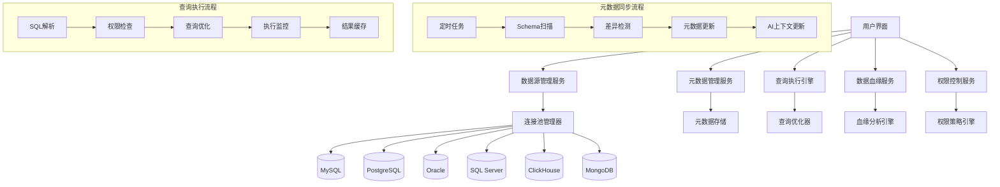

# 阶段3：数据治理详细设计

## 📋 阶段概述

### 目标与价值
在用户体系基础上，构建完整的数据治理平台，实现多数据源管理、元数据治理、数据血缘分析、查询监控等企业级数据管理功能。

**核心价值主张**：
- 统一管理多个数据源，支持异构数据库
- 自动发现和维护数据库元数据信息
- 为AI提供丰富准确的上下文信息，提升SQL生成质量
- 完整的数据访问权限控制和审计追踪
- 智能化的查询优化和性能监控
- 企业级数据治理能力，确保数据合规

### 成功指标
- **数据源接入完整性**：支持90%+主流数据库类型
- **元数据同步准确性**：元数据同步准确率 > 99%
- **SQL生成质量提升**：准确率从85%提升到95%+
- **查询性能优化**：平均响应时间降低50%+
- **数据安全合规**：100%数据访问可追溯审计

## 🏗️ 整体架构设计

### 数据治理架构图



### 核心模块设计

#### 1. 数据源管理模块
- **多数据库适配器**：统一的数据库访问接口
- **连接池管理**：智能连接池，支持负载均衡
- **健康检查**：实时监控数据源状态
- **配置管理**：安全的数据源配置存储

#### 2. 元数据管理模块
- **Schema发现**：自动扫描数据库结构
- **元数据同步**：增量同步元数据变更
- **数据字典**：维护业务字段含义
- **版本管理**：跟踪Schema变更历史

#### 3. 查询执行引擎
- **SQL解析器**：解析和验证SQL语句
- **查询优化器**：基于统计信息优化查询
- **执行监控**：实时监控查询执行状态
- **结果缓存**：智能缓存查询结果

#### 4. 数据血缘服务
- **血缘分析**：分析表间关系和数据流
- **影响分析**：评估Schema变更影响
- **依赖追踪**：跟踪查询和表的依赖关系

## 📊 数据库详细设计

### 元数据管理核心表结构

```sql
-- 1. 数据源定义表
CREATE TABLE data_sources (
    id TEXT PRIMARY KEY DEFAULT (lower(hex(randomblob(16)))),
    name VARCHAR(100) NOT NULL UNIQUE,
    display_name VARCHAR(200) NOT NULL,
    description TEXT,
    db_type VARCHAR(50) NOT NULL, -- mysql, postgresql, oracle, sqlserver, clickhouse, mongodb
    host VARCHAR(255) NOT NULL,
    port INTEGER NOT NULL,
    database_name VARCHAR(100) NOT NULL,
    username VARCHAR(100),
    password_encrypted TEXT, -- 加密存储密码
    connection_params JSON, -- 额外连接参数
    max_connections INTEGER DEFAULT 10,
    connection_timeout INTEGER DEFAULT 30, -- 秒
    query_timeout INTEGER DEFAULT 300, -- 秒
    ssl_enabled BOOLEAN DEFAULT FALSE,
    ssl_config JSON,
    status TINYINT DEFAULT 1 COMMENT '1:active, 0:inactive, -1:error',
    last_health_check DATETIME,
    health_check_error TEXT,
    created_by TEXT NOT NULL,
    created_at DATETIME DEFAULT CURRENT_TIMESTAMP,
    updated_at DATETIME DEFAULT CURRENT_TIMESTAMP,
    FOREIGN KEY (created_by) REFERENCES users(id)
);

-- 2. 数据库Schema信息表
CREATE TABLE database_schemas (
    id TEXT PRIMARY KEY DEFAULT (lower(hex(randomblob(16)))),
    data_source_id TEXT NOT NULL,
    schema_name VARCHAR(100) NOT NULL,
    schema_type VARCHAR(50) DEFAULT 'database', -- database, schema, namespace
    description TEXT,
    table_count INTEGER DEFAULT 0,
    total_size_bytes BIGINT DEFAULT 0,
    last_synced_at DATETIME,
    sync_status VARCHAR(20) DEFAULT 'pending', -- pending, syncing, completed, failed
    sync_error TEXT,
    created_at DATETIME DEFAULT CURRENT_TIMESTAMP,
    updated_at DATETIME DEFAULT CURRENT_TIMESTAMP,
    FOREIGN KEY (data_source_id) REFERENCES data_sources(id) ON DELETE CASCADE,
    UNIQUE(data_source_id, schema_name)
);

-- 3. 数据表元信息表
CREATE TABLE table_metadata (
    id TEXT PRIMARY KEY DEFAULT (lower(hex(randomblob(16)))),
    schema_id TEXT NOT NULL,
    table_name VARCHAR(200) NOT NULL,
    table_type VARCHAR(50) DEFAULT 'table', -- table, view, materialized_view
    display_name VARCHAR(300),
    business_description TEXT, -- 业务含义描述
    technical_description TEXT, -- 技术描述
    owner VARCHAR(100),
    tags JSON, -- 标签：['pii', 'sensitive', 'dimension', 'fact']
    row_count BIGINT DEFAULT 0,
    size_bytes BIGINT DEFAULT 0,
    partitioned BOOLEAN DEFAULT FALSE,
    partition_info JSON,
    created_at_db DATETIME, -- 在数据库中的创建时间
    updated_at_db DATETIME, -- 在数据库中的更新时间
    last_analyzed DATETIME, -- 最后分析时间
    data_freshness_hours INTEGER, -- 数据新鲜度（小时）
    created_at DATETIME DEFAULT CURRENT_TIMESTAMP,
    updated_at DATETIME DEFAULT CURRENT_TIMESTAMP,
    FOREIGN KEY (schema_id) REFERENCES database_schemas(id) ON DELETE CASCADE,
    UNIQUE(schema_id, table_name)
);

-- 4. 字段元信息表
CREATE TABLE column_metadata (
    id TEXT PRIMARY KEY DEFAULT (lower(hex(randomblob(16)))),
    table_id TEXT NOT NULL,
    column_name VARCHAR(200) NOT NULL,
    ordinal_position INTEGER NOT NULL,
    data_type VARCHAR(100) NOT NULL,
    max_length INTEGER,
    numeric_precision INTEGER,
    numeric_scale INTEGER,
    is_nullable BOOLEAN DEFAULT TRUE,
    column_default TEXT,
    is_primary_key BOOLEAN DEFAULT FALSE,
    is_foreign_key BOOLEAN DEFAULT FALSE,
    foreign_key_table TEXT,
    foreign_key_column TEXT,
    is_unique BOOLEAN DEFAULT FALSE,
    is_indexed BOOLEAN DEFAULT FALSE,
    display_name VARCHAR(300),
    business_description TEXT, -- 业务含义
    data_classification VARCHAR(50), -- public, internal, confidential, restricted
    data_category VARCHAR(50), -- identifier, attribute, metric, dimension
    sample_values JSON, -- 示例值
    value_range JSON, -- 值域范围
    enum_values JSON, -- 枚举值
    regex_pattern TEXT, -- 数据格式正则
    created_at DATETIME DEFAULT CURRENT_TIMESTAMP,
    updated_at DATETIME DEFAULT CURRENT_TIMESTAMP,
    FOREIGN KEY (table_id) REFERENCES table_metadata(id) ON DELETE CASCADE,
    UNIQUE(table_id, column_name)
);

-- 5. 表关系元信息表
CREATE TABLE table_relationships (
    id TEXT PRIMARY KEY DEFAULT (lower(hex(randomblob(16)))),
    source_table_id TEXT NOT NULL,
    target_table_id TEXT NOT NULL,
    relationship_type VARCHAR(50) NOT NULL, -- foreign_key, reference, derived, aggregation
    source_columns JSON NOT NULL, -- ["column1", "column2"]
    target_columns JSON NOT NULL, -- ["ref_column1", "ref_column2"]
    relationship_strength DECIMAL(3,2) DEFAULT 1.00, -- 关系强度 0.0-1.0
    constraint_name VARCHAR(200),
    is_enforced BOOLEAN DEFAULT TRUE,
    description TEXT,
    discovered_at DATETIME DEFAULT CURRENT_TIMESTAMP,
    confidence_score DECIMAL(3,2) DEFAULT 1.00, -- 置信度
    FOREIGN KEY (source_table_id) REFERENCES table_metadata(id) ON DELETE CASCADE,
    FOREIGN KEY (target_table_id) REFERENCES table_metadata(id) ON DELETE CASCADE,
    UNIQUE(source_table_id, target_table_id, relationship_type, constraint_name)
);

-- 6. 查询执行历史表
CREATE TABLE query_execution_history (
    id TEXT PRIMARY KEY DEFAULT (lower(hex(randomblob(16)))),
    user_id TEXT NOT NULL,
    session_id TEXT,
    data_source_id TEXT NOT NULL,
    sql_query TEXT NOT NULL,
    sql_hash VARCHAR(64) NOT NULL, -- SQL的哈希值，用于去重统计
    query_type VARCHAR(20) DEFAULT 'SELECT', -- SELECT, INSERT, UPDATE, DELETE
    execution_status VARCHAR(20) DEFAULT 'pending', -- pending, running, completed, failed, cancelled
    start_time DATETIME DEFAULT CURRENT_TIMESTAMP,
    end_time DATETIME,
    execution_time_ms INTEGER,
    rows_affected INTEGER,
    rows_returned INTEGER,
    bytes_scanned BIGINT,
    error_message TEXT,
    query_plan JSON, -- 执行计划
    performance_stats JSON, -- 性能统计
    client_ip VARCHAR(45),
    user_agent TEXT,
    created_at DATETIME DEFAULT CURRENT_TIMESTAMP,
    FOREIGN KEY (user_id) REFERENCES users(id),
    FOREIGN KEY (session_id) REFERENCES chat_sessions(id),
    FOREIGN KEY (data_source_id) REFERENCES data_sources(id)
);

-- 7. 数据血缘关系表
CREATE TABLE data_lineage (
    id TEXT PRIMARY KEY DEFAULT (lower(hex(randomblob(16)))),
    source_table_id TEXT NOT NULL,
    target_table_id TEXT NOT NULL,
    source_columns JSON, -- 源字段列表
    target_columns JSON, -- 目标字段列表
    transformation_type VARCHAR(50), -- direct_copy, aggregation, join, calculation, filter
    transformation_logic TEXT, -- 转换逻辑描述
    transformation_sql TEXT, -- 转换SQL
    lineage_type VARCHAR(50) DEFAULT 'table', -- table, column, query
    confidence_score DECIMAL(3,2) DEFAULT 0.80,
    discovered_by VARCHAR(50) DEFAULT 'system', -- system, manual, analysis
    impact_level VARCHAR(20) DEFAULT 'medium', -- low, medium, high, critical
    last_verified DATETIME DEFAULT CURRENT_TIMESTAMP,
    created_at DATETIME DEFAULT CURRENT_TIMESTAMP,
    FOREIGN KEY (source_table_id) REFERENCES table_metadata(id) ON DELETE CASCADE,
    FOREIGN KEY (target_table_id) REFERENCES table_metadata(id) ON DELETE CASCADE
);

-- 8. 数据质量规则表
CREATE TABLE data_quality_rules (
    id TEXT PRIMARY KEY DEFAULT (lower(hex(randomblob(16)))),
    table_id TEXT NOT NULL,
    column_id TEXT,
    rule_name VARCHAR(100) NOT NULL,
    rule_type VARCHAR(50) NOT NULL, -- not_null, unique, range, format, custom
    rule_config JSON NOT NULL, -- 规则配置
    severity VARCHAR(20) DEFAULT 'warning', -- info, warning, error, critical
    is_active BOOLEAN DEFAULT TRUE,
    created_by TEXT NOT NULL,
    created_at DATETIME DEFAULT CURRENT_TIMESTAMP,
    updated_at DATETIME DEFAULT CURRENT_TIMESTAMP,
    FOREIGN KEY (table_id) REFERENCES table_metadata(id) ON DELETE CASCADE,
    FOREIGN KEY (column_id) REFERENCES column_metadata(id) ON DELETE CASCADE,
    FOREIGN KEY (created_by) REFERENCES users(id)
);

-- 9. 数据质量检查结果表
CREATE TABLE data_quality_results (
    id TEXT PRIMARY KEY DEFAULT (lower(hex(randomblob(16)))),
    rule_id TEXT NOT NULL,
    check_time DATETIME DEFAULT CURRENT_TIMESTAMP,
    status VARCHAR(20) NOT NULL, -- passed, failed, error
    passed_count BIGINT DEFAULT 0,
    failed_count BIGINT DEFAULT 0,
    error_details TEXT,
    sample_failures JSON, -- 失败样本数据
    score DECIMAL(5,2), -- 质量得分 0-100
    trend VARCHAR(20), -- improving, stable, declining
    FOREIGN KEY (rule_id) REFERENCES data_quality_rules(id) ON DELETE CASCADE
);

-- 10. 数据访问权限表
CREATE TABLE data_access_permissions (
    id TEXT PRIMARY KEY DEFAULT (lower(hex(randomblob(16)))),
    user_id TEXT,
    role_id TEXT,
    data_source_id TEXT,
    schema_id TEXT,
    table_id TEXT,
    permission_type VARCHAR(50) NOT NULL, -- read, write, execute, admin
    access_level VARCHAR(50) DEFAULT 'full', -- full, filtered, masked, denied
    filter_condition TEXT, -- 行级权限过滤条件
    mask_columns JSON, -- 需要脱敏的字段
    granted_by TEXT NOT NULL,
    granted_at DATETIME DEFAULT CURRENT_TIMESTAMP,
    expires_at DATETIME,
    is_active BOOLEAN DEFAULT TRUE,
    FOREIGN KEY (user_id) REFERENCES users(id) ON DELETE CASCADE,
    FOREIGN KEY (role_id) REFERENCES roles(id) ON DELETE CASCADE,
    FOREIGN KEY (data_source_id) REFERENCES data_sources(id) ON DELETE CASCADE,
    FOREIGN KEY (schema_id) REFERENCES database_schemas(id) ON DELETE CASCADE,
    FOREIGN KEY (table_id) REFERENCES table_metadata(id) ON DELETE CASCADE,
    FOREIGN KEY (granted_by) REFERENCES users(id),
    CHECK ((user_id IS NOT NULL) OR (role_id IS NOT NULL))
);

-- 创建索引
CREATE INDEX idx_data_sources_status ON data_sources(status);
CREATE INDEX idx_database_schemas_data_source_id ON database_schemas(data_source_id);
CREATE INDEX idx_table_metadata_schema_id ON table_metadata(schema_id);
CREATE INDEX idx_table_metadata_table_name ON table_metadata(table_name);
CREATE INDEX idx_column_metadata_table_id ON column_metadata(table_id);
CREATE INDEX idx_column_metadata_column_name ON column_metadata(column_name);
CREATE INDEX idx_table_relationships_source_table_id ON table_relationships(source_table_id);
CREATE INDEX idx_table_relationships_target_table_id ON table_relationships(target_table_id);
CREATE INDEX idx_query_execution_history_user_id ON query_execution_history(user_id);
CREATE INDEX idx_query_execution_history_data_source_id ON query_execution_history(data_source_id);
CREATE INDEX idx_query_execution_history_sql_hash ON query_execution_history(sql_hash);
CREATE INDEX idx_query_execution_history_start_time ON query_execution_history(start_time);
CREATE INDEX idx_data_lineage_source_table_id ON data_lineage(source_table_id);
CREATE INDEX idx_data_lineage_target_table_id ON data_lineage(target_table_id);
CREATE INDEX idx_data_quality_rules_table_id ON data_quality_rules(table_id);
CREATE INDEX idx_data_quality_results_rule_id ON data_quality_results(rule_id);
CREATE INDEX idx_data_quality_results_check_time ON data_quality_results(check_time);
CREATE INDEX idx_data_access_permissions_user_id ON data_access_permissions(user_id);
CREATE INDEX idx_data_access_permissions_data_source_id ON data_access_permissions(data_source_id);
```

### 初始化数据

```sql
-- 插入默认数据源类型配置
INSERT INTO system_config (key, value, description) VALUES
('supported_db_types', '["mysql", "postgresql", "oracle", "sqlserver", "clickhouse", "mongodb", "sqlite", "hive", "spark", "redshift"]', '支持的数据库类型'),
('default_connection_timeout', '30', '默认连接超时时间（秒）'),
('default_query_timeout', '300', '默认查询超时时间（秒）'),
('metadata_sync_interval', '3600', '元数据同步间隔（秒）'),
('max_query_result_rows', '10000', '查询结果最大行数'),
('enable_query_cache', 'true', '是否启用查询缓存'),
('cache_ttl_seconds', '86400', '缓存过期时间（秒）');

-- 插入数据分类枚举
INSERT INTO system_config (key, value, description) VALUES
('data_classifications', '["public", "internal", "confidential", "restricted"]', '数据分类等级'),
('data_categories', '["identifier", "attribute", "metric", "dimension", "measure"]', '数据类别'),
('table_tags', '["pii", "sensitive", "dimension", "fact", "staging", "mart", "raw"]', '表标签'),
('relationship_types', '["foreign_key", "reference", "derived", "aggregation", "lookup"]', '表关系类型');
```

## 🔧 详细技术实现

### 1. 数据源管理服务

```go
// internal/service/datasource_service.go
package service

import (
    "context"
    "crypto/aes"
    "crypto/cipher"
    "crypto/rand"
    "database/sql"
    "encoding/base64"
    "fmt"
    "io"
    "sync"
    "time"
)

type DataSourceService struct {
    repo           repository.DataSourceRepository
    connectionPool map[string]*ConnectionPool
    poolMutex      sync.RWMutex
    encryptionKey  []byte
}

type ConnectionPool struct {
    DataSource *model.DataSource
    Connections chan *sql.DB
    Active     map[*sql.DB]bool
    Mutex      sync.Mutex
    LastUsed   time.Time
    HealthStatus string
}

type DataSourceRequest struct {
    Name           string            `json:"name" validate:"required"`
    DisplayName    string            `json:"display_name" validate:"required"`
    Description    string            `json:"description"`
    DBType         string            `json:"db_type" validate:"required,oneof=mysql postgresql oracle sqlserver clickhouse mongodb"`
    Host           string            `json:"host" validate:"required"`
    Port           int               `json:"port" validate:"required,min=1,max=65535"`
    DatabaseName   string            `json:"database_name" validate:"required"`
    Username       string            `json:"username" validate:"required"`
    Password       string            `json:"password" validate:"required"`
    ConnectionParams map[string]interface{} `json:"connection_params"`
    MaxConnections int               `json:"max_connections" validate:"min=1,max=100"`
    SSLEnabled     bool              `json:"ssl_enabled"`
    SSLConfig      map[string]interface{} `json:"ssl_config"`
}

func NewDataSourceService(repo repository.DataSourceRepository, encryptionKey string) *DataSourceService {
    return &DataSourceService{
        repo:           repo,
        connectionPool: make(map[string]*ConnectionPool),
        encryptionKey:  []byte(encryptionKey),
    }
}

// CreateDataSource 创建数据源
func (ds *DataSourceService) CreateDataSource(ctx context.Context, req *DataSourceRequest, createdBy string) (*model.DataSource, error) {
    // 1. 验证连接
    if err := ds.testConnection(ctx, req); err != nil {
        return nil, fmt.Errorf("connection test failed: %w", err)
    }
    
    // 2. 加密密码
    encryptedPassword, err := ds.encryptPassword(req.Password)
    if err != nil {
        return nil, fmt.Errorf("encrypt password: %w", err)
    }
    
    // 3. 创建数据源对象
    dataSource := &model.DataSource{
        Name:             req.Name,
        DisplayName:      req.DisplayName,
        Description:      req.Description,
        DBType:           req.DBType,
        Host:             req.Host,
        Port:             req.Port,
        DatabaseName:     req.DatabaseName,
        Username:         req.Username,
        PasswordEncrypted: encryptedPassword,
        ConnectionParams: req.ConnectionParams,
        MaxConnections:   req.MaxConnections,
        SSLEnabled:       req.SSLEnabled,
        SSLConfig:        req.SSLConfig,
        Status:           model.DataSourceStatusActive,
        CreatedBy:        createdBy,
        CreatedAt:        time.Now(),
        UpdatedAt:        time.Now(),
    }
    
    // 4. 保存到数据库
    if err := ds.repo.Create(ctx, dataSource); err != nil {
        return nil, fmt.Errorf("create data source: %w", err)
    }
    
    // 5. 初始化连接池
    if err := ds.initializeConnectionPool(dataSource); err != nil {
        return nil, fmt.Errorf("initialize connection pool: %w", err)
    }
    
    // 6. 触发元数据同步
    go ds.triggerMetadataSync(dataSource.ID)
    
    return dataSource, nil
}

// GetConnection 获取数据库连接
func (ds *DataSourceService) GetConnection(ctx context.Context, dataSourceID string) (*sql.DB, error) {
    ds.poolMutex.RLock()
    pool, exists := ds.connectionPool[dataSourceID]
    ds.poolMutex.RUnlock()
    
    if !exists {
        // 懒加载连接池
        dataSource, err := ds.repo.GetByID(ctx, dataSourceID)
        if err != nil {
            return nil, fmt.Errorf("get data source: %w", err)
        }
        
        if err := ds.initializeConnectionPool(dataSource); err != nil {
            return nil, fmt.Errorf("initialize connection pool: %w", err)
        }
        
        pool = ds.connectionPool[dataSourceID]
    }
    
    // 从连接池获取连接
    select {
    case conn := <-pool.Connections:
        pool.Mutex.Lock()
        pool.Active[conn] = true
        pool.LastUsed = time.Now()
        pool.Mutex.Unlock()
        return conn, nil
    case <-time.After(30 * time.Second):
        return nil, fmt.Errorf("connection timeout")
    }
}

// ReleaseConnection 释放数据库连接
func (ds *DataSourceService) ReleaseConnection(dataSourceID string, conn *sql.DB) {
    ds.poolMutex.RLock()
    pool, exists := ds.connectionPool[dataSourceID]
    ds.poolMutex.RUnlock()
    
    if !exists {
        conn.Close()
        return
    }
    
    pool.Mutex.Lock()
    delete(pool.Active, conn)
    pool.Mutex.Unlock()
    
    // 检查连接健康状态
    if err := conn.Ping(); err != nil {
        conn.Close()
        return
    }
    
    // 归还到连接池
    select {
    case pool.Connections <- conn:
    default:
        // 连接池已满，直接关闭
        conn.Close()
    }
}

// TestConnection 测试数据源连接
func (ds *DataSourceService) TestConnection(ctx context.Context, dataSourceID string) error {
    dataSource, err := ds.repo.GetByID(ctx, dataSourceID)
    if err != nil {
        return fmt.Errorf("get data source: %w", err)
    }
    
    // 解密密码
    password, err := ds.decryptPassword(dataSource.PasswordEncrypted)
    if err != nil {
        return fmt.Errorf("decrypt password: %w", err)
    }
    
    // 构建连接字符串
    dsn := ds.buildConnectionString(dataSource, password)
    
    // 测试连接
    db, err := sql.Open(dataSource.DBType, dsn)
    if err != nil {
        return fmt.Errorf("open connection: %w", err)
    }
    defer db.Close()
    
    ctx, cancel := context.WithTimeout(ctx, 10*time.Second)
    defer cancel()
    
    if err := db.PingContext(ctx); err != nil {
        return fmt.Errorf("ping database: %w", err)
    }
    
    return nil
}

// ListDataSources 列出数据源
func (ds *DataSourceService) ListDataSources(ctx context.Context, userID string) ([]*model.DataSource, error) {
    // 根据用户权限过滤数据源
    dataSources, err := ds.repo.ListByUser(ctx, userID)
    if err != nil {
        return nil, fmt.Errorf("list data sources: %w", err)
    }
    
    // 移除敏感信息
    for _, dataSource := range dataSources {
        dataSource.PasswordEncrypted = ""
    }
    
    return dataSources, nil
}

// UpdateDataSource 更新数据源
func (ds *DataSourceService) UpdateDataSource(ctx context.Context, id string, req *DataSourceRequest) error {
    // 1. 获取现有数据源
    existing, err := ds.repo.GetByID(ctx, id)
    if err != nil {
        return fmt.Errorf("get existing data source: %w", err)
    }
    
    // 2. 如果密码或连接信息变更，测试新连接
    if req.Password != "" || req.Host != existing.Host || req.Port != existing.Port {
        if err := ds.testConnection(ctx, req); err != nil {
            return fmt.Errorf("connection test failed: %w", err)
        }
    }
    
    // 3. 更新数据源信息
    if req.Password != "" {
        encryptedPassword, err := ds.encryptPassword(req.Password)
        if err != nil {
            return fmt.Errorf("encrypt password: %w", err)
        }
        existing.PasswordEncrypted = encryptedPassword
    }
    
    existing.DisplayName = req.DisplayName
    existing.Description = req.Description
    existing.Host = req.Host
    existing.Port = req.Port
    existing.DatabaseName = req.DatabaseName
    existing.Username = req.Username
    existing.ConnectionParams = req.ConnectionParams
    existing.MaxConnections = req.MaxConnections
    existing.SSLEnabled = req.SSLEnabled
    existing.SSLConfig = req.SSLConfig
    existing.UpdatedAt = time.Now()
    
    // 4. 保存更新
    if err := ds.repo.Update(ctx, existing); err != nil {
        return fmt.Errorf("update data source: %w", err)
    }
    
    // 5. 重新初始化连接池
    ds.closeConnectionPool(id)
    if err := ds.initializeConnectionPool(existing); err != nil {
        return fmt.Errorf("reinitialize connection pool: %w", err)
    }
    
    return nil
}

// DeleteDataSource 删除数据源
func (ds *DataSourceService) DeleteDataSource(ctx context.Context, id string) error {
    // 1. 关闭连接池
    ds.closeConnectionPool(id)
    
    // 2. 删除数据源（级联删除相关元数据）
    if err := ds.repo.Delete(ctx, id); err != nil {
        return fmt.Errorf("delete data source: %w", err)
    }
    
    return nil
}

// 私有方法

func (ds *DataSourceService) testConnection(ctx context.Context, req *DataSourceRequest) error {
    dsn := ds.buildConnectionStringFromRequest(req)
    
    db, err := sql.Open(req.DBType, dsn)
    if err != nil {
        return err
    }
    defer db.Close()
    
    ctx, cancel := context.WithTimeout(ctx, 10*time.Second)
    defer cancel()
    
    return db.PingContext(ctx)
}

func (ds *DataSourceService) buildConnectionString(dataSource *model.DataSource, password string) string {
    switch dataSource.DBType {
    case "mysql":
        return fmt.Sprintf("%s:%s@tcp(%s:%d)/%s?parseTime=true&charset=utf8mb4",
            dataSource.Username, password, dataSource.Host, dataSource.Port, dataSource.DatabaseName)
    case "postgresql":
        return fmt.Sprintf("host=%s port=%d user=%s password=%s dbname=%s sslmode=disable",
            dataSource.Host, dataSource.Port, dataSource.Username, password, dataSource.DatabaseName)
    case "sqlserver":
        return fmt.Sprintf("server=%s;port=%d;user id=%s;password=%s;database=%s",
            dataSource.Host, dataSource.Port, dataSource.Username, password, dataSource.DatabaseName)
    case "oracle":
        return fmt.Sprintf("%s/%s@%s:%d/%s",
            dataSource.Username, password, dataSource.Host, dataSource.Port, dataSource.DatabaseName)
    default:
        return ""
    }
}

func (ds *DataSourceService) buildConnectionStringFromRequest(req *DataSourceRequest) string {
    switch req.DBType {
    case "mysql":
        return fmt.Sprintf("%s:%s@tcp(%s:%d)/%s?parseTime=true&charset=utf8mb4",
            req.Username, req.Password, req.Host, req.Port, req.DatabaseName)
    case "postgresql":
        return fmt.Sprintf("host=%s port=%d user=%s password=%s dbname=%s sslmode=disable",
            req.Host, req.Port, req.Username, req.Password, req.DatabaseName)
    case "sqlserver":
        return fmt.Sprintf("server=%s;port=%d;user id=%s;password=%s;database=%s",
            req.Host, req.Port, req.Username, req.Password, req.DatabaseName)
    case "oracle":
        return fmt.Sprintf("%s/%s@%s:%d/%s",
            req.Username, req.Password, req.Host, req.Port, req.DatabaseName)
    default:
        return ""
    }
}

func (ds *DataSourceService) initializeConnectionPool(dataSource *model.DataSource) error {
    password, err := ds.decryptPassword(dataSource.PasswordEncrypted)
    if err != nil {
        return fmt.Errorf("decrypt password: %w", err)
    }
    
    dsn := ds.buildConnectionString(dataSource, password)
    
    pool := &ConnectionPool{
        DataSource:  dataSource,
        Connections: make(chan *sql.DB, dataSource.MaxConnections),
        Active:      make(map[*sql.DB]bool),
        LastUsed:    time.Now(),
        HealthStatus: "healthy",
    }
    
    // 预创建连接
    for i := 0; i < dataSource.MaxConnections/2; i++ {
        conn, err := sql.Open(dataSource.DBType, dsn)
        if err != nil {
            return fmt.Errorf("create connection: %w", err)
        }
        
        if err := conn.Ping(); err != nil {
            conn.Close()
            return fmt.Errorf("ping connection: %w", err)
        }
        
        pool.Connections <- conn
    }
    
    ds.poolMutex.Lock()
    ds.connectionPool[dataSource.ID] = pool
    ds.poolMutex.Unlock()
    
    return nil
}

func (ds *DataSourceService) closeConnectionPool(dataSourceID string) {
    ds.poolMutex.Lock()
    pool, exists := ds.connectionPool[dataSourceID]
    if exists {
        delete(ds.connectionPool, dataSourceID)
    }
    ds.poolMutex.Unlock()
    
    if !exists {
        return
    }
    
    // 关闭所有连接
    close(pool.Connections)
    for conn := range pool.Connections {
        conn.Close()
    }
    
    pool.Mutex.Lock()
    for conn := range pool.Active {
        conn.Close()
    }
    pool.Mutex.Unlock()
}

func (ds *DataSourceService) encryptPassword(password string) (string, error) {
    block, err := aes.NewCipher(ds.encryptionKey)
    if err != nil {
        return "", err
    }
    
    gcm, err := cipher.NewGCM(block)
    if err != nil {
        return "", err
    }
    
    nonce := make([]byte, gcm.NonceSize())
    if _, err := io.ReadFull(rand.Reader, nonce); err != nil {
        return "", err
    }
    
    ciphertext := gcm.Seal(nonce, nonce, []byte(password), nil)
    return base64.StdEncoding.EncodeToString(ciphertext), nil
}

func (ds *DataSourceService) decryptPassword(encryptedPassword string) (string, error) {
    data, err := base64.StdEncoding.DecodeString(encryptedPassword)
    if err != nil {
        return "", err
    }
    
    block, err := aes.NewCipher(ds.encryptionKey)
    if err != nil {
        return "", err
    }
    
    gcm, err := cipher.NewGCM(block)
    if err != nil {
        return "", err
    }
    
    nonceSize := gcm.NonceSize()
    if len(data) < nonceSize {
        return "", fmt.Errorf("ciphertext too short")
    }
    
    nonce, ciphertext := data[:nonceSize], data[nonceSize:]
    plaintext, err := gcm.Open(nil, nonce, ciphertext, nil)
    if err != nil {
        return "", err
    }
    
    return string(plaintext), nil
}

func (ds *DataSourceService) triggerMetadataSync(dataSourceID string) {
    // 触发元数据同步任务
    // 这里可以发送到消息队列或直接调用元数据服务
    log.Printf("Triggering metadata sync for data source: %s", dataSourceID)
}

// 定期健康检查
func (ds *DataSourceService) StartHealthCheck() {
    ticker := time.NewTicker(5 * time.Minute)
    go func() {
        for range ticker.C {
            ds.performHealthCheck()
        }
    }()
}

func (ds *DataSourceService) performHealthCheck() {
    ds.poolMutex.RLock()
    pools := make([]*ConnectionPool, 0, len(ds.connectionPool))
    for _, pool := range ds.connectionPool {
        pools = append(pools, pool)
    }
    ds.poolMutex.RUnlock()
    
    for _, pool := range pools {
        go ds.checkPoolHealth(pool)
    }
}

func (ds *DataSourceService) checkPoolHealth(pool *ConnectionPool) {
    ctx, cancel := context.WithTimeout(context.Background(), 10*time.Second)
    defer cancel()
    
    // 从池中获取一个连接进行健康检查
    select {
    case conn := <-pool.Connections:
        if err := conn.PingContext(ctx); err != nil {
            pool.HealthStatus = "unhealthy"
            conn.Close()
        } else {
            pool.HealthStatus = "healthy"
            pool.Connections <- conn
        }
    default:
        // 连接池为空，创建临时连接测试
        password, err := ds.decryptPassword(pool.DataSource.PasswordEncrypted)
        if err != nil {
            pool.HealthStatus = "error"
            return
        }
        
        dsn := ds.buildConnectionString(pool.DataSource, password)
        conn, err := sql.Open(pool.DataSource.DBType, dsn)
        if err != nil {
            pool.HealthStatus = "error"
            return
        }
        defer conn.Close()
        
        if err := conn.PingContext(ctx); err != nil {
            pool.HealthStatus = "unhealthy"
        } else {
            pool.HealthStatus = "healthy"
        }
    }
    
    // 更新数据库中的健康状态
    ds.repo.UpdateHealthStatus(context.Background(), pool.DataSource.ID, pool.HealthStatus, "")
}
```

### 2. 元数据管理服务

```go
// internal/service/metadata_service.go
package service

import (
    "context"
    "database/sql"
    "fmt"
    "sort"
    "strings"
    "sync"
    "time"
)

type MetadataService struct {
    repo              repository.MetadataRepository
    dataSourceService *DataSourceService
    syncMutex         sync.Mutex
    syncStatus        map[string]*SyncStatus
}

type SyncStatus struct {
    DataSourceID string
    Status       string // pending, running, completed, failed
    StartTime    time.Time
    EndTime      time.Time
    Progress     int
    Error        string
    TablesFound  int
    TablesSync   int
}

type DatabaseIntrospector interface {
    GetSchemas(ctx context.Context, conn *sql.DB) ([]SchemaInfo, error)
    GetTables(ctx context.Context, conn *sql.DB, schemaName string) ([]TableInfo, error)
    GetColumns(ctx context.Context, conn *sql.DB, schemaName, tableName string) ([]ColumnInfo, error)
    GetForeignKeys(ctx context.Context, conn *sql.DB, schemaName, tableName string) ([]ForeignKeyInfo, error)
    GetIndexes(ctx context.Context, conn *sql.DB, schemaName, tableName string) ([]IndexInfo, error)
    GetTableStats(ctx context.Context, conn *sql.DB, schemaName, tableName string) (*TableStats, error)
}

type SchemaInfo struct {
    Name        string
    Description string
    TableCount  int
    TotalSize   int64
}

type TableInfo struct {
    Name        string
    Type        string // table, view, materialized_view
    Comment     string
    Owner       string
    CreatedAt   time.Time
    UpdatedAt   time.Time
    RowCount    int64
    SizeBytes   int64
}

type ColumnInfo struct {
    Name            string
    OrdinalPosition int
    DataType        string
    MaxLength       *int
    NumericPrecision *int
    NumericScale    *int
    IsNullable      bool
    ColumnDefault   *string
    Comment         string
    IsPrimaryKey    bool
    IsUnique        bool
    IsIndexed       bool
}

type ForeignKeyInfo struct {
    ConstraintName   string
    ColumnName       string
    RefTableSchema   string
    RefTableName     string
    RefColumnName    string
}

type IndexInfo struct {
    IndexName   string
    ColumnName  string
    IsUnique    bool
    OrdinalPosition int
}

type TableStats struct {
    RowCount    int64
    SizeBytes   int64
    LastUpdated time.Time
}

func NewMetadataService(repo repository.MetadataRepository, dataSourceService *DataSourceService) *MetadataService {
    return &MetadataService{
        repo:              repo,
        dataSourceService: dataSourceService,
        syncStatus:        make(map[string]*SyncStatus),
    }
}

// SyncMetadata 同步数据源元数据
func (ms *MetadataService) SyncMetadata(ctx context.Context, dataSourceID string, fullSync bool) error {
    ms.syncMutex.Lock()
    if status, exists := ms.syncStatus[dataSourceID]; exists && status.Status == "running" {
        ms.syncMutex.Unlock()
        return fmt.Errorf("sync already in progress for data source: %s", dataSourceID)
    }
    
    // 创建同步状态
    status := &SyncStatus{
        DataSourceID: dataSourceID,
        Status:       "running",
        StartTime:    time.Now(),
        Progress:     0,
    }
    ms.syncStatus[dataSourceID] = status
    ms.syncMutex.Unlock()
    
    // 异步执行同步
    go func() {
        defer func() {
            ms.syncMutex.Lock()
            status.Status = "completed"
            status.EndTime = time.Now()
            ms.syncMutex.Unlock()
        }()
        
        if err := ms.performSync(ctx, dataSourceID, fullSync, status); err != nil {
            ms.syncMutex.Lock()
            status.Status = "failed"
            status.Error = err.Error()
            ms.syncMutex.Unlock()
        }
    }()
    
    return nil
}

// GetSyncStatus 获取同步状态
func (ms *MetadataService) GetSyncStatus(dataSourceID string) *SyncStatus {
    ms.syncMutex.Lock()
    defer ms.syncMutex.Unlock()
    
    status, exists := ms.syncStatus[dataSourceID]
    if !exists {
        return &SyncStatus{
            DataSourceID: dataSourceID,
            Status:       "never_synced",
        }
    }
    
    return status
}

// GetDatabaseSchema 获取数据库Schema信息（用于LLM上下文）
func (ms *MetadataService) GetDatabaseSchema(ctx context.Context, dataSourceID string, schemaNames []string) (*DatabaseSchema, error) {
    // 获取指定数据源的元数据
    schemas, err := ms.repo.GetSchemasByDataSource(ctx, dataSourceID)
    if err != nil {
        return nil, fmt.Errorf("get schemas: %w", err)
    }
    
    var filteredSchemas []*model.DatabaseSchema
    if len(schemaNames) > 0 {
        schemaMap := make(map[string]bool)
        for _, name := range schemaNames {
            schemaMap[name] = true
        }
        
        for _, schema := range schemas {
            if schemaMap[schema.SchemaName] {
                filteredSchemas = append(filteredSchemas, schema)
            }
        }
    } else {
        filteredSchemas = schemas
    }
    
    // 构建返回结果
    dbSchema := &DatabaseSchema{
        Tables: make([]TableSchema, 0),
    }
    
    for _, schema := range filteredSchemas {
        tables, err := ms.repo.GetTablesBySchema(ctx, schema.ID)
        if err != nil {
            continue
        }
        
        for _, table := range tables {
            columns, err := ms.repo.GetColumnsByTable(ctx, table.ID)
            if err != nil {
                continue
            }
            
            tableSchema := TableSchema{
                Name:    table.TableName,
                Comment: table.BusinessDescription,
                Columns: make([]ColumnSchema, 0),
            }
            
            for _, column := range columns {
                columnSchema := ColumnSchema{
                    Name:         column.ColumnName,
                    Type:         column.DataType,
                    Comment:      column.BusinessDescription,
                    IsPrimaryKey: column.IsPrimaryKey,
                    IsForeignKey: column.IsForeignKey,
                    IsNullable:   column.IsNullable,
                }
                
                tableSchema.Columns = append(tableSchema.Columns, columnSchema)
            }
            
            dbSchema.Tables = append(dbSchema.Tables, tableSchema)
        }
    }
    
    return dbSchema, nil
}

// SearchTables 搜索表
func (ms *MetadataService) SearchTables(ctx context.Context, dataSourceID, keyword string, tags []string, limit int) ([]*model.TableMetadata, error) {
    return ms.repo.SearchTables(ctx, dataSourceID, keyword, tags, limit)
}

// GetTableDetails 获取表详细信息
func (ms *MetadataService) GetTableDetails(ctx context.Context, tableID string) (*model.TableDetails, error) {
    // 获取表基本信息
    table, err := ms.repo.GetTableByID(ctx, tableID)
    if err != nil {
        return nil, fmt.Errorf("get table: %w", err)
    }
    
    // 获取字段信息
    columns, err := ms.repo.GetColumnsByTable(ctx, tableID)
    if err != nil {
        return nil, fmt.Errorf("get columns: %w", err)
    }
    
    // 获取关系信息
    relationships, err := ms.repo.GetTableRelationships(ctx, tableID)
    if err != nil {
        return nil, fmt.Errorf("get relationships: %w", err)
    }
    
    // 获取数据质量信息
    qualityRules, err := ms.repo.GetDataQualityRules(ctx, tableID)
    if err != nil {
        return nil, fmt.Errorf("get quality rules: %w", err)
    }
    
    return &model.TableDetails{
        Table:         table,
        Columns:       columns,
        Relationships: relationships,
        QualityRules:  qualityRules,
    }, nil
}

// UpdateTableDescription 更新表描述
func (ms *MetadataService) UpdateTableDescription(ctx context.Context, tableID, description string, updatedBy string) error {
    return ms.repo.UpdateTableDescription(ctx, tableID, description, updatedBy)
}

// UpdateColumnDescription 更新字段描述
func (ms *MetadataService) UpdateColumnDescription(ctx context.Context, columnID, description string, updatedBy string) error {
    return ms.repo.UpdateColumnDescription(ctx, columnID, description, updatedBy)
}

// AddTableTag 添加表标签
func (ms *MetadataService) AddTableTag(ctx context.Context, tableID string, tags []string, addedBy string) error {
    return ms.repo.AddTableTags(ctx, tableID, tags, addedBy)
}

// 私有方法

func (ms *MetadataService) performSync(ctx context.Context, dataSourceID string, fullSync bool, status *SyncStatus) error {
    // 1. 获取数据源信息
    dataSource, err := ms.dataSourceService.repo.GetByID(ctx, dataSourceID)
    if err != nil {
        return fmt.Errorf("get data source: %w", err)
    }
    
    // 2. 获取数据库连接
    conn, err := ms.dataSourceService.GetConnection(ctx, dataSourceID)
    if err != nil {
        return fmt.Errorf("get connection: %w", err)
    }
    defer ms.dataSourceService.ReleaseConnection(dataSourceID, conn)
    
    // 3. 创建数据库内省器
    introspector := ms.createIntrospector(dataSource.DBType)
    if introspector == nil {
        return fmt.Errorf("unsupported database type: %s", dataSource.DBType)
    }
    
    // 4. 获取Schema列表
    schemas, err := introspector.GetSchemas(ctx, conn)
    if err != nil {
        return fmt.Errorf("get schemas: %w", err)
    }
    
    status.Progress = 10
    
    // 5. 同步每个Schema
    totalTables := 0
    for _, schemaInfo := range schemas {
        totalTables += schemaInfo.TableCount
    }
    status.TablesFound = totalTables
    
    processedTables := 0
    for _, schemaInfo := range schemas {
        // 同步Schema信息
        schema, err := ms.syncSchema(ctx, dataSourceID, schemaInfo)
        if err != nil {
            return fmt.Errorf("sync schema %s: %w", schemaInfo.Name, err)
        }
        
        // 获取Schema下的表
        tables, err := introspector.GetTables(ctx, conn, schemaInfo.Name)
        if err != nil {
            return fmt.Errorf("get tables for schema %s: %w", schemaInfo.Name, err)
        }
        
        // 同步表信息
        for _, tableInfo := range tables {
            if err := ms.syncTable(ctx, conn, introspector, schema.ID, schemaInfo.Name, tableInfo); err != nil {
                return fmt.Errorf("sync table %s.%s: %w", schemaInfo.Name, tableInfo.Name, err)
            }
            
            processedTables++
            status.TablesSync = processedTables
            status.Progress = 10 + (processedTables*80)/totalTables
        }
    }
    
    // 6. 分析表关系
    if err := ms.analyzeRelationships(ctx, dataSourceID); err != nil {
        return fmt.Errorf("analyze relationships: %w", err)
    }
    
    status.Progress = 95
    
    // 7. 清理过时的元数据
    if fullSync {
        if err := ms.cleanupObsoleteMetadata(ctx, dataSourceID); err != nil {
            return fmt.Errorf("cleanup obsolete metadata: %w", err)
        }
    }
    
    status.Progress = 100
    
    return nil
}

func (ms *MetadataService) createIntrospector(dbType string) DatabaseIntrospector {
    switch dbType {
    case "mysql":
        return &MySQLIntrospector{}
    case "postgresql":
        return &PostgreSQLIntrospector{}
    case "sqlserver":
        return &SQLServerIntrospector{}
    case "oracle":
        return &OracleIntrospector{}
    default:
        return nil
    }
}

func (ms *MetadataService) syncSchema(ctx context.Context, dataSourceID string, schemaInfo SchemaInfo) (*model.DatabaseSchema, error) {
    // 检查Schema是否已存在
    existing, err := ms.repo.GetSchemaByName(ctx, dataSourceID, schemaInfo.Name)
    if err == nil {
        // 更新现有Schema
        existing.Description = schemaInfo.Description
        existing.TableCount = schemaInfo.TableCount
        existing.TotalSizeBytes = schemaInfo.TotalSize
        existing.LastSyncedAt = time.Now()
        existing.SyncStatus = "completed"
        existing.UpdatedAt = time.Now()
        
        return existing, ms.repo.UpdateSchema(ctx, existing)
    }
    
    // 创建新Schema
    schema := &model.DatabaseSchema{
        DataSourceID:   dataSourceID,
        SchemaName:     schemaInfo.Name,
        Description:    schemaInfo.Description,
        TableCount:     schemaInfo.TableCount,
        TotalSizeBytes: schemaInfo.TotalSize,
        LastSyncedAt:   time.Now(),
        SyncStatus:     "completed",
        CreatedAt:      time.Now(),
        UpdatedAt:      time.Now(),
    }
    
    return schema, ms.repo.CreateSchema(ctx, schema)
}

func (ms *MetadataService) syncTable(ctx context.Context, conn *sql.DB, introspector DatabaseIntrospector, schemaID, schemaName string, tableInfo TableInfo) error {
    // 检查表是否已存在
    existing, err := ms.repo.GetTableByName(ctx, schemaID, tableInfo.Name)
    if err == nil {
        // 更新现有表
        existing.TableType = tableInfo.Type
        existing.TechnicalDescription = tableInfo.Comment
        existing.Owner = tableInfo.Owner
        existing.RowCount = tableInfo.RowCount
        existing.SizeBytes = tableInfo.SizeBytes
        existing.CreatedAtDB = &tableInfo.CreatedAt
        existing.UpdatedAtDB = &tableInfo.UpdatedAt
        existing.UpdatedAt = time.Now()
        
        if err := ms.repo.UpdateTable(ctx, existing); err != nil {
            return err
        }
        
        // 同步字段信息
        return ms.syncColumns(ctx, conn, introspector, existing.ID, schemaName, tableInfo.Name)
    }
    
    // 创建新表
    table := &model.TableMetadata{
        SchemaID:             schemaID,
        TableName:            tableInfo.Name,
        TableType:            tableInfo.Type,
        DisplayName:          tableInfo.Name,
        TechnicalDescription: tableInfo.Comment,
        Owner:                tableInfo.Owner,
        RowCount:             tableInfo.RowCount,
        SizeBytes:            tableInfo.SizeBytes,
        CreatedAtDB:          &tableInfo.CreatedAt,
        UpdatedAtDB:          &tableInfo.UpdatedAt,
        CreatedAt:            time.Now(),
        UpdatedAt:            time.Now(),
    }
    
    if err := ms.repo.CreateTable(ctx, table); err != nil {
        return err
    }
    
    // 同步字段信息
    return ms.syncColumns(ctx, conn, introspector, table.ID, schemaName, tableInfo.Name)
}

func (ms *MetadataService) syncColumns(ctx context.Context, conn *sql.DB, introspector DatabaseIntrospector, tableID, schemaName, tableName string) error {
    // 获取字段信息
    columns, err := introspector.GetColumns(ctx, conn, schemaName, tableName)
    if err != nil {
        return fmt.Errorf("get columns: %w", err)
    }
    
    // 获取外键信息
    foreignKeys, err := introspector.GetForeignKeys(ctx, conn, schemaName, tableName)
    if err != nil {
        return fmt.Errorf("get foreign keys: %w", err)
    }
    
    // 构建外键映射
    fkMap := make(map[string]*ForeignKeyInfo)
    for _, fk := range foreignKeys {
        fkMap[fk.ColumnName] = &fk
    }
    
    // 获取索引信息
    indexes, err := introspector.GetIndexes(ctx, conn, schemaName, tableName)
    if err != nil {
        return fmt.Errorf("get indexes: %w", err)
    }
    
    // 构建索引映射
    indexMap := make(map[string]bool)
    for _, idx := range indexes {
        indexMap[idx.ColumnName] = true
    }
    
    // 同步每个字段
    for _, columnInfo := range columns {
        // 检查字段是否已存在
        existing, err := ms.repo.GetColumnByName(ctx, tableID, columnInfo.Name)
        if err == nil {
            // 更新现有字段
            ms.updateExistingColumn(existing, columnInfo, fkMap, indexMap)
            if err := ms.repo.UpdateColumn(ctx, existing); err != nil {
                return err
            }
            continue
        }
        
        // 创建新字段
        column := ms.createNewColumn(tableID, columnInfo, fkMap, indexMap)
        if err := ms.repo.CreateColumn(ctx, column); err != nil {
            return err
        }
    }
    
    return nil
}

func (ms *MetadataService) updateExistingColumn(existing *model.ColumnMetadata, columnInfo ColumnInfo, fkMap map[string]*ForeignKeyInfo, indexMap map[string]bool) {
    existing.OrdinalPosition = columnInfo.OrdinalPosition
    existing.DataType = columnInfo.DataType
    existing.MaxLength = columnInfo.MaxLength
    existing.NumericPrecision = columnInfo.NumericPrecision
    existing.NumericScale = columnInfo.NumericScale
    existing.IsNullable = columnInfo.IsNullable
    existing.ColumnDefault = columnInfo.ColumnDefault
    existing.IsPrimaryKey = columnInfo.IsPrimaryKey
    existing.IsUnique = columnInfo.IsUnique
    existing.IsIndexed = indexMap[columnInfo.Name]
    existing.UpdatedAt = time.Now()
    
    // 更新外键信息
    if fk, exists := fkMap[columnInfo.Name]; exists {
        existing.IsForeignKey = true
        existing.ForeignKeyTable = &fk.RefTableName
        existing.ForeignKeyColumn = &fk.RefColumnName
    } else {
        existing.IsForeignKey = false
        existing.ForeignKeyTable = nil
        existing.ForeignKeyColumn = nil
    }
}

func (ms *MetadataService) createNewColumn(tableID string, columnInfo ColumnInfo, fkMap map[string]*ForeignKeyInfo, indexMap map[string]bool) *model.ColumnMetadata {
    column := &model.ColumnMetadata{
        TableID:          tableID,
        ColumnName:       columnInfo.Name,
        OrdinalPosition:  columnInfo.OrdinalPosition,
        DataType:         columnInfo.DataType,
        MaxLength:        columnInfo.MaxLength,
        NumericPrecision: columnInfo.NumericPrecision,
        NumericScale:     columnInfo.NumericScale,
        IsNullable:       columnInfo.IsNullable,
        ColumnDefault:    columnInfo.ColumnDefault,
        IsPrimaryKey:     columnInfo.IsPrimaryKey,
        IsUnique:         columnInfo.IsUnique,
        IsIndexed:        indexMap[columnInfo.Name],
        DisplayName:      columnInfo.Name,
        CreatedAt:        time.Now(),
        UpdatedAt:        time.Now(),
    }
    
    // 设置外键信息
    if fk, exists := fkMap[columnInfo.Name]; exists {
        column.IsForeignKey = true
        column.ForeignKeyTable = &fk.RefTableName
        column.ForeignKeyColumn = &fk.RefColumnName
    }
    
    return column
}

func (ms *MetadataService) analyzeRelationships(ctx context.Context, dataSourceID string) error {
    // 基于外键约束分析表关系
    relationships, err := ms.repo.AnalyzeTableRelationships(ctx, dataSourceID)
    if err != nil {
        return fmt.Errorf("analyze relationships: %w", err)
    }
    
    // 保存关系信息
    for _, rel := range relationships {
        if err := ms.repo.CreateOrUpdateRelationship(ctx, rel); err != nil {
            return fmt.Errorf("save relationship: %w", err)
        }
    }
    
    return nil
}

func (ms *MetadataService) cleanupObsoleteMetadata(ctx context.Context, dataSourceID string) error {
    // 清理不再存在的表和字段
    return ms.repo.CleanupObsoleteMetadata(ctx, dataSourceID, time.Now().Add(-1*time.Hour))
}

// 定期同步任务
func (ms *MetadataService) StartScheduledSync() {
    ticker := time.NewTicker(1 * time.Hour) // 每小时检查一次
    go func() {
        for range ticker.C {
            ms.performScheduledSync()
        }
    }()
}

func (ms *MetadataService) performScheduledSync() {
    ctx := context.Background()
    
    // 获取需要同步的数据源
    dataSources, err := ms.dataSourceService.repo.ListActiveDataSources(ctx)
    if err != nil {
        log.Printf("Failed to list active data sources: %v", err)
        return
    }
    
    for _, dataSource := range dataSources {
        // 检查上次同步时间
        lastSync, err := ms.repo.GetLastSyncTime(ctx, dataSource.ID)
        if err != nil {
            continue
        }
        
        // 如果超过6小时未同步，触发增量同步
        if time.Since(lastSync) > 6*time.Hour {
            ms.SyncMetadata(ctx, dataSource.ID, false)
        }
        
        // 如果超过24小时未全量同步，触发全量同步
        if time.Since(lastSync) > 24*time.Hour {
            ms.SyncMetadata(ctx, dataSource.ID, true)
        }
    }
}
```

### 3. MySQL数据库内省器实现

```go
// internal/service/mysql_introspector.go
package service

import (
    "context"
    "database/sql"
    "fmt"
    "strconv"
    "strings"
    "time"
)

type MySQLIntrospector struct{}

func (m *MySQLIntrospector) GetSchemas(ctx context.Context, conn *sql.DB) ([]SchemaInfo, error) {
    query := `
        SELECT 
            SCHEMA_NAME,
            DEFAULT_CHARACTER_SET_NAME as description,
            COUNT(*) as table_count
        FROM information_schema.SCHEMATA s
        LEFT JOIN information_schema.TABLES t ON s.SCHEMA_NAME = t.TABLE_SCHEMA
        WHERE SCHEMA_NAME NOT IN ('information_schema', 'performance_schema', 'mysql', 'sys')
        GROUP BY SCHEMA_NAME, DEFAULT_CHARACTER_SET_NAME
        ORDER BY SCHEMA_NAME
    `
    
    rows, err := conn.QueryContext(ctx, query)
    if err != nil {
        return nil, err
    }
    defer rows.Close()
    
    var schemas []SchemaInfo
    for rows.Next() {
        var schema SchemaInfo
        var description sql.NullString
        var tableCount sql.NullInt64
        
        if err := rows.Scan(&schema.Name, &description, &tableCount); err != nil {
            return nil, err
        }
        
        schema.Description = description.String
        schema.TableCount = int(tableCount.Int64)
        
        schemas = append(schemas, schema)
    }
    
    return schemas, rows.Err()
}

func (m *MySQLIntrospector) GetTables(ctx context.Context, conn *sql.DB, schemaName string) ([]TableInfo, error) {
    query := `
        SELECT 
            TABLE_NAME,
            TABLE_TYPE,
            IFNULL(TABLE_COMMENT, '') as TABLE_COMMENT,
            IFNULL(TABLE_ROWS, 0) as row_count,
            IFNULL(DATA_LENGTH + INDEX_LENGTH, 0) as size_bytes,
            CREATE_TIME,
            UPDATE_TIME
        FROM information_schema.TABLES
        WHERE TABLE_SCHEMA = ? 
        AND TABLE_TYPE IN ('BASE TABLE', 'VIEW')
        ORDER BY TABLE_NAME
    `
    
    rows, err := conn.QueryContext(ctx, query, schemaName)
    if err != nil {
        return nil, err
    }
    defer rows.Close()
    
    var tables []TableInfo
    for rows.Next() {
        var table TableInfo
        var tableType string
        var createTime, updateTime sql.NullTime
        
        if err := rows.Scan(
            &table.Name,
            &tableType,
            &table.Comment,
            &table.RowCount,
            &table.SizeBytes,
            &createTime,
            &updateTime,
        ); err != nil {
            return nil, err
        }
        
        // 转换表类型
        switch tableType {
        case "BASE TABLE":
            table.Type = "table"
        case "VIEW":
            table.Type = "view"
        default:
            table.Type = strings.ToLower(tableType)
        }
        
        if createTime.Valid {
            table.CreatedAt = createTime.Time
        }
        if updateTime.Valid {
            table.UpdatedAt = updateTime.Time
        }
        
        tables = append(tables, table)
    }
    
    return tables, rows.Err()
}

func (m *MySQLIntrospector) GetColumns(ctx context.Context, conn *sql.DB, schemaName, tableName string) ([]ColumnInfo, error) {
    query := `
        SELECT 
            COLUMN_NAME,
            ORDINAL_POSITION,
            DATA_TYPE,
            CHARACTER_MAXIMUM_LENGTH,
            NUMERIC_PRECISION,
            NUMERIC_SCALE,
            IF(IS_NULLABLE = 'YES', 1, 0) as is_nullable,
            COLUMN_DEFAULT,
            IFNULL(COLUMN_COMMENT, '') as column_comment,
            IF(COLUMN_KEY = 'PRI', 1, 0) as is_primary_key,
            IF(COLUMN_KEY = 'UNI', 1, 0) as is_unique,
            IF(COLUMN_KEY IN ('PRI', 'UNI', 'MUL'), 1, 0) as is_indexed
        FROM information_schema.COLUMNS
        WHERE TABLE_SCHEMA = ? AND TABLE_NAME = ?
        ORDER BY ORDINAL_POSITION
    `
    
    rows, err := conn.QueryContext(ctx, query, schemaName, tableName)
    if err != nil {
        return nil, err
    }
    defer rows.Close()
    
    var columns []ColumnInfo
    for rows.Next() {
        var column ColumnInfo
        var maxLength, precision, scale sql.NullInt64
        var columnDefault sql.NullString
        
        if err := rows.Scan(
            &column.Name,
            &column.OrdinalPosition,
            &column.DataType,
            &maxLength,
            &precision,
            &scale,
            &column.IsNullable,
            &columnDefault,
            &column.Comment,
            &column.IsPrimaryKey,
            &column.IsUnique,
            &column.IsIndexed,
        ); err != nil {
            return nil, err
        }
        
        if maxLength.Valid {
            length := int(maxLength.Int64)
            column.MaxLength = &length
        }
        if precision.Valid {
            prec := int(precision.Int64)
            column.NumericPrecision = &prec
        }
        if scale.Valid {
            sc := int(scale.Int64)
            column.NumericScale = &sc
        }
        if columnDefault.Valid {
            column.ColumnDefault = &columnDefault.String
        }
        
        columns = append(columns, column)
    }
    
    return columns, rows.Err()
}

func (m *MySQLIntrospector) GetForeignKeys(ctx context.Context, conn *sql.DB, schemaName, tableName string) ([]ForeignKeyInfo, error) {
    query := `
        SELECT 
            CONSTRAINT_NAME,
            COLUMN_NAME,
            REFERENCED_TABLE_SCHEMA,
            REFERENCED_TABLE_NAME,
            REFERENCED_COLUMN_NAME
        FROM information_schema.KEY_COLUMN_USAGE
        WHERE TABLE_SCHEMA = ? 
        AND TABLE_NAME = ?
        AND REFERENCED_TABLE_NAME IS NOT NULL
        ORDER BY ORDINAL_POSITION
    `
    
    rows, err := conn.QueryContext(ctx, query, schemaName, tableName)
    if err != nil {
        return nil, err
    }
    defer rows.Close()
    
    var foreignKeys []ForeignKeyInfo
    for rows.Next() {
        var fk ForeignKeyInfo
        
        if err := rows.Scan(
            &fk.ConstraintName,
            &fk.ColumnName,
            &fk.RefTableSchema,
            &fk.RefTableName,
            &fk.RefColumnName,
        ); err != nil {
            return nil, err
        }
        
        foreignKeys = append(foreignKeys, fk)
    }
    
    return foreignKeys, rows.Err()
}

func (m *MySQLIntrospector) GetIndexes(ctx context.Context, conn *sql.DB, schemaName, tableName string) ([]IndexInfo, error) {
    query := `
        SELECT 
            INDEX_NAME,
            COLUMN_NAME,
            IF(NON_UNIQUE = 0, 1, 0) as is_unique,
            SEQ_IN_INDEX as ordinal_position
        FROM information_schema.STATISTICS
        WHERE TABLE_SCHEMA = ? 
        AND TABLE_NAME = ?
        ORDER BY INDEX_NAME, SEQ_IN_INDEX
    `
    
    rows, err := conn.QueryContext(ctx, query, schemaName, tableName)
    if err != nil {
        return nil, err
    }
    defer rows.Close()
    
    var indexes []IndexInfo
    for rows.Next() {
        var index IndexInfo
        
        if err := rows.Scan(
            &index.IndexName,
            &index.ColumnName,
            &index.IsUnique,
            &index.OrdinalPosition,
        ); err != nil {
            return nil, err
        }
        
        indexes = append(indexes, index)
    }
    
    return indexes, rows.Err()
}

func (m *MySQLIntrospector) GetTableStats(ctx context.Context, conn *sql.DB, schemaName, tableName string) (*TableStats, error) {
    query := `
        SELECT 
            IFNULL(TABLE_ROWS, 0) as row_count,
            IFNULL(DATA_LENGTH + INDEX_LENGTH, 0) as size_bytes,
            IFNULL(UPDATE_TIME, CREATE_TIME) as last_updated
        FROM information_schema.TABLES
        WHERE TABLE_SCHEMA = ? AND TABLE_NAME = ?
    `
    
    var stats TableStats
    var lastUpdated sql.NullTime
    
    err := conn.QueryRowContext(ctx, query, schemaName, tableName).Scan(
        &stats.RowCount,
        &stats.SizeBytes,
        &lastUpdated,
    )
    
    if err != nil {
        return nil, err
    }
    
    if lastUpdated.Valid {
        stats.LastUpdated = lastUpdated.Time
    }
    
    return &stats, nil
}
```

### 4. 查询执行引擎

```go
// internal/service/query_engine.go
package service

import (
    "context"
    "crypto/sha256"
    "database/sql"
    "encoding/hex"
    "fmt"
    "regexp"
    "strings"
    "sync"
    "time"
)

type QueryEngine struct {
    dataSourceService *DataSourceService
    metadataService   *MetadataService
    permissionService *service.PermissionService
    executionRepo     repository.QueryExecutionRepository
    cache             map[string]*CachedResult
    cacheMutex        sync.RWMutex
    cacheTTL          time.Duration
}

type QueryRequest struct {
    DataSourceID string `json:"data_source_id" validate:"required"`
    SQL          string `json:"sql" validate:"required"`
    UserID       string `json:"user_id" validate:"required"`
    SessionID    string `json:"session_id,omitempty"`
    MaxRows      int    `json:"max_rows,omitempty"`
    Timeout      int    `json:"timeout,omitempty"`
}

type QueryResult struct {
    ExecutionID    string                   `json:"execution_id"`
    Data           []map[string]interface{} `json:"data"`
    Columns        []ColumnInfo             `json:"columns"`
    RowCount       int                      `json:"row_count"`
    ExecutionTime  time.Duration            `json:"execution_time"`
    FromCache      bool                     `json:"from_cache"`
    BytesScanned   int64                    `json:"bytes_scanned"`
    QueryPlan      interface{}              `json:"query_plan,omitempty"`
}

type CachedResult struct {
    Result    *QueryResult
    ExpiresAt time.Time
    HitCount  int64
}

type QueryValidator struct {
    allowedStatements []string
    forbiddenKeywords []string
    maxQueryLength    int
}

func NewQueryEngine(
    dataSourceService *DataSourceService,
    metadataService *MetadataService,
    permissionService *service.PermissionService,
    executionRepo repository.QueryExecutionRepository,
) *QueryEngine {
    return &QueryEngine{
        dataSourceService: dataSourceService,
        metadataService:   metadataService,
        permissionService: permissionService,
        executionRepo:     executionRepo,
        cache:             make(map[string]*CachedResult),
        cacheTTL:          24 * time.Hour,
    }
}

// ExecuteQuery 执行查询
func (qe *QueryEngine) ExecuteQuery(ctx context.Context, req *QueryRequest) (*QueryResult, error) {
    // 1. 验证查询权限
    if err := qe.validatePermissions(ctx, req); err != nil {
        return nil, fmt.Errorf("permission check failed: %w", err)
    }
    
    // 2. 验证SQL语句
    if err := qe.validateSQL(req.SQL); err != nil {
        return nil, fmt.Errorf("SQL validation failed: %w", err)
    }
    
    // 3. 检查缓存
    cacheKey := qe.generateCacheKey(req)
    if cached := qe.getFromCache(cacheKey); cached != nil {
        qe.updateCacheStats(cacheKey)
        return cached, nil
    }
    
    // 4. 创建执行记录
    execution := &model.QueryExecution{
        UserID:        req.UserID,
        SessionID:     req.SessionID,
        DataSourceID:  req.DataSourceID,
        SQLQuery:      req.SQL,
        SQLHash:       qe.hashSQL(req.SQL),
        QueryType:     qe.getQueryType(req.SQL),
        Status:        "pending",
        StartTime:     time.Now(),
    }
    
    if err := qe.executionRepo.Create(ctx, execution); err != nil {
        return nil, fmt.Errorf("create execution record: %w", err)
    }
    
    // 5. 执行查询
    result, err := qe.doExecuteQuery(ctx, req, execution)
    if err != nil {
        // 更新执行状态为失败
        execution.Status = "failed"
        execution.EndTime = time.Now()
        execution.ErrorMessage = err.Error()
        qe.executionRepo.Update(ctx, execution)
        return nil, err
    }
    
    // 6. 更新执行状态为成功
    execution.Status = "completed"
    execution.EndTime = time.Now()
    execution.ExecutionTimeMs = int(result.ExecutionTime.Milliseconds())
    execution.RowsReturned = result.RowCount
    qe.executionRepo.Update(ctx, execution)
    
    // 7. 缓存结果
    qe.putToCache(cacheKey, result)
    
    result.ExecutionID = execution.ID
    return result, nil
}

// GetQueryHistory 获取查询历史
func (qe *QueryEngine) GetQueryHistory(ctx context.Context, userID string, limit int) ([]*model.QueryExecution, error) {
    return qe.executionRepo.GetByUserID(ctx, userID, limit)
}

// GetQueryStats 获取查询统计
func (qe *QueryEngine) GetQueryStats(ctx context.Context, userID string, dataSourceID string, timeRange string) (*QueryStats, error) {
    return qe.executionRepo.GetStats(ctx, userID, dataSourceID, timeRange)
}

// CancelQuery 取消查询
func (qe *QueryEngine) CancelQuery(ctx context.Context, executionID string, userID string) error {
    execution, err := qe.executionRepo.GetByID(ctx, executionID)
    if err != nil {
        return fmt.Errorf("get execution: %w", err)
    }
    
    if execution.UserID != userID {
        return fmt.Errorf("permission denied")
    }
    
    if execution.Status != "running" {
        return fmt.Errorf("query is not running")
    }
    
    // 更新状态为取消
    execution.Status = "cancelled"
    execution.EndTime = time.Now()
    
    return qe.executionRepo.Update(ctx, execution)
}

// 私有方法

func (qe *QueryEngine) validatePermissions(ctx context.Context, req *QueryRequest) error {
    // 检查用户是否有数据源查询权限
    hasPermission, err := qe.permissionService.CheckPermission(
        ctx, req.UserID, "query", "execute")
    if err != nil {
        return err
    }
    
    if !hasPermission {
        return fmt.Errorf("insufficient permissions to execute queries")
    }
    
    // 检查数据源级别权限
    return qe.checkDataSourcePermission(ctx, req.UserID, req.DataSourceID)
}

func (qe *QueryEngine) checkDataSourcePermission(ctx context.Context, userID, dataSourceID string) error {
    // 这里可以实现更精细的数据源权限控制
    // 例如：用户只能查询特定的表、只能在特定时间段查询等
    return nil
}

func (qe *QueryEngine) validateSQL(sql string) error {
    validator := &QueryValidator{
        allowedStatements: []string{"SELECT", "WITH"},
        forbiddenKeywords: []string{
            "DELETE", "DROP", "TRUNCATE", "INSERT", "UPDATE",
            "CREATE", "ALTER", "GRANT", "REVOKE", "EXEC",
        },
        maxQueryLength: 10000,
    }
    
    return validator.Validate(sql)
}

func (qv *QueryValidator) Validate(sql string) error {
    // 1. 检查长度
    if len(sql) > qv.maxQueryLength {
        return fmt.Errorf("query too long (max %d characters)", qv.maxQueryLength)
    }
    
    // 2. 移除注释和多余空格
    cleanSQL := qv.cleanSQL(sql)
    
    // 3. 检查是否以允许的语句开头
    if !qv.startsWithAllowedStatement(cleanSQL) {
        return fmt.Errorf("only SELECT and WITH statements are allowed")
    }
    
    // 4. 检查禁用关键词
    if qv.containsForbiddenKeywords(cleanSQL) {
        return fmt.Errorf("query contains forbidden keywords")
    }
    
    // 5. 检查潜在的SQL注入
    if qv.hasSQLInjectionRisk(cleanSQL) {
        return fmt.Errorf("query has potential SQL injection risk")
    }
    
    return nil
}

func (qv *QueryValidator) cleanSQL(sql string) string {
    // 移除SQL注释
    sql = regexp.MustCompile(`--.*$`).ReplaceAllString(sql, "")
    sql = regexp.MustCompile(`/\*.*?\*/`).ReplaceAllString(sql, "")
    
    // 移除多余空格
    sql = regexp.MustCompile(`\s+`).ReplaceAllString(sql, " ")
    
    return strings.TrimSpace(strings.ToUpper(sql))
}

func (qv *QueryValidator) startsWithAllowedStatement(sql string) bool {
    for _, stmt := range qv.allowedStatements {
        if strings.HasPrefix(sql, stmt+" ") || strings.HasPrefix(sql, stmt+"(") {
            return true
        }
    }
    return false
}

func (qv *QueryValidator) containsForbiddenKeywords(sql string) bool {
    for _, keyword := range qv.forbiddenKeywords {
        if strings.Contains(sql, " "+keyword+" ") || 
           strings.Contains(sql, " "+keyword+"(") ||
           strings.HasSuffix(sql, " "+keyword) {
            return true
        }
    }
    return false
}

func (qv *QueryValidator) hasSQLInjectionRisk(sql string) bool {
    // 检查一些常见的SQL注入模式
    patterns := []string{
        `'; *(DROP|DELETE|UPDATE|INSERT)`,
        `UNION\s+SELECT`,
        `OR\s+1\s*=\s*1`,
        `AND\s+1\s*=\s*1`,
        `';--`,
        `'OR'`,
    }
    
    for _, pattern := range patterns {
        matched, _ := regexp.MatchString(pattern, sql)
        if matched {
            return true
        }
    }
    
    return false
}

func (qe *QueryEngine) doExecuteQuery(ctx context.Context, req *QueryRequest, execution *model.QueryExecution) (*QueryResult, error) {
    // 更新状态为运行中
    execution.Status = "running"
    qe.executionRepo.Update(ctx, execution)
    
    // 获取数据库连接
    conn, err := qe.dataSourceService.GetConnection(ctx, req.DataSourceID)
    if err != nil {
        return nil, fmt.Errorf("get connection: %w", err)
    }
    defer qe.dataSourceService.ReleaseConnection(req.DataSourceID, conn)
    
    // 设置查询超时
    timeout := time.Duration(req.Timeout) * time.Second
    if timeout == 0 {
        timeout = 5 * time.Minute // 默认5分钟超时
    }
    
    queryCtx, cancel := context.WithTimeout(ctx, timeout)
    defer cancel()
    
    // 应用行数限制
    maxRows := req.MaxRows
    if maxRows == 0 || maxRows > 10000 {
        maxRows = 10000 // 默认最大10000行
    }
    
    // 在SQL后添加LIMIT子句（如果没有）
    limitedSQL := qe.addLimitClause(req.SQL, maxRows)
    
    startTime := time.Now()
    
    // 执行查询
    rows, err := conn.QueryContext(queryCtx, limitedSQL)
    if err != nil {
        return nil, fmt.Errorf("execute query: %w", err)
    }
    defer rows.Close()
    
    // 获取列信息
    columns, err := rows.Columns()
    if err != nil {
        return nil, fmt.Errorf("get columns: %w", err)
    }
    
    columnTypes, err := rows.ColumnTypes()
    if err != nil {
        return nil, fmt.Errorf("get column types: %w", err)
    }
    
    // 构建列信息
    columnInfos := make([]ColumnInfo, len(columns))
    for i, col := range columns {
        columnInfos[i] = ColumnInfo{
            Name:     col,
            DataType: columnTypes[i].DatabaseTypeName(),
        }
    }
    
    // 读取数据
    var data []map[string]interface{}
    rowCount := 0
    
    for rows.Next() && rowCount < maxRows {
        // 创建接收数据的切片
        values := make([]interface{}, len(columns))
        valuePtrs := make([]interface{}, len(columns))
        for i := range values {
            valuePtrs[i] = &values[i]
        }
        
        if err := rows.Scan(valuePtrs...); err != nil {
            return nil, fmt.Errorf("scan row: %w", err)
        }
        
        // 构建行数据
        row := make(map[string]interface{})
        for i, col := range columns {
            val := values[i]
            if b, ok := val.([]byte); ok {
                val = string(b)
            }
            row[col] = val
        }
        
        data = append(data, row)
        rowCount++
    }
    
    if err := rows.Err(); err != nil {
        return nil, fmt.Errorf("row iteration error: %w", err)
    }
    
    executionTime := time.Since(startTime)
    
    return &QueryResult{
        Data:          data,
        Columns:       columnInfos,
        RowCount:      rowCount,
        ExecutionTime: executionTime,
        FromCache:     false,
        BytesScanned:  int64(rowCount * len(columns) * 100), // 粗略估算
    }, nil
}

func (qe *QueryEngine) addLimitClause(sql string, maxRows int) string {
    upperSQL := strings.ToUpper(strings.TrimSpace(sql))
    
    // 如果已经有LIMIT子句，不添加
    if strings.Contains(upperSQL, " LIMIT ") {
        return sql
    }
    
    return fmt.Sprintf("%s LIMIT %d", sql, maxRows)
}

func (qe *QueryEngine) generateCacheKey(req *QueryRequest) string {
    data := fmt.Sprintf("%s:%s:%s", req.DataSourceID, req.UserID, req.SQL)
    hash := sha256.Sum256([]byte(data))
    return hex.EncodeToString(hash[:])
}

func (qe *QueryEngine) hashSQL(sql string) string {
    hash := sha256.Sum256([]byte(sql))
    return hex.EncodeToString(hash[:])
}

func (qe *QueryEngine) getQueryType(sql string) string {
    sql = strings.TrimSpace(strings.ToUpper(sql))
    
    switch {
    case strings.HasPrefix(sql, "SELECT"):
        return "SELECT"
    case strings.HasPrefix(sql, "WITH"):
        return "WITH"
    case strings.HasPrefix(sql, "SHOW"):
        return "SHOW"
    case strings.HasPrefix(sql, "DESCRIBE") || strings.HasPrefix(sql, "DESC"):
        return "DESCRIBE"
    default:
        return "OTHER"
    }
}

func (qe *QueryEngine) getFromCache(key string) *QueryResult {
    qe.cacheMutex.RLock()
    defer qe.cacheMutex.RUnlock()
    
    cached, exists := qe.cache[key]
    if !exists || time.Now().After(cached.ExpiresAt) {
        return nil
    }
    
    // 复制结果，标记为来自缓存
    result := *cached.Result
    result.FromCache = true
    
    return &result
}

func (qe *QueryEngine) putToCache(key string, result *QueryResult) {
    qe.cacheMutex.Lock()
    defer qe.cacheMutex.Unlock()
    
    qe.cache[key] = &CachedResult{
        Result:    result,
        ExpiresAt: time.Now().Add(qe.cacheTTL),
        HitCount:  0,
    }
}

func (qe *QueryEngine) updateCacheStats(key string) {
    qe.cacheMutex.Lock()
    defer qe.cacheMutex.Unlock()
    
    if cached, exists := qe.cache[key]; exists {
        cached.HitCount++
    }
}

// 定期清理过期缓存
func (qe *QueryEngine) StartCacheCleanup() {
    ticker := time.NewTicker(1 * time.Hour)
    go func() {
        for range ticker.C {
            qe.cleanupExpiredCache()
        }
    }()
}

func (qe *QueryEngine) cleanupExpiredCache() {
    qe.cacheMutex.Lock()
    defer qe.cacheMutex.Unlock()
    
    now := time.Now()
    for key, cached := range qe.cache {
        if now.After(cached.ExpiresAt) {
            delete(qe.cache, key)
        }
    }
}
```

### 5. 前端数据源管理界面

```svelte
<!-- web/src/routes/admin/datasources/+page.svelte -->
<script lang="ts">
  import { onMount } from 'svelte';
  import { authStore } from '$lib/stores/authStore';
  import DataSourceCard from '$lib/components/admin/DataSourceCard.svelte';
  import DataSourceForm from '$lib/components/admin/DataSourceForm.svelte';
  import LoadingSpinner from '$lib/components/LoadingSpinner.svelte';
  import ProtectedRoute from '$lib/components/auth/ProtectedRoute.svelte';

  let dataSources: DataSource[] = [];
  let isLoading = true;
  let error = '';
  let showAddForm = false;
  let selectedDataSource: DataSource | null = null;

  interface DataSource {
    id: string;
    name: string;
    display_name: string;
    description: string;
    db_type: string;
    host: string;
    port: number;
    database_name: string;
    username: string;
    status: number;
    last_health_check?: string;
    created_at: string;
  }

  onMount(() => {
    loadDataSources();
  });

  async function loadDataSources() {
    try {
      isLoading = true;
      const response = await fetch('/api/v1/datasources', {
        headers: {
          'Authorization': `Bearer ${$authStore.token}`
        }
      });

      const result = await response.json();
      if (result.success) {
        dataSources = result.data;
      } else {
        error = result.message;
      }
    } catch (err) {
      error = '加载数据源失败';
      console.error('Load datasources error:', err);
    } finally {
      isLoading = false;
    }
  }

  async function handleTestConnection(dataSourceId: string) {
    try {
      const response = await fetch(`/api/v1/datasources/${dataSourceId}/test`, {
        method: 'POST',
        headers: {
          'Authorization': `Bearer ${$authStore.token}`
        }
      });

      const result = await response.json();
      if (result.success) {
        alert('连接测试成功！');
      } else {
        alert(`连接测试失败：${result.message}`);
      }
    } catch (err) {
      alert('连接测试失败');
    }
  }

  async function handleSyncMetadata(dataSourceId: string) {
    try {
      const response = await fetch(`/api/v1/datasources/${dataSourceId}/sync`, {
        method: 'POST',
        headers: {
          'Authorization': `Bearer ${$authStore.token}`
        }
      });

      const result = await response.json();
      if (result.success) {
        alert('元数据同步已开始，请稍后查看同步状态');
      } else {
        alert(`同步失败：${result.message}`);
      }
    } catch (err) {
      alert('同步失败');
    }
  }

  function handleAddDataSource() {
    selectedDataSource = null;
    showAddForm = true;
  }

  function handleEditDataSource(dataSource: DataSource) {
    selectedDataSource = dataSource;
    showAddForm = true;
  }

  async function handleDeleteDataSource(dataSourceId: string) {
    if (!confirm('确定要删除这个数据源吗？此操作不可恢复。')) {
      return;
    }

    try {
      const response = await fetch(`/api/v1/datasources/${dataSourceId}`, {
        method: 'DELETE',
        headers: {
          'Authorization': `Bearer ${$authStore.token}`
        }
      });

      const result = await response.json();
      if (result.success) {
        await loadDataSources();
        alert('数据源删除成功');
      } else {
        alert(`删除失败：${result.message}`);
      }
    } catch (err) {
      alert('删除失败');
    }
  }

  function handleFormSubmit() {
    showAddForm = false;
    loadDataSources();
  }

  function handleFormCancel() {
    showAddForm = false;
    selectedDataSource = null;
  }
</script>

<ProtectedRoute requiredPermission="datasource:read">
  <div class="container mx-auto p-6">
    <!-- 页面标题 -->
    <div class="flex justify-between items-center mb-6">
      <div>
        <h1 class="text-3xl font-bold">数据源管理</h1>
        <p class="text-base-content/70 mt-1">
          管理和配置系统中的数据源连接
        </p>
      </div>
      
      {#if $authStore.hasPermission('datasource', 'create')}
        <button 
          class="btn btn-primary"
          on:click={handleAddDataSource}
        >
          <svg xmlns="http://www.w3.org/2000/svg" class="h-5 w-5 mr-2" fill="none" viewBox="0 0 24 24" stroke="currentColor">
            <path stroke-linecap="round" stroke-linejoin="round" stroke-width="2" d="M12 4v16m8-8H4" />
          </svg>
          添加数据源
        </button>
      {/if}
    </div>

    <!-- 错误提示 -->
    {#if error}
      <div class="alert alert-error mb-6">
        <svg xmlns="http://www.w3.org/2000/svg" class="stroke-current shrink-0 h-6 w-6" fill="none" viewBox="0 0 24 24">
          <path stroke-linecap="round" stroke-linejoin="round" stroke-width="2" d="M10 14l2-2m0 0l2-2m-2 2l-2-2m2 2l2 2m7-2a9 9 0 11-18 0 9 9 0 0118 0z" />
        </svg>
        <span>{error}</span>
      </div>
    {/if}

    <!-- 数据源列表 -->
    {#if isLoading}
      <div class="flex justify-center py-12">
        <LoadingSpinner size="lg" />
        <span class="ml-4 text-lg">加载数据源中...</span>
      </div>
    {:else if dataSources.length === 0}
      <div class="text-center py-12">
        <div class="text-6xl mb-4">🗄️</div>
        <h2 class="text-2xl font-semibold mb-2">暂无数据源</h2>
        <p class="text-base-content/70 mb-6">
          开始添加您的第一个数据源以使用智能查询功能
        </p>
        <button 
          class="btn btn-primary"
          on:click={handleAddDataSource}
        >
          添加数据源
        </button>
      </div>
    {:else}
      <div class="grid grid-cols-1 md:grid-cols-2 lg:grid-cols-3 gap-6">
        {#each dataSources as dataSource (dataSource.id)}
          <DataSourceCard
            {dataSource}
            on:test={() => handleTestConnection(dataSource.id)}
            on:sync={() => handleSyncMetadata(dataSource.id)}
            on:edit={() => handleEditDataSource(dataSource)}
            on:delete={() => handleDeleteDataSource(dataSource.id)}
          />
        {/each}
      </div>
    {/if}

    <!-- 添加/编辑表单模态框 -->
    {#if showAddForm}
      <div class="modal modal-open">
        <div class="modal-box w-11/12 max-w-2xl">
          <DataSourceForm
            dataSource={selectedDataSource}
            on:submit={handleFormSubmit}
            on:cancel={handleFormCancel}
          />
        </div>
      </div>
    {/if}
  </div>
</ProtectedRoute>
```

```svelte
<!-- web/src/lib/components/admin/DataSourceCard.svelte -->
<script lang="ts">
  import { createEventDispatcher } from 'svelte';
  import { authStore } from '$lib/stores/authStore';

  export let dataSource: any;

  const dispatch = createEventDispatcher();

  function getStatusColor(status: number) {
    switch (status) {
      case 1: return 'success';
      case 0: return 'warning';
      case -1: return 'error';
      default: return 'neutral';
    }
  }

  function getStatusText(status: number) {
    switch (status) {
      case 1: return '正常';
      case 0: return '未激活';
      case -1: return '错误';
      default: return '未知';
    }
  }

  function getDbTypeIcon(dbType: string) {
    switch (dbType.toLowerCase()) {
      case 'mysql': return '🐬';
      case 'postgresql': return '🐘';
      case 'oracle': return '🔶';
      case 'sqlserver': return '🪟';
      case 'clickhouse': return '⚡';
      case 'mongodb': return '🍃';
      default: return '🗄️';
    }
  }

  function formatDateTime(dateString: string) {
    return new Date(dateString).toLocaleString('zh-CN');
  }
</script>

<div class="card bg-base-100 shadow-xl">
  <div class="card-body">
    <!-- 数据源标题 -->
    <div class="flex items-start justify-between mb-4">
      <div class="flex items-center">
        <span class="text-2xl mr-3">{getDbTypeIcon(dataSource.db_type)}</span>
        <div>
          <h2 class="card-title text-lg">{dataSource.display_name}</h2>
          <p class="text-sm text-base-content/70">{dataSource.name}</p>
        </div>
      </div>
      
      <div class="badge badge-{getStatusColor(dataSource.status)} badge-sm">
        {getStatusText(dataSource.status)}
      </div>
    </div>

    <!-- 连接信息 -->
    <div class="space-y-2 mb-4">
      <div class="flex justify-between text-sm">
        <span class="text-base-content/70">数据库类型:</span>
        <span class="font-medium uppercase">{dataSource.db_type}</span>
      </div>
      <div class="flex justify-between text-sm">
        <span class="text-base-content/70">主机地址:</span>
        <span class="font-mono">{dataSource.host}:{dataSource.port}</span>
      </div>
      <div class="flex justify-between text-sm">
        <span class="text-base-content/70">数据库:</span>
        <span class="font-mono">{dataSource.database_name}</span>
      </div>
      <div class="flex justify-between text-sm">
        <span class="text-base-content/70">用户名:</span>
        <span class="font-mono">{dataSource.username}</span>
      </div>
    </div>

    <!-- 描述 -->
    {#if dataSource.description}
      <p class="text-sm text-base-content/70 mb-4 line-clamp-2">
        {dataSource.description}
      </p>
    {/if}

    <!-- 最后健康检查 -->
    {#if dataSource.last_health_check}
      <div class="text-xs text-base-content/50 mb-4">
        最后检查: {formatDateTime(dataSource.last_health_check)}
      </div>
    {/if}

    <!-- 操作按钮 -->
    <div class="card-actions justify-end">
      <div class="join">
        <button 
          class="btn btn-sm btn-outline join-item"
          on:click={() => dispatch('test')}
        >
          测试连接
        </button>
        
        <button 
          class="btn btn-sm btn-outline join-item"
          on:click={() => dispatch('sync')}
        >
          同步元数据
        </button>
        
        {#if $authStore.hasPermission('datasource', 'update')}
          <button 
            class="btn btn-sm btn-primary join-item"
            on:click={() => dispatch('edit')}
          >
            编辑
          </button>
        {/if}
        
        {#if $authStore.hasPermission('datasource', 'delete')}
          <button 
            class="btn btn-sm btn-error join-item"
            on:click={() => dispatch('delete')}
          >
            删除
          </button>
        {/if}
      </div>
    </div>
  </div>
</div>

<style>
  .line-clamp-2 {
    display: -webkit-box;
    -webkit-line-clamp: 2;
    -webkit-box-orient: vertical;
    overflow: hidden;
  }
</style>
```

## 📋 交付清单

### 1. 后端交付物
- [ ] 完整的数据源管理服务
- [ ] 多数据库适配器实现
- [ ] 元数据自动同步系统
- [ ] 查询执行引擎
- [ ] 数据权限控制系统
- [ ] 查询监控和审计功能
- [ ] 单元测试和集成测试

### 2. 前端交付物
- [ ] 数据源管理界面
- [ ] 元数据浏览器
- [ ] 查询历史和监控界面
- [ ] 数据字典管理界面
- [ ] 权限配置界面

### 3. 数据库交付物
- [ ] 完整的元数据管理表结构
- [ ] 数据源连接配置表
- [ ] 查询执行历史表
- [ ] 数据血缘分析表
- [ ] 数据质量管理表

### 4. 文档交付物
- [ ] 数据治理架构文档
- [ ] 多数据源接入指南
- [ ] 元数据管理手册
- [ ] 查询性能优化指南
- [ ] 数据安全合规文档

### 5. 验收标准
- [ ] 支持5+主流数据库类型（100%）
- [ ] 元数据同步准确率 > 99%
- [ ] SQL生成准确率提升到95%+
- [ ] 查询响应时间降低50%+
- [ ] 数据访问100%可追溯审计

---

**预计完成时间**：3周（在用户体系基础上增量开发）

**依赖条件**：用户体系已完成并稳定运行

*本文档由技术架构团队维护，版本：v1.0，最后更新：2025-01-08*