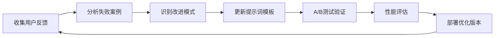

# 🎯 提示词工程最佳实践

<div align="center">


**Chat2SQL P1阶段 - SQL生成提示词设计与优化指南**

</div>

## 📋 概述

本文档专门针对Chat2SQL系统的SQL生成提示词设计，提供系统性的提示词工程方法论、模板库和优化策略。

## 🎯 核心原则

### 1. 精确性原则
- 生成的SQL必须语法正确
- 字段名必须与数据库结构完全匹配
- 数据类型转换必须准确

### 2. 安全性原则
- 只允许SELECT查询操作
- 禁止所有写操作（INSERT、UPDATE、DELETE）
- 防止SQL注入攻击

### 3. 可理解性原则
- 提示词结构清晰
- 规则明确且无歧义
- 示例具有代表性

## 🏗️ 提示词架构设计

### 基础架构模板

```go
// internal/ai/prompts/sql_generator.go
const BasePromptTemplate = `
## 角色定义
你是一个专业的SQL查询生成专家，专门为PostgreSQL 17数据库生成准确、安全的SELECT查询语句。

## 数据库结构
{{.DatabaseSchema}}

## 用户查询
{{.UserQuery}}

{{if .QueryHistory}}
## 历史查询参考
{{range .QueryHistory}}
- 查询: {{.Query}}
- SQL: {{.SQL}}
{{end}}
{{end}}

## 生成规则
1. 安全性：只生成SELECT查询，严禁DELETE/UPDATE/INSERT/DROP等操作
2. 准确性：字段名必须与上述数据库结构完全匹配
3. 语法：使用PostgreSQL 17标准语法
4. 格式：返回纯SQL语句，不包含解释文字和markdown格式
5. 性能：避免不必要的全表扫描，合理使用索引

## 特殊处理
- 时间查询：使用标准日期函数，如 DATE_TRUNC, NOW(), INTERVAL
- 模糊查询：使用ILIKE进行大小写不敏感匹配
- 聚合查询：合理使用GROUP BY和HAVING子句
- 排序：明确指定ORDER BY子句

## 输出要求
直接返回SQL语句，不要包含任何解释文字。

## 生成SQL
`
```

### 高级提示词模板

```go
// 意图感知的提示词模板
const IntentAwarePromptTemplate = `
## 系统角色
你是Chat2SQL的核心SQL生成引擎，具备以下能力：
- 理解中文自然语言查询意图
- 生成高效的PostgreSQL查询语句
- 确保查询安全性和性能优化

## 查询意图分析
查询类型：{{.QueryIntent}}
复杂度评估：{{.ComplexityLevel}}

## 数据库上下文
### 表结构信息
{{.DetailedSchema}}

### 业务上下文
{{if .BusinessContext}}
{{.BusinessContext}}
{{end}}

## 用户查询解析
原始查询：{{.UserQuery}}
关键实体：{{.ExtractedEntities}}
时间范围：{{.TimeRange}}

## SQL生成策略
{{if eq .QueryIntent "aggregation"}}
### 聚合查询策略
- 识别聚合函数：COUNT、SUM、AVG、MAX、MIN
- 合理使用GROUP BY分组
- 添加适当的HAVING条件
{{else if eq .QueryIntent "join"}}
### 关联查询策略
- 分析表间关系
- 选择最优的JOIN类型
- 确保JOIN条件正确
{{else if eq .QueryIntent "time_series"}}
### 时间序列查询策略
- 使用合适的时间函数
- 考虑时区处理
- 优化时间范围查询
{{end}}

## 性能优化建议
- 利用现有索引：{{.AvailableIndexes}}
- 避免全表扫描
- 合理限制返回记录数

## 安全检查清单
- ✓ 只包含SELECT操作
- ✓ 字段名与schema匹配
- ✓ 防止SQL注入
- ✓ 合理的WHERE条件

## SQL输出
`
```

## 📚 提示词模板库

### 1. 基础查询模板

```go
// 简单查询模板
const SimpleQueryTemplate = `
基于以下表结构，将用户查询转换为SQL：

表结构：{{.Schema}}
用户查询：{{.Query}}

要求：
1. 生成SELECT查询
2. 字段名精确匹配
3. 返回纯SQL语句

SQL：
`

// 条件查询模板
const ConditionalQueryTemplate = `
根据用户需求生成带条件的SQL查询：

数据库信息：{{.Schema}}
查询需求：{{.Query}}
筛选条件：{{.Conditions}}

生成规则：
- 使用WHERE子句添加筛选条件
- 字符串匹配使用ILIKE
- 数值比较使用精确操作符
- 时间查询使用DATE函数

SQL语句：
`
```

### 2. 聚合查询模板

```go
const AggregationTemplate = `
为以下聚合分析需求生成SQL：

## 数据源
{{.Schema}}

## 分析需求
{{.Query}}

## 聚合策略
- 识别度量字段：{{.Metrics}}
- 分组维度：{{.Dimensions}}
- 过滤条件：{{.Filters}}

## PostgreSQL聚合语法要求
1. SELECT子句包含分组字段和聚合函数
2. GROUP BY包含所有非聚合字段
3. 使用HAVING进行聚合结果筛选
4. ORDER BY提供合理排序

生成SQL：
`
```

### 3. 关联查询模板

```go
const JoinQueryTemplate = `
生成多表关联查询SQL：

## 相关表结构
{{range .Tables}}
### {{.TableName}}
{{.Schema}}
{{end}}

## 表关系说明
{{.Relationships}}

## 查询需求
{{.Query}}

## JOIN策略选择
- INNER JOIN：获取匹配记录
- LEFT JOIN：保留主表所有记录
- RIGHT JOIN：保留从表所有记录
- FULL OUTER JOIN：保留所有记录

## 性能考虑
- 优先使用有索引的字段作为JOIN条件
- 合理安排JOIN顺序
- 在WHERE子句中添加筛选条件

生成SQL：
`
```

### 4. 时间序列模板

```go
const TimeSeriesTemplate = `
生成时间序列分析SQL：

表结构：{{.Schema}}
时间字段：{{.TimeColumn}}
查询需求：{{.Query}}
时间范围：{{.TimeRange}}

## PostgreSQL时间函数
- DATE_TRUNC('day', timestamp): 按天分组
- EXTRACT(YEAR FROM date): 提取年份
- NOW() - INTERVAL '7 days': 最近7天
- AGE(timestamp1, timestamp2): 计算时间差

## 时间查询最佳实践
1. 使用时间索引优化查询性能
2. 明确指定时区处理
3. 合理设置时间范围避免全表扫描
4. 使用DATE_TRUNC进行时间分组

SQL查询：
`
```

## 🔧 提示词优化策略

### 1. 渐进式优化方法

```go
// 提示词版本管理
type PromptVersion struct {
    Version     string                 `json:"version"`
    Template    string                 `json:"template"`
    Performance PromptPerformance      `json:"performance"`
    TestCases   []PromptTestCase       `json:"test_cases"`
    CreatedAt   time.Time             `json:"created_at"`
}

type PromptPerformance struct {
    AccuracyRate    float64 `json:"accuracy_rate"`
    AvgResponseTime float64 `json:"avg_response_time"`
    TokenUsage      int     `json:"token_usage"`
    SuccessRate     float64 `json:"success_rate"`
}

// 提示词A/B测试框架
type PromptABTest struct {
    TestID      string    `json:"test_id"`
    VersionA    string    `json:"version_a"`
    VersionB    string    `json:"version_b"`
    SampleSize  int       `json:"sample_size"`
    StartTime   time.Time `json:"start_time"`
    Results     ABTestResults `json:"results"`
}
```

### 2. 上下文增强策略

```go
// 动态上下文构建
func (pe *PromptEngine) BuildEnhancedContext(
    userQuery string, 
    connectionID int64) (*EnhancedContext, error) {
    
    context := &EnhancedContext{
        UserQuery: userQuery,
    }
    
    // 1. 获取数据库Schema
    schema, err := pe.schemaService.GetDetailedSchema(connectionID)
    if err != nil {
        return nil, err
    }
    context.DatabaseSchema = schema
    
    // 2. 分析查询意图
    intent := pe.intentAnalyzer.Analyze(userQuery)
    context.QueryIntent = intent
    
    // 3. 提取关键实体
    entities := pe.entityExtractor.Extract(userQuery)
    context.ExtractedEntities = entities
    
    // 4. 获取相关历史查询
    history := pe.historyService.GetSimilarQueries(userQuery, 3)
    context.QueryHistory = history
    
    // 5. 添加业务上下文
    if businessContext := pe.getBusinessContext(connectionID); businessContext != nil {
        context.BusinessContext = businessContext
    }
    
    return context, nil
}
```

### 3. 失败案例学习

```go
// 失败案例分析和学习
type FailureAnalyzer struct {
    failureStore map[string]*FailureCase
    patterns     []FailurePattern
}

type FailureCase struct {
    UserQuery    string    `json:"user_query"`
    GeneratedSQL string    `json:"generated_sql"`
    ErrorType    string    `json:"error_type"`
    ErrorMessage string    `json:"error_message"`
    CorrectSQL   string    `json:"correct_sql"`
    Timestamp    time.Time `json:"timestamp"`
}

func (fa *FailureAnalyzer) LearnFromFailure(failure *FailureCase) {
    // 1. 识别失败模式
    pattern := fa.identifyFailurePattern(failure)
    
    // 2. 更新提示词模板
    if pattern.Frequency > 5 {
        fa.suggestPromptImprovement(pattern)
    }
    
    // 3. 添加到负面样本库
    fa.addNegativeExample(failure)
}
```

## 📊 提示词评估指标

### 1. 准确率评估

```go
// 准确率评估框架
type AccuracyEvaluator struct {
    testSuite    []TestCase
    sqlValidator *SQLValidator
    dbExecutor   *DatabaseExecutor
}

type TestCase struct {
    UserQuery      string `json:"user_query"`
    ExpectedSQL    string `json:"expected_sql"`
    ExpectedResult []map[string]interface{} `json:"expected_result"`
    Category       string `json:"category"`
    Difficulty     int    `json:"difficulty"`
}

func (ae *AccuracyEvaluator) EvaluatePrompt(
    promptTemplate string) (*EvaluationResult, error) {
    
    var correct, total int
    results := make([]TestResult, 0, len(ae.testSuite))
    
    for _, testCase := range ae.testSuite {
        // 生成SQL
        generatedSQL, err := ae.generateSQL(promptTemplate, testCase.UserQuery)
        if err != nil {
            results = append(results, TestResult{
                TestCase: testCase,
                Error:    err,
                Passed:   false,
            })
            total++
            continue
        }
        
        // 验证SQL语法
        if err := ae.sqlValidator.Validate(generatedSQL); err != nil {
            results = append(results, TestResult{
                TestCase:    testCase,
                GeneratedSQL: generatedSQL,
                Error:       err,
                Passed:      false,
            })
            total++
            continue
        }
        
        // 执行并比较结果
        passed := ae.compareResults(generatedSQL, testCase.ExpectedResult)
        if passed {
            correct++
        }
        total++
        
        results = append(results, TestResult{
            TestCase:     testCase,
            GeneratedSQL: generatedSQL,
            Passed:       passed,
        })
    }
    
    return &EvaluationResult{
        AccuracyRate: float64(correct) / float64(total),
        TotalTests:   total,
        PassedTests:  correct,
        Results:      results,
    }, nil
}
```

### 2. 性能评估

```go
// 性能评估指标
type PerformanceMetrics struct {
    AvgTokenUsage     float64 `json:"avg_token_usage"`
    AvgResponseTime   float64 `json:"avg_response_time"`
    P95ResponseTime   float64 `json:"p95_response_time"`
    SuccessRate       float64 `json:"success_rate"`
    CostPerQuery      float64 `json:"cost_per_query"`
}

func (pe *PerformanceEvaluator) EvaluatePerformance(
    promptTemplate string, 
    testQueries []string) (*PerformanceMetrics, error) {
    
    var totalTokens, totalTime int64
    var costs []float64
    var responseTimes []time.Duration
    var successes int
    
    for _, query := range testQueries {
        start := time.Now()
        
        response, err := pe.generateWithMetrics(promptTemplate, query)
        duration := time.Since(start)
        
        if err == nil {
            successes++
            totalTokens += int64(response.TokensUsed)
            costs = append(costs, response.Cost)
        }
        
        totalTime += duration.Milliseconds()
        responseTimes = append(responseTimes, duration)
    }
    
    return &PerformanceMetrics{
        AvgTokenUsage:   float64(totalTokens) / float64(len(testQueries)),
        AvgResponseTime: float64(totalTime) / float64(len(testQueries)),
        P95ResponseTime: calculateP95(responseTimes),
        SuccessRate:     float64(successes) / float64(len(testQueries)),
        CostPerQuery:    calculateAverage(costs),
    }, nil
}
```

## 🎛️ 动态提示词生成

### 1. 自适应提示词引擎

```go
// 自适应提示词引擎
type AdaptivePromptEngine struct {
    baseTemplates    map[string]string
    userPreferences  map[int64]*UserPreference
    contextAnalyzer  *ContextAnalyzer
    performanceTracker *PerformanceTracker
}

func (ape *AdaptivePromptEngine) GenerateOptimalPrompt(
    userID int64, 
    query string, 
    context *QueryContext) (string, error) {
    
    // 1. 分析查询复杂度
    complexity := ape.contextAnalyzer.AnalyzeComplexity(query)
    
    // 2. 获取用户偏好
    preference := ape.userPreferences[userID]
    
    // 3. 选择基础模板
    baseTemplate := ape.selectBaseTemplate(complexity, preference)
    
    // 4. 动态调整模板
    adjustedTemplate := ape.adjustTemplate(baseTemplate, context)
    
    // 5. 添加个性化元素
    finalTemplate := ape.personalize(adjustedTemplate, preference)
    
    return finalTemplate, nil
}

func (ape *AdaptivePromptEngine) adjustTemplate(
    template string, 
    context *QueryContext) string {
    
    // 根据上下文动态调整
    switch context.QueryIntent {
    case "aggregation":
        return ape.enhanceForAggregation(template, context)
    case "join":
        return ape.enhanceForJoin(template, context)
    case "time_series":
        return ape.enhanceForTimeSeries(template, context)
    default:
        return template
    }
}
```

### 2. 实时反馈优化

```go
// 实时反馈学习系统
type FeedbackLearningSystem struct {
    feedbackStore   *FeedbackStore
    promptOptimizer *PromptOptimizer
    updateTrigger   chan *FeedbackEvent
}

type FeedbackEvent struct {
    UserID       int64     `json:"user_id"`
    QueryID      string    `json:"query_id"`
    UserQuery    string    `json:"user_query"`
    GeneratedSQL string    `json:"generated_sql"`
    UserRating   int       `json:"user_rating"`
    Feedback     string    `json:"feedback"`
    IsCorrect    bool      `json:"is_correct"`
    Timestamp    time.Time `json:"timestamp"`
}

func (fls *FeedbackLearningSystem) ProcessFeedback(event *FeedbackEvent) {
    // 1. 存储反馈
    fls.feedbackStore.Store(event)
    
    // 2. 分析反馈模式
    pattern := fls.analyzeFeedbackPattern(event)
    
    // 3. 触发提示词优化
    if pattern.ShouldOptimize() {
        fls.updateTrigger <- event
    }
}

func (fls *FeedbackLearningSystem) StartLearningLoop() {
    go func() {
        for event := range fls.updateTrigger {
            // 异步优化提示词
            optimizedPrompt := fls.promptOptimizer.OptimizeBasedOnFeedback(event)
            
            // A/B测试新提示词
            fls.startABTest(optimizedPrompt)
        }
    }()
}
```

## 📋 测试用例库

### 1. 基础查询测试

```yaml
# test_cases/basic_queries.yaml
basic_queries:
  - name: "简单表查询"
    user_query: "查询所有用户信息"
    expected_sql: "SELECT * FROM users"
    category: "basic"
    difficulty: 1
    
  - name: "字段选择"
    user_query: "显示用户姓名和邮箱"
    expected_sql: "SELECT name, email FROM users"
    category: "basic"
    difficulty: 1
    
  - name: "条件查询"
    user_query: "查找年龄大于25岁的用户"
    expected_sql: "SELECT * FROM users WHERE age > 25"
    category: "basic"
    difficulty: 2
```

### 2. 复杂查询测试

```yaml
# test_cases/complex_queries.yaml
complex_queries:
  - name: "聚合统计"
    user_query: "统计各部门的员工数量"
    expected_sql: "SELECT department, COUNT(*) as employee_count FROM employees GROUP BY department"
    category: "aggregation"
    difficulty: 3
    
  - name: "多表关联"
    user_query: "查询用户及其订单信息"
    expected_sql: "SELECT u.name, o.order_date, o.total_amount FROM users u LEFT JOIN orders o ON u.id = o.user_id"
    category: "join"
    difficulty: 4
    
  - name: "时间序列分析"
    user_query: "查看最近30天的销售趋势"
    expected_sql: "SELECT DATE_TRUNC('day', created_at) as date, SUM(amount) as daily_sales FROM sales WHERE created_at >= NOW() - INTERVAL '30 days' GROUP BY DATE_TRUNC('day', created_at) ORDER BY date"
    category: "time_series"
    difficulty: 5
```

## 🚨 安全检查清单

### 提示词安全审核

```go
// 提示词安全审核器
type PromptSecurityAuditor struct {
    blacklistPatterns []string
    whitelistOps      []string
    sqlValidator      *SecurityValidator
}

func (psa *PromptSecurityAuditor) AuditPrompt(template string) (*SecurityAuditResult, error) {
    result := &SecurityAuditResult{
        IsSecure: true,
        Issues:   make([]SecurityIssue, 0),
    }
    
    // 1. 检查是否包含危险指令
    for _, pattern := range psa.blacklistPatterns {
        if strings.Contains(strings.ToLower(template), pattern) {
            result.Issues = append(result.Issues, SecurityIssue{
                Type:        "DANGEROUS_INSTRUCTION",
                Description: fmt.Sprintf("包含危险模式: %s", pattern),
                Severity:    "HIGH",
            })
            result.IsSecure = false
        }
    }
    
    // 2. 验证允许的操作
    if !psa.validateAllowedOperations(template) {
        result.Issues = append(result.Issues, SecurityIssue{
            Type:        "UNAUTHORIZED_OPERATION",
            Description: "包含不允许的SQL操作",
            Severity:    "HIGH",
        })
        result.IsSecure = false
    }
    
    return result, nil
}

var securityBlacklist = []string{
    "delete", "update", "insert", "drop", "create", "alter",
    "truncate", "grant", "revoke", "exec", "execute",
    "xp_", "sp_", "master", "sys", "information_schema",
}
```

## 📈 持续优化流程

### 1. 每日优化循环



### 2. 版本迭代策略

```go
// 提示词版本迭代管理
type PromptVersionManager struct {
    versions      map[string]*PromptVersion
    currentActive string
    rollbackStack []string
    abTestManager *ABTestManager
}

func (pvm *PromptVersionManager) DeployNewVersion(
    version *PromptVersion) error {
    
    // 1. 安全审核
    auditResult, err := pvm.securityAuditor.Audit(version)
    if err != nil || !auditResult.IsSecure {
        return fmt.Errorf("安全审核失败: %v", auditResult.Issues)
    }
    
    // 2. 性能预评估
    perfResult, err := pvm.performanceEvaluator.Evaluate(version)
    if err != nil || perfResult.AccuracyRate < 0.7 {
        return fmt.Errorf("性能评估不达标: 准确率 %.2f", perfResult.AccuracyRate)
    }
    
    // 3. 灰度发布
    err = pvm.abTestManager.StartGradualRollout(version, 0.1) // 10%流量
    if err != nil {
        return err
    }
    
    // 4. 监控和自动回滚
    go pvm.monitorAndAutoRollback(version)
    
    return nil
}
```

## 🏆 最佳实践总结

### ✅ 成功要素

1. **结构化设计**：清晰的提示词结构和层次
2. **上下文丰富**：充分利用数据库Schema和历史查询
3. **安全优先**：严格的安全规则和验证机制
4. **持续优化**：基于反馈的持续改进循环

### ⚠️ 常见陷阱

1. **过度复杂**：提示词过长导致模型理解困难
2. **规则冲突**：相互矛盾的生成规则
3. **上下文不足**：缺乏必要的业务上下文信息
4. **测试不充分**：边界情况覆盖不足

### 🎯 优化目标

- **准确率**: > 70% (目标: 85%+)
- **响应时间**: < 3s (目标: < 1s)
- **Token效率**: < 2000 tokens/query
- **安全性**: 100% 阻止危险操作

---

<div align="center">

**🎯 优秀的提示词是Chat2SQL成功的关键：精确+安全+高效**

</div>