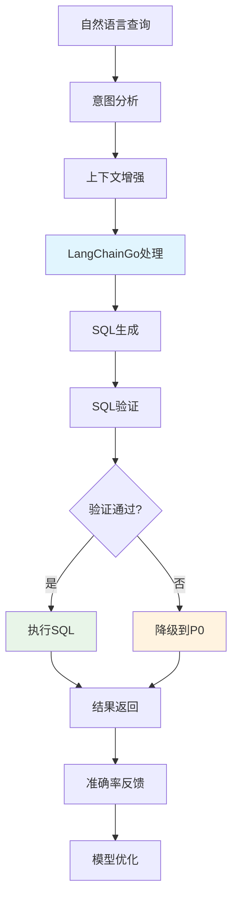

# 🤖 P1阶段：AI能力开发计划（3周）

<div align="center">


**智能SQL生成 - 基于LangChainGo的自然语言理解能力**

</div>

## 📋 项目概述

### 🎯 阶段目标
在P0稳定基座之上，集成LangChainGo AI框架，实现**自然语言转SQL**的核心能力，让业务人员能够用自然语言查询数据库。

### ✨ 核心价值
- ✅ **零门槛查询**：业务人员无需学习SQL语法
- ✅ **AI能力验证**：验证LangChainGo技术栈的可行性
- ✅ **智能理解**：支持复杂业务查询的语义理解
- ✅ **渐进式部署**：在P0基础上平滑升级，保证系统稳定性

### 📊 成功指标

| 指标类别 | 目标值 | 验证方式 |
|---------|-------|---------|
| **SQL生成准确率** | > 70% | 人工评估+自动化测试 |
| **API响应时间P95** | < 3s | 性能测试 |
| **AI模型可用性** | > 99% | 监控告警 |
| **降级机制可用性** | 100% | 故障注入测试 |
| **Token消耗效率** | < $0.01/查询 | 成本监控 |

---

## 🏗️ 技术架构设计

### 📦 P1核心组件架构

```go
// P1: 在P0基础上增加AI能力
type Chat2SQLServiceP1 struct {
    Chat2SQLCoreP0                      // 继承P0全部功能
    
    // 🤖 LangChainGo AI核心
    llmProvider    llms.Model           // LangChainGo单模型提供商
    promptTemplate *prompts.PromptTemplate // 提示词模板引擎
    chainManager   *chains.Chain        // 链式处理管理器
    
    // 🧠 智能处理组件
    sqlParser      *SQLParser           // SQL解析和验证
    contextManager *ContextManager      // 上下文管理
    intentAnalyzer *IntentAnalyzer      // 意图分析器
    
    // 📊 监控和优化
    costTracker    *CostTracker         // Token消耗追踪
    accuracyMonitor *AccuracyMonitor    // 准确率监控
    performanceProfiler *PerformanceProfiler // 性能分析
}
```

### 🔄 AI处理流程设计



### 🧠 LangChainGo集成架构

```go
// LangChainGo多模型提供商配置
type LLMProviderConfig struct {
    // 主要模型配置
    PrimaryModel struct {
        Provider    string `json:"provider"`     // "openai"
        Model       string `json:"model"`        // "gpt-4o-mini"
        Temperature float64 `json:"temperature"` // 0.1
        MaxTokens   int     `json:"max_tokens"`  // 2048
        TopP        float64 `json:"top_p"`       // 0.9
    } `json:"primary_model"`
    
    // 备用模型配置  
    FallbackModel struct {
        Provider    string `json:"provider"`     // "claude"
        Model       string `json:"model"`        // "claude-3-haiku"
        Temperature float64 `json:"temperature"` // 0.0
        MaxTokens   int     `json:"max_tokens"`  // 1024
    } `json:"fallback_model"`
    
    // 请求限制
    RateLimit struct {
        RequestsPerMinute int `json:"requests_per_minute"` // 60
        TokensPerMinute   int `json:"tokens_per_minute"`   // 50000
    } `json:"rate_limit"`
}
```

---

## 📅 3周开发计划

### 🗓️ 第1周：LangChainGo基础集成

#### Day 1-2: 环境准备 + 核心依赖

- [ ] **LangChainGo依赖集成**
  ```go
  // go.mod新增AI依赖
  require (
      github.com/tmc/langchaingo v0.1.15
      github.com/tmc/langchaingo/llms/openai v0.1.15
      github.com/tmc/langchaingo/llms/anthropic v0.1.15
      github.com/tmc/langchaingo/prompts v0.1.15
      github.com/tmc/langchaingo/chains v0.1.15
  )
  ```

- [ ] **AI服务基础架构**
  ```go
  // internal/ai/service.go
  type AIService struct {
      llmClient  llms.Model
      config     *LLMProviderConfig
      httpClient *http.Client
      metrics    *prometheus.CounterVec
  }
  
  func NewAIService(config *LLMProviderConfig) (*AIService, error) {
      // 初始化LangChainGo客户端
      client, err := openai.New(
          openai.WithToken(config.APIKey),
          openai.WithModel(config.PrimaryModel.Model),
      )
      if err != nil {
          return nil, err
      }
      
      return &AIService{
          llmClient: client,
          config:    config,
      }, nil
  }
  ```

#### Day 3-4: 提示词工程基础

- [ ] **SQL生成提示词模板**
  ```go
  // internal/ai/prompts.go
  const SQLGenerationPromptTemplate = `
  你是一个专业的SQL查询生成专家。根据用户的自然语言需求，生成准确的PostgreSQL查询语句。
  
  ## 数据库结构信息：
  {{.DatabaseSchema}}
  
  ## 用户查询：
  {{.UserQuery}}
  
  ## 规则：
  1. 只生成SELECT查询，禁止DELETE/UPDATE/INSERT/DROP操作
  2. 使用PostgreSQL 17语法
  3. 字段名必须与数据库结构完全匹配
  4. 返回格式：纯SQL语句，不包含解释文字
  5. 如果查询不明确，返回最合理的解释
  
  ## 生成SQL：
  `
  
  func (ai *AIService) CreateSQLPrompt(userQuery, schema string) (*prompts.PromptTemplate, error) {
      template := prompts.NewPromptTemplate(
          SQLGenerationPromptTemplate,
          []string{"UserQuery", "DatabaseSchema"},
      )
      
      return template, nil
  }
  ```

- [ ] **上下文管理器**
  ```go
  // internal/ai/context.go
  type ContextManager struct {
      schemaCache   map[int64]string // connectionID -> schema
      historyBuffer map[int64][]QueryHistory // 查询历史
      maxHistory    int
  }
  
  func (cm *ContextManager) BuildContext(connectionID int64, userQuery string) (*QueryContext, error) {
      schema := cm.schemaCache[connectionID]
      history := cm.getRecentHistory(connectionID, 5)
      
      return &QueryContext{
          UserQuery:      userQuery,
          DatabaseSchema: schema,
          QueryHistory:   history,
          Timestamp:      time.Now(),
      }, nil
  }
  ```

#### Day 5-7: SQL生成核心逻辑

- [ ] **AI查询处理器**
  ```go
  // internal/ai/query_processor.go
  type QueryProcessor struct {
      aiService     *AIService
      contextMgr    *ContextManager
      sqlValidator  *SQLValidator
      costTracker   *CostTracker
  }
  
  func (qp *QueryProcessor) ProcessNaturalLanguageQuery(
      ctx context.Context, req *ChatRequest) (*SQLResponse, error) {
      
      // 1. 构建查询上下文
      queryCtx, err := qp.contextMgr.BuildContext(req.ConnectionID, req.Query)
      if err != nil {
          return nil, err
      }
      
      // 2. 生成提示词
      prompt, err := qp.aiService.CreateSQLPrompt(req.Query, queryCtx.DatabaseSchema)
      if err != nil {
          return nil, err
      }
      
      // 3. 调用LangChainGo生成SQL
      start := time.Now()
      response, err := qp.aiService.llmClient.GenerateContent(ctx,
          []llms.MessageContent{llms.TextParts(llms.ChatMessageTypeHuman, prompt.Format())})
      duration := time.Since(start)
      
      if err != nil {
          return nil, err
      }
      
      // 4. 提取SQL语句
      sql := qp.extractSQL(response.Choices[0].Content)
      
      // 5. SQL验证
      if err := qp.sqlValidator.Validate(sql); err != nil {
          return nil, fmt.Errorf("生成的SQL无效: %w", err)
      }
      
      // 6. 记录成本
      qp.costTracker.RecordUsage(response.Usage.TotalTokens, duration)
      
      return &SQLResponse{
          SQL:           sql,
          Confidence:    0.8, // TODO: 实现置信度算法
          TokensUsed:    response.Usage.TotalTokens,
          ProcessingTime: duration,
      }, nil
  }
  ```

---

### 🗓️ 第2周：智能验证 + 性能优化

#### Day 8-9: SQL验证和安全

- [ ] **SQL安全验证器**
  ```go
  // internal/ai/sql_validator.go
  type SQLValidator struct {
      parser       *SQLParser
      blacklist    []string
      schemaValidator *SchemaValidator
  }
  
  func (sv *SQLValidator) Validate(sql string) error {
      // 1. 基础安全检查
      if err := sv.checkSecurityRules(sql); err != nil {
          return err
      }
      
      // 2. 语法解析验证
      ast, err := sv.parser.Parse(sql)
      if err != nil {
          return fmt.Errorf("SQL语法错误: %w", err)
      }
      
      // 3. 权限验证
      if err := sv.validatePermissions(ast); err != nil {
          return err
      }
      
      // 4. 性能检查（避免全表扫描等）
      if err := sv.checkPerformanceRisks(ast); err != nil {
          return err
      }
      
      return nil
  }
  
  func (sv *SQLValidator) checkSecurityRules(sql string) error {
      upperSQL := strings.ToUpper(sql)
      
      // 禁止的操作
      forbiddenOps := []string{
          "DELETE", "UPDATE", "INSERT", "DROP", "CREATE", 
          "ALTER", "TRUNCATE", "REPLACE", "GRANT", "REVOKE",
      }
      
      for _, op := range forbiddenOps {
          if strings.Contains(upperSQL, op) {
              return fmt.Errorf("禁止的SQL操作: %s", op)
          }
      }
      
      return nil
  }
  ```

- [ ] **意图分析器**
  ```go
  // internal/ai/intent_analyzer.go
  type IntentAnalyzer struct {
      patterns map[QueryIntent][]string
  }
  
  type QueryIntent int
  const (
      IntentDataQuery QueryIntent = iota
      IntentAggregation
      IntentJoinQuery
      IntentTimeSeriesAnalysis
      IntentUnknown
  )
  
  func (ia *IntentAnalyzer) AnalyzeIntent(query string) QueryIntent {
      lowerQuery := strings.ToLower(query)
      
      // 聚合查询检测
      if containsAny(lowerQuery, []string{"总数", "平均", "最大", "最小", "统计"}) {
          return IntentAggregation
      }
      
      // 时间序列分析
      if containsAny(lowerQuery, []string{"趋势", "变化", "过去", "最近"}) {
          return IntentTimeSeriesAnalysis
      }
      
      // 关联查询
      if containsAny(lowerQuery, []string{"关联", "联合", "连接"}) {
          return IntentJoinQuery
      }
      
      return IntentDataQuery
  }
  ```

#### Day 10-11: 性能优化 + 流式处理

- [ ] **LangChainGo并发优化**
  ```go
  // internal/ai/performance.go
  type PerformanceOptimizer struct {
      workerPool   *WorkerPool
      objectPool   sync.Pool
      metrics      *PerformanceMetrics
  }
  
  type WorkerPool struct {
      workers     int
      jobQueue    chan QueryJob
      resultQueue chan QueryResult
      quit        chan bool
  }
  
  func (po *PerformanceOptimizer) ProcessConcurrentQueries(
      ctx context.Context, queries []ChatRequest) ([]*SQLResponse, error) {
      
      var wg sync.WaitGroup
      results := make([]*SQLResponse, len(queries))
      semaphore := make(chan struct{}, po.workerPool.workers)
      
      for i, query := range queries {
          wg.Add(1)
          go func(index int, req ChatRequest) {
              defer wg.Done()
              
              // 并发控制
              semaphore <- struct{}{}
              defer func() { <-semaphore }()
              
              // 对象重用，减少GC压力
              processor := po.objectPool.Get().(*QueryProcessor)
              defer func() {
                  processor.Reset()
                  po.objectPool.Put(processor)
              }()
              
              result, err := processor.ProcessNaturalLanguageQuery(ctx, &req)
              if err != nil {
                  results[index] = &SQLResponse{Error: err}
                  return
              }
              
              results[index] = result
          }(i, query)
      }
      
      wg.Wait()
      return results, nil
  }
  ```

- [ ] **流式响应处理**
  ```go
  // internal/ai/streaming.go
  func (ai *AIService) GenerateStreamingSQL(
      ctx context.Context, req *ChatRequest) (<-chan StreamResponse, error) {
      
      responseChan := make(chan StreamResponse, 10)
      
      go func() {
          defer close(responseChan)
          
          // 流式生成SQL
          _, err := ai.llmClient.GenerateContent(ctx,
              []llms.MessageContent{llms.TextParts(llms.ChatMessageTypeHuman, req.Query)},
              llms.WithStreamingFunc(func(ctx context.Context, chunk []byte) error {
                  select {
                  case responseChan <- StreamResponse{
                      Type: "chunk",
                      Data: string(chunk),
                  }:
                  case <-ctx.Done():
                      return ctx.Err()
                  }
                  return nil
              }),
          )
          
          if err != nil {
              responseChan <- StreamResponse{
                  Type: "error",
                  Data: err.Error(),
              }
          }
      }()
      
      return responseChan, nil
  }
  ```

#### Day 12-14: 监控 + 成本控制

- [ ] **AI成本监控**
  ```go
  // internal/ai/cost_tracker.go
  type CostTracker struct {
      dailyUsage   map[string]*DailyUsage // date -> usage
      userUsage    map[int64]*UserUsage   // userID -> usage
      budgetLimits *BudgetLimits
      alerts       *AlertManager
  }
  
  type TokenUsage struct {
      InputTokens  int     `json:"input_tokens"`
      OutputTokens int     `json:"output_tokens"`
      TotalTokens  int     `json:"total_tokens"`
      Cost         float64 `json:"cost_usd"`
      Timestamp    time.Time `json:"timestamp"`
  }
  
  func (ct *CostTracker) RecordUsage(userID int64, usage TokenUsage) error {
      // 记录用户使用量
      if ct.userUsage[userID] == nil {
          ct.userUsage[userID] = &UserUsage{}
      }
      ct.userUsage[userID].AddUsage(usage)
      
      // 检查预算限制
      if ct.userUsage[userID].DailyCost > ct.budgetLimits.DailyPerUser {
          return fmt.Errorf("用户日预算已超限: %.2f > %.2f", 
              ct.userUsage[userID].DailyCost, ct.budgetLimits.DailyPerUser)
      }
      
      // 发送告警
      if ct.userUsage[userID].DailyCost > ct.budgetLimits.DailyPerUser*0.8 {
          ct.alerts.SendBudgetWarning(userID, ct.userUsage[userID].DailyCost)
      }
      
      return nil
  }
  ```

- [ ] **准确率监控**
  ```go
  // internal/ai/accuracy_monitor.go
  type AccuracyMonitor struct {
      feedbackStore map[string]*QueryFeedback
      metrics       *AccuracyMetrics
  }
  
  type QueryFeedback struct {
      QueryID     string    `json:"query_id"`
      UserQuery   string    `json:"user_query"`
      GeneratedSQL string   `json:"generated_sql"`
      IsCorrect   bool      `json:"is_correct"`
      UserRating  int       `json:"user_rating"` // 1-5
      Feedback    string    `json:"feedback"`
      Timestamp   time.Time `json:"timestamp"`
  }
  
  func (am *AccuracyMonitor) RecordFeedback(feedback QueryFeedback) {
      am.feedbackStore[feedback.QueryID] = &feedback
      
      // 更新准确率指标
      am.metrics.UpdateAccuracy(feedback.IsCorrect)
      
      // 如果准确率低于阈值，触发告警
      if am.metrics.GetDailyAccuracy() < 0.7 {
          am.alertLowAccuracy()
      }
  }
  ```

---

### 🗓️ 第3周：集成测试 + 部署优化

#### Day 15-17: 集成测试 + API完善

- [ ] **AI服务集成测试**
  ```go
  // internal/ai/service_test.go
  func TestAIService_GenerateSQL(t *testing.T) {
      ai := setupTestAIService(t)
      
      testCases := []struct {
          name         string
          userQuery    string
          expectedSQL  string
          expectError  bool
      }{
          {
              name:        "简单查询",
              userQuery:   "查询所有用户信息",
              expectedSQL: "SELECT * FROM users",
              expectError: false,
          },
          {
              name:        "聚合查询",
              userQuery:   "统计用户总数",
              expectedSQL: "SELECT COUNT(*) FROM users",
              expectError: false,
          },
          {
              name:        "非法查询",
              userQuery:   "删除所有用户",
              expectError: true,
          },
      }
      
      for _, tc := range testCases {
          t.Run(tc.name, func(t *testing.T) {
              req := &ChatRequest{
                  Query:        tc.userQuery,
                  ConnectionID: 1,
                  UserID:       1,
              }
              
              resp, err := ai.ProcessNaturalLanguageQuery(context.Background(), req)
              
              if tc.expectError {
                  assert.Error(t, err)
              } else {
                  assert.NoError(t, err)
                  assert.Contains(t, resp.SQL, tc.expectedSQL)
                  assert.Greater(t, resp.Confidence, 0.5)
              }
          })
      }
  }
  ```

- [ ] **HTTP API接口**
  ```go
  // internal/handler/ai_handler.go
  type AIHandler struct {
      aiService *ai.QueryProcessor
      logger    *zap.Logger
  }
  
  // POST /api/v1/ai/chat2sql
  func (h *AIHandler) Chat2SQL(c *gin.Context) {
      var req ChatRequest
      if err := c.ShouldBindJSON(&req); err != nil {
          c.JSON(400, gin.H{"error": "请求参数无效"})
          return
      }
      
      // 设置请求超时
      ctx, cancel := context.WithTimeout(c.Request.Context(), 30*time.Second)
      defer cancel()
      
      // 处理AI查询
      resp, err := h.aiService.ProcessNaturalLanguageQuery(ctx, &req)
      if err != nil {
          h.logger.Error("AI查询处理失败", zap.Error(err))
          c.JSON(500, gin.H{"error": "AI查询处理失败"})
          return
      }
      
      c.JSON(200, gin.H{
          "sql":            resp.SQL,
          "confidence":     resp.Confidence,
          "processing_time": resp.ProcessingTime.Milliseconds(),
          "tokens_used":    resp.TokensUsed,
      })
  }
  
  // POST /api/v1/ai/feedback
  func (h *AIHandler) SubmitFeedback(c *gin.Context) {
      var feedback QueryFeedback
      if err := c.ShouldBindJSON(&feedback); err != nil {
          c.JSON(400, gin.H{"error": "反馈参数无效"})
          return
      }
      
      h.aiService.RecordFeedback(feedback)
      c.JSON(200, gin.H{"message": "反馈提交成功"})
  }
  ```

#### Day 18-19: 性能测试 + 优化

- [ ] **AI性能压力测试**
  ```bash
  # 使用wrk进行AI接口压力测试
  wrk -t8 -c100 -d60s \
      -H "Authorization: Bearer ${TOKEN}" \
      -H "Content-Type: application/json" \
      -s ai_stress_test.lua \
      http://localhost:8080/api/v1/ai/chat2sql
  ```

  ```lua
  -- ai_stress_test.lua
  local json = require("json")
  
  local queries = {
      "查询所有用户信息",
      "统计最近一周的订单数量",
      "查找上个月销售额最高的产品",
      "显示各部门的员工数量分布"
  }
  
  request = function()
      local query = queries[math.random(#queries)]
      local body = json.encode({
          query = query,
          connection_id = 1,
          user_id = math.random(1000)
      })
      
      return wrk.format("POST", "/api/v1/ai/chat2sql", {
          ["Content-Type"] = "application/json",
          ["Authorization"] = "Bearer " .. os.getenv("TOKEN")
      }, body)
  end
  ```

- [ ] **模型响应时间优化**
  ```go
  // internal/ai/optimization.go
  type ResponseTimeOptimizer struct {
      responseCache map[string]*CachedResponse
      cacheTTL      time.Duration
      prewarming    *PrewarmingManager
  }
  
  func (rto *ResponseTimeOptimizer) OptimizeResponse(query string) {
      // 1. 查询缓存
      if cached := rto.responseCache[hash(query)]; cached != nil {
          if time.Since(cached.Timestamp) < rto.cacheTTL {
              return cached.Response
          }
      }
      
      // 2. 预热常用模式
      rto.prewarming.WarmupCommonPatterns()
      
      // 3. 异步预生成相似查询
      go rto.preGenerateSimilarQueries(query)
  }
  ```

#### Day 20-21: 文档 + 部署准备

- [ ] **API文档更新**
  ```go
  // Swagger文档注释
  // @Summary Chat2SQL智能查询
  // @Description 将自然语言转换为SQL查询
  // @Tags AI
  // @Accept json
  // @Produce json
  // @Param request body ChatRequest true "查询请求"
  // @Success 200 {object} SQLResponse
  // @Failure 400 {object} ErrorResponse
  // @Failure 500 {object} ErrorResponse
  // @Router /api/v1/ai/chat2sql [post]
  func (h *AIHandler) Chat2SQL(c *gin.Context) { ... }
  ```

- [ ] **Docker配置更新**
  ```dockerfile
  # 添加AI相关依赖
  FROM golang:1.23-alpine AS builder
  
  # 安装AI模型依赖
  RUN apk add --no-cache git ca-certificates
  
  WORKDIR /app
  COPY go.mod go.sum ./
  
  # 下载LangChainGo依赖
  RUN go mod download
  
  COPY . .
  RUN CGO_ENABLED=0 GOOS=linux go build \
      -ldflags="-w -s" \
      -o chat2sql ./cmd/server
  
  FROM alpine:latest
  RUN apk --no-cache add ca-certificates tzdata
  
  WORKDIR /root/
  COPY --from=builder /app/chat2sql .
  COPY --from=builder /app/configs ./configs
  
  # AI配置文件
  COPY --from=builder /app/prompts ./prompts
  
  EXPOSE 8080
  CMD ["./chat2sql"]
  ```

---

## ✅ 验收标准

### 🔍 功能验收

| 功能模块 | 验收标准 | 测试方法 |
|---------|---------|---------|
| **自然语言理解** | 支持常见的中文查询语句 | 人工测试 + 自动化测试 |
| **SQL生成** | 生成语法正确的PostgreSQL查询 | SQL解析器验证 |
| **安全验证** | 100%阻止非SELECT操作 | 安全测试用例 |
| **降级机制** | AI失败时自动降级到P0 | 故障注入测试 |
| **成本控制** | Token使用量在预算范围内 | 成本监控报告 |

### 📊 性能验收

| 性能指标 | 目标值 | 当前值 | 状态 |
|---------|-------|-------|------|
| SQL生成准确率 | > 70% | TBD | ⏳ |
| API响应时间P95 | < 3s | TBD | ⏳ |
| AI模型可用性 | > 99% | TBD | ⏳ |
| 并发处理能力 | > 50 QPS | TBD | ⏳ |
| Token消耗效率 | < $0.01/查询 | TBD | ⏳ |

### 🧠 AI能力验收

- [ ] **基础查询生成**：SELECT、WHERE、ORDER BY
- [ ] **聚合查询**：COUNT、SUM、AVG、GROUP BY
- [ ] **关联查询**：INNER JOIN、LEFT JOIN
- [ ] **时间查询**：日期范围、时间函数
- [ ] **复杂条件**：AND、OR、IN、LIKE

---

## 📈 质量保障

### 🧪 测试策略

```yaml
AI测试覆盖率目标:
  单元测试: "> 80%"
  集成测试: "> 90%"
  准确率测试: "500+样本"
  性能测试: "并发100用户"

测试数据集:
  基础查询: "100个样本"
  复杂查询: "200个样本"
  边界情况: "100个样本"
  恶意输入: "100个样本"
```

### 🤖 AI模型管理

- [ ] **模型版本控制**：LangChainGo模型版本管理
- [ ] **A/B测试框架**：不同模型效果对比
- [ ] **提示词版本化**：提示词模板的版本管理
- [ ] **模型监控**：响应时间、准确率实时监控

### 🔧 开发工具

```bash
# AI开发环境工具链
go install github.com/swaggo/swag/cmd/swag@latest
go install github.com/golangci/golangci-lint/cmd/golangci-lint@latest

# AI模型测试工具
pip install openai anthropic  # 用于测试对比
```

---

## 🚀 部署策略

### 📦 交付物

1. **AI服务代码**：完整的LangChainGo集成代码
2. **提示词模板**：SQL生成的提示词模板库
3. **配置文件**：AI模型配置和参数调优
4. **测试数据集**：AI准确率测试的标准数据集
5. **监控仪表板**：AI性能和成本监控面板

### 🎯 上线检查清单

- [ ] LangChainGo集成测试通过
- [ ] SQL生成准确率达标（>70%）
- [ ] AI安全验证通过
- [ ] 成本监控配置完成
- [ ] 降级机制验证通过
- [ ] API文档更新完成
- [ ] 性能测试达标
- [ ] 监控告警配置

---

## 🔄 后续P2阶段准备

### 📋 P2阶段预览

P1完成后，P2阶段将重点实现：

1. **多模型智能路由**：根据查询复杂度选择最优模型
2. **语义缓存**：Redis向量缓存，提高响应速度
3. **成本优化**：智能模型选择，降低AI成本50%+

### 🔗 技术债务管理

- [ ] **代码重构**：为P2多模型架构做准备
- [ ] **性能优化**：基于P1性能数据进行优化
- [ ] **监控增强**：为P2阶段添加更详细的监控指标

---

## 📞 支持联系

| 角色 | 负责人 | 联系方式 |
|-----|-------|---------|
| **AI工程师** | TBD | TBD |
| **后端工程师** | TBD | TBD |
| **算法工程师** | TBD | TBD |
| **产品经理** | TBD | TBD |

---

<div align="center">

**🎯 P1阶段成功标准：实现稳定可用的自然语言转SQL能力，准确率达到70%以上**

</div>