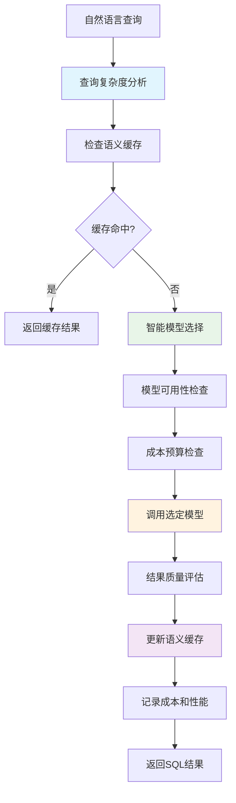

# 🧠 P2阶段：智能路由开发计划（4周）

<div align="center">


**智能路由 - 基于多模型的成本优化与性能提升**

</div>

## 📋 项目概述

### 🎯 阶段目标
在P0-P1稳定基础之上，实现**多模型智能路由系统**，通过智能模型选择、语义缓存和成本控制，大幅降低AI调用成本并提升系统性能。

### ✨ 核心价值
- ✅ **成本优化**：通过智能路由策略降低AI调用成本50%+
- ✅ **性能提升**：语义缓存机制减少重复计算，提升响应速度
- ✅ **智能选择**：根据查询复杂度自动选择最优模型
- ✅ **成本控制**：实时监控和预算管理，避免成本失控

### 📊 成功指标

| 指标类别 | 目标值 | 验证方式 |
|---------|-------|---------| 
| **成本降低率** | > 50% | 成本分析报告 |
| **缓存命中率** | > 75% | Redis监控指标 |
| **API响应时间P95** | < 1.5s | 性能测试 |
| **模型路由准确率** | > 95% | 路由算法验证 |
| **系统可用性** | > 99.5% | 监控告警 |

---

## 🏗️ 技术架构设计

### 📦 P2核心组件架构

P2阶段在P0+P1基础上，实现智能多模型路由系统，通过路由优化、缓存机制和成本控制实现显著的成本节省：

**核心组件：**
- **智能路由核心**：模型选择、路由决策、模型注册管理
- **语义缓存层**：Redis缓存、缓存策略、多层缓存架构
- **成本控制**：实时追踪、预算管理、使用量统计
- **监控分析**：性能监控、成本分析、预测优化

📖 **详细架构设计**：参考 [P2-技术指南目录](./P2-技术指南/) 中的完整技术实现

### 🔄 智能路由处理流程



### 🧠 多模型智能路由架构

P2阶段实现基于查询复杂度的智能模型选择，支持多层次路由策略：

**路由策略：**
- **简单查询(40%)**：本地Ollama或DeepSeek ($0-0.14/1K tokens)
- **中等查询(45%)**：GPT-4o-mini或Claude-3.5 Haiku ($0.15-0.25/1K tokens)
- **复杂查询(15%)**：GPT-4o或Claude-3.5 Sonnet ($2.5-3.0/1K tokens)

**关键特性：**
- 复杂度阈值自动分类
- 成本、性能、准确率多目标优化
- 故障降级和重试机制
- 实时负载均衡

📖 **详细实现指南**：参考 [多模型智能路由实现指南](./P2-技术指南/多模型智能路由实现指南.md)

---

## 📅 4周开发计划

### 🗓️ 第1周：多模型路由引擎基础

#### Day 1-2: 模型注册与管理系统
- [ ] **模型注册中心**：支持OpenAI、Claude、DeepSeek、Ollama模型注册
- [ ] **模型健康检查**：实时监控模型可用性、延迟和限流状态
- [ ] **模型配置管理**：支持动态配置更新和热重载

#### Day 3-4: 查询复杂度分析引擎
- [ ] **复杂度评估算法**：基于关键词、语法结构、表关联复杂度评分
- [ ] **查询分类器**：简单/中等/复杂查询自动分类
- [ ] **历史学习机制**：基于查询历史优化分类准确率

#### Day 5-7: 智能路由决策引擎
- [ ] **路由算法核心**：基于成本、性能、准确率的多目标优化
- [ ] **实时负载均衡**：模型QPS限制和动态负载分配
- [ ] **降级策略**：模型故障时的自动降级和重试机制

---

### 🗓️ 第2周：语义缓存系统

#### Day 8-9: Redis语义缓存引擎
- [ ] **精确匹配缓存**：查询字符串完全匹配的高速缓存
- [ ] **语义相似缓存**：基于编辑距离和向量相似度的语义缓存
- [ ] **分层缓存策略**：L1内存缓存 + L2 Redis缓存

#### Day 10-11: 缓存策略优化
- [ ] **TTL动态调整**：根据查询频率和准确率动态调整过期时间
- [ ] **缓存预热机制**：常用查询模式预加载
- [ ] **缓存清理策略**：LRU + 定期清理过期和低质量缓存

#### Day 12-14: 缓存性能监控
- [ ] **缓存指标收集**：命中率、延迟、内存使用率监控
- [ ] **缓存分析工具**：缓存效果分析和优化建议
- [ ] **告警机制**：缓存故障和性能异常告警

---

### 🗓️ 第3周：成本控制系统

#### Day 15-17: 成本监控与追踪
- [ ] **实时成本追踪**：Token使用量和成本实时统计
- [ ] **多维度预算管理**：用户/部门/公司级别预算控制
- [ ] **成本分析报告**：详细的成本分解和趋势分析

#### Day 18-19: 智能成本优化
- [ ] **成本预测模型**：基于历史数据预测未来成本趋势
- [ ] **成本异常检测**：异常成本增长自动告警
- [ ] **成本优化建议**：自动生成成本优化策略建议

#### Day 20-21: 预算控制与告警
- [ ] **预算限制机制**：达到预算阈值时的自动限流和停止
- [ ] **成本告警系统**：多级告警和通知机制
- [ ] **紧急制动机制**：成本失控时的紧急停止功能

---

### 🗓️ 第4周：系统集成与优化

#### Day 22-24: 端到端集成测试
- [ ] **功能集成测试**：多模型路由、缓存、成本控制的整体测试
- [ ] **性能基准测试**：与P1阶段对比的性能和成本基准测试
- [ ] **稳定性测试**：长时间运行和压力测试

#### Day 25-26: 性能调优与监控
- [ ] **路由算法优化**：基于测试数据优化路由决策算法
- [ ] **缓存策略调优**：优化缓存配置以提升命中率
- [ ] **监控仪表板**：Grafana仪表板展示路由和成本指标

#### Day 27-28: 文档与部署准备
- [ ] **技术文档**：路由算法、缓存策略、成本控制的详细文档
- [ ] **运维手册**：部署、配置、故障排查手册
- [ ] **API文档更新**：新增路由和成本相关API的文档
- 📖 **技术指南**：参考下方技术指南导航获取详细实现文档

---

## 📚 技术指南导航

P2阶段的详细技术实现已拆分为专门的技术指南，请根据开发任务参考相应文档：

| 技术指南 | 适用阶段 | 主要内容 |
|---------|---------|---------|
| [多模型智能路由实现指南](./P2-技术指南/多模型智能路由实现指南.md) | 第1周 | 模型注册、复杂度分析、路由决策算法 |
| [Redis语义缓存系统指南](./P2-技术指南/Redis语义缓存系统指南.md) | 第2周 | 缓存架构、策略优化、性能监控 |
| [成本控制与监控指南](./P2-技术指南/成本控制与监控指南.md) | 第3周 | 成本追踪、预算管理、告警系统 |
| [P2阶段-智能路由任务追踪表](./P2阶段-智能路由任务追踪表.md) | 全程 | 任务跟踪、风险管理、进度监控 |

💡 **使用建议**：
- 开发前先阅读相关技术指南了解实现细节
- 根据本文档的时间安排参考对应的技术指南
- 遇到技术问题时查阅最佳实践指南
- 使用任务追踪表管理日常开发进度

---

## ✅ 验收标准

### 🔍 功能验收

| 功能模块 | 验收标准 | 测试方法 |
|---------|---------|---------| 
| **多模型路由** | 支持4+种模型智能选择 | 自动化测试 |
| **语义缓存** | 缓存命中率>75% | 缓存性能测试 |
| **成本控制** | 成本降低>50% | 成本对比分析 |
| **性能优化** | 响应时间提升>30% | 性能基准测试 |
| **系统集成** | 与P0-P1系统无缝集成 | 集成测试 |

### 📊 性能验收

| 性能指标 | 目标值 | 当前值 | 状态 |
|---------|-------|-------|------|
| 成本降低率 | > 50% | TBD | ⏳ |
| 缓存命中率 | > 75% | TBD | ⏳ |
| 路由准确率 | > 95% | TBD | ⏳ |
| API响应时间P95 | < 1.5s | TBD | ⏳ |
| 系统可用性 | > 99.5% | TBD | ⏳ |

### 🧠 路由能力验收

- [ ] **查询复杂度分析**：准确识别查询复杂度并选择合适模型
- [ ] **智能模型选择**：基于成本、性能、准确率的最优模型选择
- [ ] **降级机制**：模型故障时的自动降级和恢复
- [ ] **负载均衡**：多模型间的智能负载分配
- [ ] **成本优化**：实现预期的成本节省目标

---

## 🚀 部署策略

### 📦 交付物

1. **智能路由系统**：完整的多模型路由引擎和决策算法
2. **语义缓存系统**：高性能Redis缓存系统和策略配置
3. **成本控制系统**：实时成本监控和预算管理工具
4. **监控仪表板**：路由性能、缓存效果、成本趋势的可视化
5. **配置管理**：模型配置、路由策略、预算设置的管理界面

### 🎯 上线检查清单

- [ ] 多模型接入配置完成
- [ ] Redis缓存服务部署完成
- [ ] 成本监控系统正常运行
- [ ] 路由算法验证通过
- [ ] 缓存命中率达标（>75%）
- [ ] 成本优化目标达成（>50%）
- [ ] 监控告警配置完成

---

## 📈 质量保障

### 🧪 测试策略

```yaml
智能路由测试覆盖率目标:
  单元测试: "> 80%"
  集成测试: "> 90%"
  路由准确率测试: "1000+样本"
  成本优化测试: "7天持续测试"

测试数据集:
  路由决策: "500个不同复杂度查询"
  缓存效果: "1000个重复查询样本"
  成本分析: "30天历史数据对比"
  性能基准: "100并发压力测试"
```

### 🔍 智能路由模型管理

- [ ] **模型版本控制**：多个AI模型的版本管理和更新
- [ ] **路由策略调优**：基于实际效果的路由算法优化
- [ ] **成本效益分析**：定期分析各模型的成本效益比
- [ ] **性能基准维护**：持续监控和更新模型性能基准

### 🔧 开发工具

**智能路由开发环境**：
- **Go Redis客户端**：高性能Redis缓存集成
- **LangChainGo框架**：多模型AI接口统一管理
- **成本分析工具**：实时成本追踪和路由性能分析
- **监控工具**：Prometheus指标收集和Grafana可视化

📖 **详细配置**：所有工具的安装配置参考各技术指南文档

---

## 💰 成本优化详细策略

P2阶段通过三个层面实现显著的成本节省：

### 🎯 多层次智能路由 (节省75-85%)
- **路由优化**：根据查询复杂度智能选择最经济的模型
- **负载均衡**：动态分配请求，避免高成本模型过载
- **降级策略**：故障时自动切换到备用模型

### 📊 语义缓存优化 (节省30-60%)
- **精确匹配缓存**：完全相同查询的即时响应(TTL: 24h)
- **语义相似缓存**：相似查询的智能匹配(TTL: 12h)
- **部分结果缓存**：中间结果的复用机制(TTL: 6h)

### 💡 实时成本控制 (节省保障100%)
- **多维预算管理**：用户/部门/公司级别预算控制
- **智能告警系统**：成本异常的自动检测和响应
- **紧急制动机制**：预算超限时的自动保护

📖 **详细实现**：
- 路由策略详见 [多模型智能路由实现指南](./P2-技术指南/多模型智能路由实现指南.md)
- 缓存机制详见 [Redis语义缓存系统指南](./P2-技术指南/Redis语义缓存系统指南.md)
- 成本控制详见 [成本控制与监控指南](./P2-技术指南/成本控制与监控指南.md)

---

## 🔄 后续P3阶段准备

### 📋 P3阶段预览

P2完成后，P3阶段将重点实现：

1. **Qdrant向量增强**：语义理解能力的显著提升
2. **向量相似度搜索**：历史查询智能匹配
3. **准确率优化**：从70%提升到85%+

### 🔗 技术债务管理

- [ ] **路由算法优化**：基于P2使用数据进行算法fine-tuning
- [ ] **缓存策略进化**：为P3的向量搜索做缓存架构准备
- [ ] **成本模型更新**：加入向量计算成本的建模

---

## 📞 支持联系

| 角色 | 负责人 | 联系方式 |
|-----|-------|---------|
| **全栈工程师** | TBD | TBD |
| **AI工程师** | TBD | TBD |
| **性能工程师** | TBD | TBD |
| **成本分析师** | TBD | TBD |

---

<div align="center">

**🎯 P2阶段成功标准：实现智能多模型路由，AI成本降低50%以上**

</div>