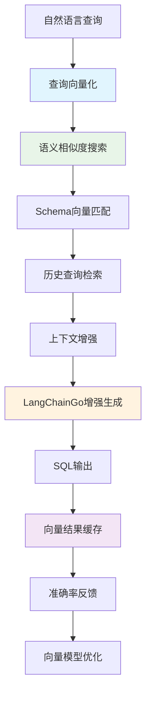

# 🔍 P3阶段：向量增强开发计划（3周）

<div align="center">


**向量增强 - 基于Qdrant的语义理解能力提升**

</div>

## 📋 项目概述

### 🎯 阶段目标
在P0-P2稳定基础之上，集成Qdrant向量数据库和LangChainGo Embedding引擎，实现**语义理解增强**的SQL生成能力，大幅提升查询准确率和用户体验。

### ✨ 核心价值
- ✅ **语义理解**：通过向量相似度提升自然语言理解精度
- ✅ **准确率突破**：从P2阶段基础上将准确率提升至85%+
- ✅ **智能匹配**：Schema和历史查询的语义相似度匹配
- ✅ **性能优化**：向量缓存和批量处理提升响应速度

### 📊 成功指标

| 指标类别 | 目标值 | 验证方式 |
|---------|-------|---------|
| **SQL生成准确率** | > 85% | 人工评估+自动化测试 |
| **语义匹配精度** | > 90% | 向量相似度评估 |
| **API响应时间P95** | < 2s | 性能测试 |
| **向量检索速度** | < 100ms | Qdrant性能监控 |
| **系统可用性** | > 99.5% | 监控告警 |

---

## 🏗️ 技术架构设计

### 📦 P3核心组件架构

P3阶段在P0+P1+P2基础上，集成Qdrant向量数据库和LangChainGo，实现语义增强的SQL生成能力：

**核心组件：**
- **Qdrant向量核心**：gRPC客户端、向量搜索引擎、向量化引擎
- **语义增强组件**：Schema向量化器、语义匹配器、上下文增强器  
- **性能优化**：向量缓存、批量处理器、性能追踪

📖 **详细架构设计**：参考 [P3-技术指南目录](./P3-技术指南/) 中的完整技术实现

### 🔄 向量增强处理流程



### 🧠 Qdrant集成架构

P3阶段采用Qdrant v1.12.0作为核心向量数据库，支持：

**核心特性：**
- **gRPC高性能连接**：支持连接池和集群部署
- **多集合管理**：Schema、Query、Context分离存储
- **HNSW索引优化**：高效的向量检索算法
- **性能配置**：批量处理、并发控制、相似度阈值

📖 **详细实现指南**：参考 [Qdrant集成与部署指南](./P3-技术指南/Qdrant集成与部署指南.md)

---

## 📅 3周开发计划

### 🗓️ 第1周：Qdrant基础集成与向量化引擎

#### Day 1-2: Qdrant环境搭建 + 基础集成
- [ ] **Qdrant服务部署**：Docker集群部署，gRPC配置优化
- [ ] **Go Qdrant客户端集成**：连接管理，集合创建，健康检查
- 📖 **详细实现**：参考 [Qdrant集成与部署指南](./P3-技术指南/Qdrant集成与部署指南.md)

#### Day 3-4: LangChainGo Embedding集成  
- [ ] **Embedding服务架构**：多模型支持，批量处理，缓存机制
- [ ] **向量化引擎优化**：API限流，错误重试，性能监控
- 📖 **详细实现**：参考 [向量搜索引擎实现指南](./P3-技术指南/向量搜索引擎实现指南.md)

#### Day 5-7: Schema向量化与存储
- [ ] **Schema向量化器**：描述生成，批量向量化，元数据管理
- [ ] **向量数据存储**：Qdrant集合管理，批量导入，索引优化
- 📖 **技术指南**：详见上述技术文档的相关章节

---

### 🗓️ 第2周：语义搜索引擎与上下文增强

#### Day 8-9: 向量搜索引擎
- [ ] **语义搜索引擎**：相似度搜索，过滤条件，结果排序
- [ ] **多策略搜索**：向量+关键词混合搜索，智能路由
- 📖 **详细实现**：参考 [向量搜索引擎实现指南](./P3-技术指南/向量搜索引擎实现指南.md)

#### Day 10-11: 上下文增强引擎
- [ ] **智能上下文增强**：Schema匹配，历史查询检索，业务推理
- [ ] **查询意图分析**：意图识别增强，多维度上下文构建
- 📖 **最佳实践**：参考 [语义相似度匹配最佳实践](./P3-技术指南/语义相似度匹配最佳实践.md)

#### Day 12-14: 性能优化与缓存
- [ ] **多层缓存系统**：L1内存缓存，L2 Redis缓存，L3持久化缓存
- [ ] **性能优化**：批量操作，连接池，向量压缩
- 📖 **详细实现**：参考 [向量缓存与性能优化指南](./P3-技术指南/向量缓存与性能优化指南.md)

---

### 🗓️ 第3周：集成测试与性能调优

#### Day 15-17: 向量增强集成测试
- [ ] **端到端集成测试**：功能验证，准确率测试，性能基准
- [ ] **语义相似度评估**：评估框架，测试数据集，质量分析
- 📖 **测试实践**：参考 [语义相似度匹配最佳实践](./P3-技术指南/语义相似度匹配最佳实践.md)
- 📊 **进度跟踪**：参考 [P3阶段-向量任务追踪表](./P3阶段-向量任务追踪表.md)

#### Day 18-19: 性能测试与调优
- [ ] **Qdrant性能优化**：HNSW参数调优，量化配置，集群优化
- [ ] **监控体系建设**：Prometheus指标，Grafana仪表板，告警配置
- 📖 **性能优化**：参考 [向量缓存与性能优化指南](./P3-技术指南/向量缓存与性能优化指南.md)

#### Day 20-21: 文档与部署准备
- [ ] **API文档更新**：Swagger文档，接口说明，示例代码
- [ ] **部署配置**：Docker Compose，环境变量，集群配置
- 📖 **部署指南**：参考 [Qdrant集成与部署指南](./P3-技术指南/Qdrant集成与部署指南.md)

---

## 📚 技术指南导航

P3阶段的详细技术实现已拆分为专门的技术指南，请根据开发任务参考相应文档：

| 技术指南 | 适用阶段 | 主要内容 |
|---------|---------|---------|
| [Qdrant集成与部署指南](./P3-技术指南/Qdrant集成与部署指南.md) | 第1周 + 第3周 | Docker部署、集群配置、Go客户端集成 |
| [向量搜索引擎实现指南](./P3-技术指南/向量搜索引擎实现指南.md) | 第1-2周 | 语义搜索、混合搜索、结果排序 |
| [语义相似度匹配最佳实践](./P3-技术指南/语义相似度匹配最佳实践.md) | 第2-3周 | 相似度算法、A/B测试、质量评估 |
| [向量缓存与性能优化指南](./P3-技术指南/向量缓存与性能优化指南.md) | 第2-3周 | 多层缓存、性能调优、监控指标 |
| [P3阶段-向量任务追踪表](./P3阶段-向量任务追踪表.md) | 全程 | 任务跟踪、风险管理、进度监控 |

💡 **使用建议**：
- 开发前先阅读相关技术指南了解实现细节
- 根据本文档的时间安排参考对应的技术指南
- 遇到技术问题时查阅最佳实践指南
- 使用任务追踪表管理日常开发进度

---

## ✅ 验收标准

### 🔍 功能验收

| 功能模块 | 验收标准 | 测试方法 |
|---------|---------|---------|
| **向量化能力** | 支持Schema和查询的向量化 | 自动化测试 |
| **语义搜索** | 相似度匹配准确率>90% | 语义评估测试 |
| **SQL生成增强** | 准确率提升至85%+ | 对比测试 |
| **性能表现** | 向量检索<100ms | 性能基准测试 |
| **系统集成** | 与P0-P2系统无缝集成 | 集成测试 |

### 📊 性能验收

| 性能指标 | 目标值 | 当前值 | 状态 |
|---------|-------|-------|------|
| SQL生成准确率 | > 85% | TBD | ⏳ |
| 语义匹配精度 | > 90% | TBD | ⏳ |
| 向量检索速度 | < 100ms | TBD | ⏳ |
| API响应时间P95 | < 2s | TBD | ⏳ |
| 系统可用性 | > 99.5% | TBD | ⏳ |

### 🧠 向量能力验收

- [ ] **Schema语义匹配**：准确识别相关表结构
- [ ] **查询意图理解**：基于向量相似度的意图推理
- [ ] **历史查询检索**：相似查询模式识别
- [ ] **上下文增强**：智能上下文补全
- [ ] **性能优化**：向量缓存和批量处理

---

## 📈 质量保障

### 🧪 测试策略

```yaml
向量测试覆盖率目标:
  单元测试: "> 80%"
  集成测试: "> 90%"
  语义准确率测试: "1000+样本"
  性能测试: "并发50用户"

测试数据集:
  Schema匹配: "200个数据库Schema"
  语义查询: "500个查询样本"
  相似度评估: "1000个查询对"
  性能基准: "100并发测试"
```

### 🔍 向量模型管理

- [ ] **Embedding模型版本控制**：OpenAI embedding模型管理
- [ ] **向量相似度调优**：阈值优化和A/B测试
- [ ] **Qdrant集群管理**：高可用配置和数据备份
- [ ] **性能监控**：向量搜索性能实时监控

### 🔧 开发工具

**向量开发环境**：
- **Go Qdrant客户端**：集成gRPC客户端和连接管理
- **Python辅助工具**：数据迁移和批量处理脚本
- **向量评估工具**：相似度评估和性能基准测试
- **监控工具**：Prometheus指标收集和Grafana可视化

📖 **详细配置**：所有工具的安装配置参考各技术指南文档

---

## 🚀 部署策略

### 📦 交付物

1. **向量服务代码**：完整的Qdrant集成和向量搜索引擎
2. **Embedding配置**：向量化模型配置和优化参数
3. **Schema向量库**：预生成的数据库Schema向量
4. **性能基准**：向量搜索性能基准和优化建议
5. **监控仪表板**：向量服务性能和准确率监控

### 🎯 上线检查清单

- [ ] Qdrant集群部署完成
- [ ] Schema向量化数据迁移完成
- [ ] 语义搜索准确率达标（>90%）
- [ ] 向量缓存配置优化
- [ ] 性能测试达标（<100ms检索）
- [ ] API文档更新完成
- [ ] 监控告警配置

---

## 🔄 后续P4阶段准备

### 📋 P4阶段预览

P3完成后，P4阶段将重点实现：

1. **React 18.3前端集成**：现代化用户界面和交互体验
2. **实时协作功能**：多用户协同查询和结果分享
3. **可视化增强**：查询结果的图表和仪表板展示

### 🔗 技术债务管理

- [ ] **向量模型优化**：基于P3使用数据进行模型fine-tuning
- [ ] **缓存策略优化**：向量缓存命中率优化
- [ ] **性能监控增强**：为P4阶段添加前端性能监控

---

## 📞 支持联系

| 角色 | 负责人 | 联系方式 |
|-----|-------|---------|
| **数据工程师** | TBD | TBD |
| **AI工程师** | TBD | TBD |
| **后端工程师** | TBD | TBD |
| **性能工程师** | TBD | TBD |

---

<div align="center">

**🎯 P3阶段成功标准：实现高精度的语义理解增强，SQL生成准确率达到85%以上**

</div>