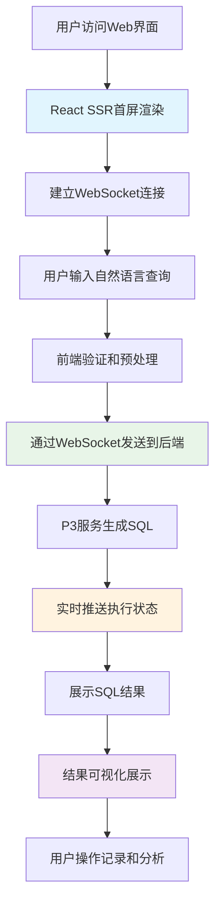

# 🎨 P4阶段：用户界面开发计划（4周）

<div align="center">


**现代化前端界面 - 基于React 18.3的完整用户体验**

</div>

## 📋 项目概述

### 🎯 阶段目标
在P0-P3稳定基础之上，实现**现代化React前端界面**，通过React 18.3并发特性、组件化设计和实时交互，为用户提供流畅、直观、功能完整的Chat2SQL查询体验。

### ✨ 核心价值
- ✅ **现代化UI/UX**：基于React 18.3并发渲染提供流畅用户体验
- ✅ **实时交互**：WebSocket支持实时查询状态和结果推送
- ✅ **响应式设计**：支持桌面端、平板和移动端全设备适配
- ✅ **可访问性支持**：遵循WCAG 2.1标准，支持残障人士访问

### 📊 成功指标

| 指标类别 | 目标值 | 验证方式 |
|---------|-------|---------| 
| **用户满意度** | > 4.0/5.0 | 用户调研问卷 |
| **首屏加载时间** | < 1.5s | Lighthouse性能测试 |
| **交互响应时间** | < 200ms | 用户操作响应测试 |
| **可访问性得分** | > 95分 | WCAG 2.1自动化测试 |
| **移动端适配率** | > 95% | 跨设备兼容性测试 |

---

## 🏗️ 技术架构设计

### 📦 P4核心组件架构

P4阶段在P0-P3全栈基础上，构建现代化React前端，实现完整的用户界面和交互体验：

**核心组件：**
- **React 18.3前端**：并发渲染、自动批处理、Suspense SSR
- **Ant Design 5.x**：企业级UI组件库和设计系统
- **WebSocket实时通信**：查询状态和结果的实时推送
- **响应式布局**：桌面端/移动端自适应设计

```go
// P4: React 18.3现代化前端 + 完整用户体验
type Chat2SQLFullStackP4 struct {
    Chat2SQLServiceP3                   // 继承P0+P1+P2+P3全部功能
    
    // React 18.3前端集成
    frontendServer *ReactSSRServer      // 服务端渲染
    websocketHub   *WebSocketHub        // 实时通信
    uiOptimizer    *ConcurrentUIOptimizer // React并发特性
}
```

### 🔄 用户交互流程设计



### 🎨 React 18.3前端架构

P4阶段充分利用React 18.3的现代化特性，构建高性能、用户友好的前端界面：

**核心特性：**
- **并发渲染 (Concurrent Rendering)**：优先级调度和中断渲染
- **自动批处理 (Automatic Batching)**：所有状态更新自动批处理，性能提升30%
- **Suspense SSR**：首屏加载速度提升40-60%，SEO友好
- **现代化Hooks**：useTransition、useDeferredValue、useSyncExternalStore

📖 **详细实现指南**：参考 [React 18.3并发特性实现指南](./P4-技术指南/React18.3并发特性实现指南.md)

---

## 📅 4周开发计划

### 🗓️ 第1周：React前端基础架构

#### Day 1-2: 项目初始化与开发环境
- [ ] **React 18.3项目初始化**：Vite + TypeScript + React 18.3配置
- [ ] **开发环境配置**：ESLint、Prettier、Husky、Jest测试环境
- [ ] **基础路由系统**：React Router v6配置和页面架构设计

#### Day 3-4: UI组件库和设计系统
- [ ] **Ant Design 5.x集成**：组件库配置和主题定制
- [ ] **设计系统建立**：色彩、字体、间距等设计令牌定义
- [ ] **基础组件开发**：Layout、Header、Sidebar、Footer布局组件

#### Day 5-7: 核心页面框架
- [ ] **主查询页面**：Chat2SQL主界面布局和基础组件
- [ ] **结果展示页面**：SQL结果展示和数据表格组件
- [ ] **历史记录页面**：查询历史列表和详情页面

---

### 🗓️ 第2周：查询界面与交互体验

#### Day 8-9: 智能查询编辑器
- [ ] **自然语言输入框**：支持多行输入、语法高亮、自动完成
- [ ] **查询建议系统**：基于历史查询的智能建议和提示
- [ ] **实时输入验证**：查询语法检查和错误提示

#### Day 10-11: SQL结果展示组件
- [ ] **数据表格组件**：支持排序、筛选、分页的高性能表格
- [ ] **图表可视化**：基于ECharts的数据图表自动生成
- [ ] **结果导出功能**：支持CSV、Excel、JSON多格式导出

#### Day 12-14: 用户体验优化
- [ ] **加载状态管理**：查询执行过程的加载动画和进度条
- [ ] **错误处理界面**：友好的错误提示和重试机制
- [ ] **快捷操作设计**：键盘快捷键、右键菜单、拖拽功能

---

### 🗓️ 第3周：WebSocket实时通信

#### Day 15-17: WebSocket集成
- [ ] **WebSocket客户端**：React中的WebSocket连接管理
- [ ] **实时状态同步**：查询执行状态的实时更新机制
- [ ] **连接重试机制**：WebSocket断线重连和错误恢复

#### Day 18-19: 实时功能实现
- [ ] **实时查询推送**：查询结果的流式推送和渐进显示
- [ ] **多用户协作**：共享查询会话和实时协作功能
- [ ] **实时通知系统**：系统消息、错误提醒的实时推送

#### Day 20-21: 性能优化
- [ ] **组件懒加载**：React.lazy和Suspense的代码分割
- [ ] **状态管理优化**：基于Zustand的轻量级状态管理
- [ ] **内存管理**：组件卸载时的资源清理和内存泄漏防护

---

### 🗓️ 第4周：响应式设计与部署

#### Day 22-24: 响应式适配
- [ ] **移动端适配**：响应式布局和移动端交互优化
- [ ] **平板端优化**：中等屏幕尺寸的界面适配
- [ ] **PWA功能**：Service Worker、离线缓存、安装提示

#### Day 25-26: 可访问性与国际化
- [ ] **可访问性支持**：ARIA标签、键盘导航、屏幕阅读器支持
- [ ] **国际化配置**：React-i18next配置和中英文切换
- [ ] **主题切换**：暗色/亮色主题切换功能

#### Day 27-28: 生产部署准备
- [ ] **生产构建优化**：Webpack/Vite构建配置和性能优化
- [ ] **Docker化部署**：前端应用的Docker镜像构建
- [ ] **Nginx配置**：静态资源服务和反向代理配置

---

## 🛠️ 技术栈规范

### 📚 核心技术选型

| 技术栈 | 版本 | 选择理由 | 性能提升 |
|-------|------|---------|---------| 
| **React** | 18.3.1 | 并发渲染、自动批处理、最新特性 | 30-60% |
| **TypeScript** | 5.0+ | 强类型、开发体验、代码质量 | 开发效率+40% |
| **Ant Design** | 5.x | 企业级组件、设计系统完整 | 开发速度+50% |
| **Vite** | 5.x | 快速构建、热更新、现代化工具链 | 构建速度+3x |
| **React Router** | 6.x | 声明式路由、类型安全、嵌套路由 | 路由性能+25% |

📖 **详细技术配置**：
- React实现详见 [React 18.3并发特性实现指南](./P4-技术指南/React18.3并发特性实现指南.md)
- 响应式设计详见 [响应式设计与可访问性指南](./P4-技术指南/响应式设计与可访问性指南.md)
- 部署配置详见 [前端部署与DevOps指南](./P4-技术指南/前端部署与DevOps指南.md)

---

## ✅ 验收标准

### 🔍 功能验收

| 功能模块 | 验收标准 | 测试方法 |
|---------|---------|---------| 
| **查询界面** | 支持自然语言输入和智能提示 | 手动测试 + 自动化UI测试 |
| **结果展示** | 支持表格、图表、导出功能 | 功能测试 + 性能测试 |
| **实时通信** | WebSocket连接稳定，状态同步准确 | 网络测试 + 压力测试 |
| **响应式设计** | 三种设备尺寸完美适配 | 设备兼容性测试 |
| **可访问性** | WCAG 2.1 AA级合规 | 可访问性自动化测试 |

### 📊 性能验收

| 性能指标 | 目标值 | 当前值 | 状态 |
|---------|-------|-------|------| 
| 首屏加载时间 | < 1.5s | TBD | ⏳ |
| 交互响应时间 | < 200ms | TBD | ⏳ |
| Lighthouse性能得分 | > 90分 | TBD | ⏳ |
| 可访问性得分 | > 95分 | TBD | ⏳ |
| PWA得分 | > 90分 | TBD | ⏳ |

### 🎨 用户体验验收

- [ ] **直观易用**：新用户5分钟内能完成首次查询
- [ ] **功能完整**：支持查询、结果查看、历史记录、设置配置
- [ ] **视觉一致**：遵循设计系统，界面风格统一
- [ ] **交互流畅**：页面切换平滑，加载状态清晰
- [ ] **错误处理**：友好的错误提示和恢复建议

---

## 🚀 部署策略

### 📦 交付物

1. **React前端应用**：完整的前端应用代码和构建产物
2. **Docker镜像**：容器化的前端应用部署镜像
3. **Nginx配置**：生产环境的反向代理和静态资源服务配置
4. **PWA清单**：Service Worker和应用清单文件
5. **测试套件**：单元测试、集成测试、E2E测试完整覆盖

### 🎯 上线检查清单

- [ ] React 18.3应用构建成功
- [ ] 所有功能模块测试通过
- [ ] 性能指标达到目标值
- [ ] 可访问性测试合规
- [ ] 跨浏览器兼容性验证
- [ ] 移动端适配测试通过
- [ ] WebSocket连接稳定性验证
- [ ] 生产环境部署配置完成

---

## 📈 质量保障

### 🧪 测试策略

```yaml
前端测试覆盖率目标:
  单元测试: "> 85%"
  集成测试: "> 90%"
  E2E测试: "关键用户路径100%覆盖"
  可访问性测试: "WCAG 2.1 AA级合规"

测试技术栈:
  单元测试: "Jest + React Testing Library"
  E2E测试: "Playwright + TypeScript"
  可访问性测试: "axe-core + eslint-plugin-jsx-a11y"
  性能测试: "Lighthouse CI + Web Vitals"
```

### 🔍 代码质量管理

- [ ] **TypeScript严格模式**：无any类型，完整的类型覆盖
- [ ] **ESLint规则**：Airbnb配置 + React Hooks规则 + 可访问性规则
- [ ] **代码审查机制**：PR必须经过代码审查才能合并
- [ ] **自动化CI/CD**：代码提交触发自动测试和构建

### 🛠️ 开发工具

**前端开发环境**：
- **IDE配置**：VSCode + React插件 + TypeScript支持
- **调试工具**：React Developer Tools + Redux DevTools
- **性能分析**：React Profiler + Lighthouse + Web Vitals
- **设计协作**：Figma + Storybook组件文档

---

## 📚 技术指南导航

P4阶段的详细技术实现已拆分为专门的技术指南，请根据开发任务参考相应文档：

| 技术指南 | 适用阶段 | 主要内容 |
|---------|---------|---------| 
| [React 18.3并发特性实现指南](./P4-技术指南/React18.3并发特性实现指南.md) | 第1-2周 | 并发渲染、自动批处理、Suspense SSR、现代化Hooks |
| [WebSocket实时通信指南](./P4-技术指南/WebSocket实时通信指南.md) | 第3周 | 实时状态同步、流式数据传输、连接管理、多用户协作 |
| [响应式设计与可访问性指南](./P4-技术指南/响应式设计与可访问性指南.md) | 第4周 | 移动端适配、WCAG 2.1标准、PWA功能、性能优化 |
| [前端部署与DevOps指南](./P4-技术指南/前端部署与DevOps指南.md) | 第4周 | 构建优化、Docker部署、CI/CD流水线、监控告警 |
| [P4阶段-用户界面任务追踪表](./P4阶段-用户界面任务追踪表.md) | 全程 | 任务跟踪、风险管理、进度监控、质量保证 |

💡 **使用建议**：
- 开发前先阅读相关技术指南了解实现细节
- 根据本文档的时间安排参考对应的技术指南
- 遇到技术问题时查阅最佳实践指南
- 使用任务追踪表管理日常开发进度

## 💡 用户体验设计核心原则

P4阶段专注于构建直观、高效、现代化的用户界面：

### 🎯 核心设计理念
- **零学习成本**：自然语言输入，无需SQL知识
- **即时反馈**：实时状态显示，操作结果立即可见
- **渐进式披露**：高级功能隐藏在二级菜单，保持界面简洁
- **容错设计**：友好的错误提示和快速恢复机制

### 📱 响应式布局策略
- **桌面端 (>1200px)**：三栏布局，全功能展示
- **平板端 (768-1199px)**：两栏布局，侧边栏可折叠
- **移动端 (<768px)**：单栏布局，底部导航

📖 **详细设计规范**：参考 [响应式设计与可访问性指南](./P4-技术指南/响应式设计与可访问性指南.md)

---

## 🔄 后续P5阶段准备

### 📋 P5阶段预览

P4完成后，P5阶段将重点实现：

1. **Kubernetes部署**：容器化部署和集群管理
2. **企业级监控**：全链路追踪和性能监控
3. **安全加固**：认证授权、数据加密、审计日志
4. **高可用设计**：多副本部署、故障转移、数据备份

### 🔗 技术债务管理

- [ ] **性能优化进化**：基于P4用户数据进行性能fine-tuning
- [ ] **组件库完善**：为P5的管理界面做组件准备
- [ ] **监控埋点**：为P5的全链路监控做数据收集准备

---

## 📞 支持联系

| 角色 | 负责人 | 联系方式 |
|-----|-------|---------| 
| **前端工程师** | TBD | TBD |
| **UI/UX设计师** | TBD | TBD |
| **全栈工程师** | TBD | TBD |
| **测试工程师** | TBD | TBD |

---

<div align="center">

**🎯 P4阶段成功标准：构建现代化React前端，用户满意度>4.0/5.0**

</div>