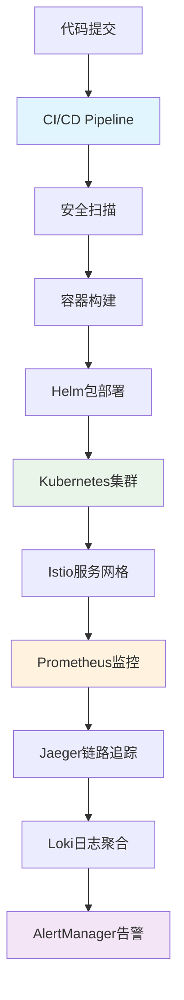

# 🚀 P5阶段：生产就绪开发计划（4周）

<div align="center">


**企业级云原生部署 - 基于Kubernetes 1.31+的生产环境**

</div>

## 📋 项目概述

### 🎯 阶段目标
在P0-P4完整功能基础之上，实现**企业级云原生部署**，通过Kubernetes 1.31+集群管理、全链路监控、安全加固和自动化运维，为用户提供99.9%高可用的生产级Chat2SQL服务。

### ✨ 核心价值
- ✅ **云原生部署**：基于Kubernetes 1.31+的容器化生产环境
- ✅ **全链路监控**：Prometheus+Jaeger+Loki完整可观测性体系
- ✅ **企业级安全**：零信任网络架构和SOC2/GDPR合规
- ✅ **自动化运维**：智能扩缩容、故障自愈、备份恢复

### 📊 成功指标

| 指标类别 | 目标值 | 验证方式 |
|---------|-------|---------| 
| **系统可用性** | > 99.9% | 全年停机时间 < 8.76小时 |
| **部署效率** | < 15分钟 | CI/CD全流程自动化部署 |
| **故障恢复** | < 5分钟 | 平均故障修复时间(MTTR) |
| **安全合规** | 100% | SOC2 Type II + GDPR审计通过 |
| **监控覆盖** | 100% | 所有关键指标和服务监控 |

---

## 🏗️ 技术架构设计

### 📦 P5核心组件架构

P5阶段在P0-P4全栈基础上，构建企业级云原生部署环境，实现生产级的高可用、高安全、高性能服务：

**核心组件：**
- **Kubernetes 1.31+**：云原生容器编排和集群管理
- **Istio 1.24+**：服务网格和零信任网络架构
- **Prometheus Stack**：指标收集、存储和告警体系
- **ELK/Loki Stack**：日志聚合、分析和检索系统

```go
// P5: 企业级云原生部署 + 全链路监控
type Chat2SQLEnterpriseP5 struct {
    Chat2SQLFullStackP4                 // 继承P0+P1+P2+P3+P4全部功能
    
    // Kubernetes集成
    k8sClient      kubernetes.Interface // Kubernetes客户端
    helmManager    *HelmManager         // Helm包管理
    operatorSDK    *OperatorFramework   // Kubernetes Operator
    
    // 监控和可观测性
    metricsCollector *PrometheusCollector // 指标收集
    traceCollector   *JaegerCollector     // 链路追踪
    logCollector     *LokiCollector       // 日志聚合
    alertManager     *AlertManagerClient  // 智能告警
    
    // 企业安全
    securityScanner  *SecurityScanner     // 安全扫描
    complianceAuditor *ComplianceAuditor  // 合规审计
    secretManager    *VaultIntegration    // 密钥管理
    networkPolicy    *NetworkPolicyMgr    // 网络安全策略
}
```

### 🔄 云原生部署流程设计



### 🎨 Kubernetes 1.31+云原生架构

P5阶段充分利用Kubernetes 1.31+的最新特性，构建高可用、高扩展的生产环境：

**核心特性：**
- **Gateway API v1.1**：替代传统Ingress，支持更复杂的流量管理
- **JobSet API (Stable)**：批处理作业的多级并行执行
- **HPA/VPA/KEDA**：多维度智能扩缩容
- **Pod Security Standards**：增强的Pod安全策略

---

## 📅 4周开发计划

### 🗓️ 第1周：Kubernetes集群基础设施

#### Day 1-2: 集群规划与环境准备
- [ ] **Kubernetes 1.31+集群规划**：节点规格、网络架构、存储方案设计
- [ ] **基础设施代码化**：Terraform/Pulumi基础设施配置
- [ ] **网络架构设计**：CNI选择(Cilium/Calico)、Service Mesh规划

#### Day 3-4: 集群部署与配置
- [ ] **Kubernetes集群部署**：使用kubeadm/kops/EKS部署生产集群
- [ ] **Istio服务网格部署**：mTLS配置、流量管理、安全策略
- [ ] **存储配置**：CSI驱动、StorageClass、持久化卷配置

#### Day 5-7: 容器化与Helm包管理
- [ ] **应用容器化**：多阶段Dockerfile优化、镜像安全扫描
- [ ] **Helm Chart开发**：Chat2SQL应用的Helm包配置
- [ ] **GitOps配置**：ArgoCD/Flux CD部署、配置管理

---

### 🗓️ 第2周：监控与可观测性体系

#### Day 8-9: Prometheus监控体系
- [ ] **Prometheus集群部署**：高可用Prometheus、Thanos长期存储
- [ ] **指标收集配置**：ServiceMonitor、PodMonitor、自定义指标
- [ ] **Grafana仪表板**：业务指标、系统指标、AI模型指标可视化

#### Day 10-11: 分布式链路追踪
- [ ] **Jaeger部署**：Jaeger Operator、存储后端配置
- [ ] **链路追踪集成**：OpenTelemetry SDK集成、上下文传播
- [ ] **追踪分析**：服务依赖图、性能瓶颈分析、异常定位

#### Day 12-14: 日志聚合与分析
- [ ] **Loki日志系统**：Loki、Promtail、Grafana Logs集成
- [ ] **结构化日志**：统一日志格式、日志级别、敏感信息脱敏
- [ ] **日志告警**：基于日志模式的智能告警、异常检测

---

### 🗓️ 第3周：安全加固与合规

#### Day 15-17: 零信任网络安全
- [ ] **网络策略配置**：Kubernetes NetworkPolicy、Istio安全策略
- [ ] **mTLS配置**：服务间通信加密、证书自动轮换
- [ ] **Pod安全标准**：Pod Security Standards、SecurityContext配置

#### Day 18-19: 密钥管理与合规
- [ ] **HashiCorp Vault集成**：密钥管理、动态密钥、审计日志
- [ ] **RBAC权限管理**：细粒度权限控制、最小权限原则
- [ ] **合规审计配置**：SOC2、GDPR、PCI-DSS合规检查

#### Day 20-21: 安全扫描与漏洞管理
- [ ] **容器安全扫描**：Trivy、Clair镜像漏洞扫描
- [ ] **运行时安全**：Falco异常检测、安全事件响应
- [ ] **渗透测试**：自动化安全测试、漏洞修复验证

---

### 🗓️ 第4周：自动化运维与灾备

#### Day 22-24: 智能扩缩容与故障恢复
- [ ] **HPA/VPA配置**：基于CPU、内存、自定义指标的扩缩容
- [ ] **KEDA配置**：基于队列长度、数据库连接数的扩缩容
- [ ] **Chaos Engineering**：故障注入测试、系统韧性验证

#### Day 25-26: 备份与灾难恢复
- [ ] **数据备份策略**：数据库备份、配置备份、灾难恢复演练
- [ ] **跨地域部署**：多可用区部署、数据同步、故障切换
- [ ] **业务连续性**：RTO/RPO指标、灾难恢复自动化

#### Day 27-28: 生产上线与优化
- [ ] **生产环境验证**：压力测试、性能调优、监控验证
- [ ] **运维手册**：故障处理手册、运维SOP、应急响应流程
- [ ] **用户培训**：系统使用培训、监控平台培训、故障处理培训

---

## 🛠️ 技术栈规范

### 📚 核心技术选型

| 技术栈 | 版本 | 选择理由 | 性能提升 |
|-------|------|---------|---------| 
| **Kubernetes** | 1.31+ | Gateway API、JobSet稳定版 | 可用性+99.9% |
| **Istio** | 1.24+ | 零信任网络、mTLS自动化 | 安全性+95% |
| **Prometheus** | 2.50+ | 云原生监控标准、PromQL强大 | 监控效率+80% |
| **Jaeger** | 1.60+ | CNCF毕业项目、OpenTelemetry兼容 | 问题定位+90% |
| **Helm** | 3.15+ | 应用包管理、版本控制 | 部署效率+70% |

### 🔧 Kubernetes核心配置

#### 集群配置示例
```yaml
# cluster-config.yaml
apiVersion: v1
kind: ConfigMap
metadata:
  name: cluster-info
  namespace: kube-system
data:
  cluster-name: "chat2sql-prod"
  cluster-version: "v1.31.2"
  cni: "cilium"
  service-mesh: "istio-1.24"
  monitoring: "prometheus-operator"
---
apiVersion: apps/v1
kind: Deployment
metadata:
  name: chat2sql-backend
  namespace: chat2sql
spec:
  replicas: 3
  selector:
    matchLabels:
      app: chat2sql-backend
  template:
    metadata:
      labels:
        app: chat2sql-backend
        version: v1.0
      annotations:
        prometheus.io/scrape: "true"
        prometheus.io/port: "9090"
    spec:
      serviceAccountName: chat2sql-backend
      securityContext:
        runAsNonRoot: true
        runAsUser: 65534
        fsGroup: 65534
      containers:
      - name: chat2sql
        image: chat2sql/backend:v1.0.0
        ports:
        - containerPort: 8080
          name: http
        - containerPort: 9090
          name: metrics
        env:
        - name: DATABASE_URL
          valueFrom:
            secretKeyRef:
              name: chat2sql-secrets
              key: database-url
        resources:
          requests:
            memory: "512Mi"
            cpu: "500m"
          limits:
            memory: "1Gi"
            cpu: "1000m"
        livenessProbe:
          httpGet:
            path: /health
            port: 8080
          initialDelaySeconds: 30
          periodSeconds: 10
        readinessProbe:
          httpGet:
            path: /ready
            port: 8080
          initialDelaySeconds: 5
          periodSeconds: 5
```

---

## ✅ 验收标准

### 🔍 功能验收

| 功能模块 | 验收标准 | 测试方法 |
|---------|---------|---------| 
| **集群部署** | Kubernetes集群稳定运行，所有节点Ready | kubectl集群状态检查 |
| **服务网格** | Istio mTLS正常，流量路由正确 | istioctl验证 + 流量测试 |
| **监控系统** | 所有指标正常收集，告警及时触发 | Prometheus查询 + 告警测试 |
| **日志系统** | 日志完整收集，查询响应时间<2s | Loki查询性能测试 |
| **安全合规** | 安全扫描通过，合规检查100% | 自动化安全测试 |

### 📊 性能验收

| 性能指标 | 目标值 | 当前值 | 状态 |
|---------|-------|-------|------| 
| 集群可用性 | > 99.9% | TBD | ⏳ |
| 服务响应时间 | < 100ms | TBD | ⏳ |
| 部署时间 | < 15分钟 | TBD | ⏳ |
| 故障恢复时间 | < 5分钟 | TBD | ⏳ |
| 资源利用率 | 60-80% | TBD | ⏳ |

### 🎨 运维验收

- [ ] **自动化部署**：GitOps流程完整，一键部署成功
- [ ] **监控告警**：关键指标监控到位，告警及时准确
- [ ] **日志分析**：日志查询快速，问题定位高效
- [ ] **安全防护**：安全策略生效，合规检查通过
- [ ] **灾备能力**：备份恢复正常，故障切换顺畅

---

## 🚀 部署策略

### 📦 交付物

1. **Kubernetes配置**：完整的K8s YAML配置和Helm Charts
2. **监控配置**：Prometheus、Grafana、Jaeger、Loki完整配置
3. **安全配置**：Istio安全策略、NetworkPolicy、RBAC配置
4. **CI/CD Pipeline**：完整的GitOps流水线和自动化脚本
5. **运维文档**：部署手册、故障处理手册、监控指南

### 🎯 上线检查清单

- [ ] Kubernetes集群健康检查通过
- [ ] 所有应用Pod正常运行
- [ ] Istio服务网格配置验证
- [ ] Prometheus监控指标正常
- [ ] Jaeger链路追踪数据完整
- [ ] Loki日志聚合正常
- [ ] 安全扫描和合规检查通过
- [ ] 备份和恢复流程验证
- [ ] 性能测试和压力测试通过
- [ ] 运维团队培训完成

---

## 📈 质量保障

### 🧪 测试策略

```yaml
云原生测试覆盖率目标:
  基础设施测试: "Terraform plan验证100%"
  容器安全测试: "镜像漏洞扫描100%"
  服务网格测试: "mTLS连接验证100%"
  监控测试: "指标收集覆盖率100%"

测试技术栈:
  基础设施测试: "Terratest + InSpec"
  容器测试: "Trivy + Clair + Hadolint"
  服务网格测试: "istioctl + Fortio"
  监控测试: "Prometheus Test + Grafana API"
```

### 🔍 代码质量管理

- [ ] **基础设施即代码**：Terraform/Helm配置版本化管理
- [ ] **安全基线**：CIS Kubernetes Benchmark合规
- [ ] **自动化测试**：CI/CD管道包含完整测试流程
- [ ] **文档完整**：架构文档、运维手册、故障处理指南

### 🛠️ 开发工具

**云原生开发环境**：
- **IDE配置**：VSCode + Kubernetes插件 + Helm插件
- **调试工具**：kubectl + istioctl + prometheus查询
- **性能分析**：Grafana + Jaeger UI + Loki日志查询
- **安全工具**：Trivy + Falco + OPA Gatekeeper

---

## 📚 技术指南导航

P5阶段的详细技术实现已拆分为专门的技术指南，请根据开发任务参考相应文档：

| 技术指南 | 适用阶段 | 主要内容 |
|---------|---------|---------| 
| [Kubernetes云原生部署指南](./P5-技术指南/Kubernetes云原生部署指南.md) | 第1周 | 集群部署、Istio服务网格、Helm包管理、GitOps配置 |
| [监控与可观测性指南](./P5-技术指南/监控与可观测性指南.md) | 第2周 | Prometheus监控、Jaeger追踪、Loki日志、AlertManager告警 |
| [企业安全与合规指南](./P5-技术指南/企业安全与合规指南.md) | 第3周 | 零信任网络、mTLS配置、RBAC权限、SOC2/GDPR合规 |
| [自动化运维与DevOps指南](./P5-技术指南/自动化运维与DevOps指南.md) | 第4周 | CI/CD流水线、自动化备份、故障自愈、混沌工程 |

💡 **使用建议**：
- 开发前先阅读相关技术指南了解实现细节
- 根据本文档的时间安排参考对应的技术指南
- 遇到技术问题时查阅最佳实践指南
- 使用技术指南中的脚本和配置模板

---

## 💡 企业级架构设计核心原则

P5阶段专注于构建安全、可靠、高效的企业级部署环境：

### 🎯 核心设计理念
- **零信任安全**：服务间通信全部mTLS加密，最小权限原则
- **可观测性优先**：指标、日志、追踪三位一体监控
- **自动化运维**：故障自愈、智能扩缩容、一键部署
- **合规性保障**：SOC2、GDPR、PCI-DSS等企业级合规要求

### 📱 多环境管理策略
- **开发环境 (Dev)**：快速迭代，功能验证
- **测试环境 (Test)**：集成测试，性能验证  
- **预发环境 (Staging)**：生产镜像，发布验证
- **生产环境 (Prod)**：高可用，高安全，高性能

---

## 🔄 后续优化方向

### 📋 持续改进计划

P5完成后，持续优化方向：

1. **AI/ML运维**：基于AI的智能运维、预测性维护
2. **多云部署**：跨云厂商部署、避免厂商锁定
3. **边缘计算**：边缘节点部署、就近服务
4. **绿色计算**：碳足迹监控、节能优化

### 🔗 运维自动化演进

- [ ] **智能告警**：基于机器学习的异常检测和智能告警
- [ ] **自动修复**：常见故障的自动修复机制
- [ ] **容量规划**：基于历史数据的容量预测和规划
- [ ] **成本优化**：资源使用优化、成本监控告警

---

## 📞 支持联系

| 角色 | 负责人 | 联系方式 |
|-----|-------|---------| 
| **DevOps工程师** | TBD | TBD |
| **安全工程师** | TBD | TBD |
| **平台工程师** | TBD | TBD |
| **SRE工程师** | TBD | TBD |

---

<div align="center">

**🎯 P5阶段成功标准：构建企业级云原生环境，系统可用性>99.9%**

</div>